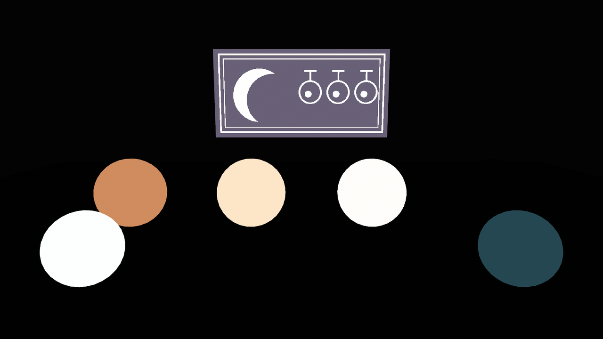
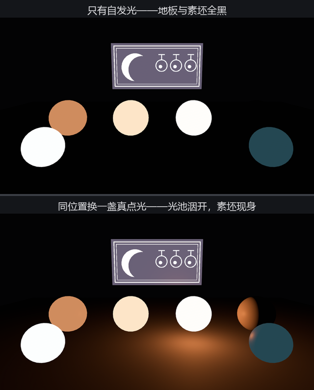
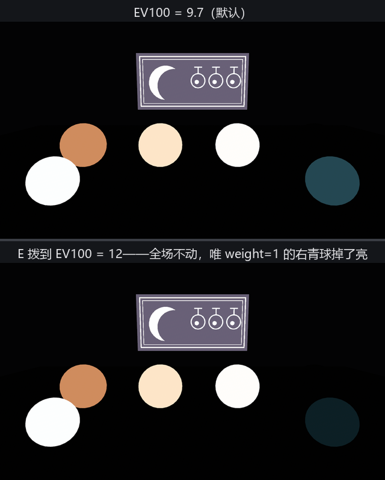

# 自发光：灯箱不是灯

道具单第五件：灯箱。戏牌要在夜场里自己亮——这归 `emissive`（自发光）管。它是账单上独立的一行：不等外来光，直接往画面里加颜色。为了让这行账看得干净，这一节把样品间的灯全撤了：没有主灯、没有影棚墙，`ClearColor` 压成近黑——**暗房**。

```rust
{{#include ../../code/ch24-materials/examples/listing-24-03.rs:setup}}
```

<span class="caption">Listing 24-3（其一）：暗房与灯箱——底色纯黑，图案全靠 emissive_texture 点亮（examples/listing-24-03.rs）</span>

灯箱的配方值得逐项看。`base_color: Color::BLACK` 把漫反射一行记零——反正暗房里也没光可反，黑底保证画面上的每一分亮都来自自发光。`emissive` 的类型不是 `Color` 而是 **`LinearRgba`**：这是道物理量，通道值不封顶于 1.0，单位按 cd/m²（尼特）理解——80 尼特上下是显示器白屏的量级。`emissive_texture` 与 `emissive` **相乘**（贴图黑处不亮、白处全亮），乘法规则和 `base_color_texture` 一家一样；所以想让贴图原样发光，`emissive` 给白。

多亮算亮？铸一排阶梯，1、10、100 尼特：

```rust
{{#include ../../code/ch24-materials/examples/listing-24-03.rs:ladder}}
```

<span class="caption">Listing 24-3（其二）：亮度阶梯 + 一颗坐在旁边的素坯球（examples/listing-24-03.rs）</span>

```console
cargo run -p ch24-materials --example listing-24-03
```

```text
小棠：暗房验灯——灯箱一块、橙球三档：1、10、100 尼特。
老烛：素坯挨着 100 尼特坐，一丝光都借不着才对。E 拨曝光，L 换真灯。
```



<span class="caption">Figure 24-5：亮度阶梯——100 尼特已被色调映射冲得发白；右边那颗素坯球在哪？</span>

阶梯上有两件事。第一，亮度是对数感受：1 到 10 的跳变和 10 到 100 的跳变看起来差不多大。第二，100 尼特那颗的橙色明显**发白**了——亮度冲高时色调映射（tonemapping）会牺牲饱和度保亮度，想要“又亮又橙”是物理上讨不到的便宜（写作时试过 1000 尼特，直接白成一颗灯泡）。

## 发光，但不照亮

最扎眼的是照片右侧：素坯球就坐在 100 尼特旁边，画面上却**一片黑**——它连个轮廓都没混上。`emissive` 的字段文档把话说得很直白：自发光材质**不会照亮周围**，它只是往自己的像素上加数，不参与别人的光照计算。灯箱是“画着灯的画”，不是灯。按 L 让老烛在同一个位置换一盏真点光：

```rust
{{#include ../../code/ch24-materials/examples/listing-24-03.rs:lamp}}
```

<span class="caption">Listing 24-3（其三）：L 键——同位置换真灯，对照实验（examples/listing-24-03.rs）</span>

```text
老烛：同一个位置换一盏真灯——地板、素坯、邻居全亮了。
```



<span class="caption">Figure 24-6：自发光（上）与真灯（下）——一个只管自己亮，一个把光分给全场</span>

想要“发光的东西也照亮四周”？两条正路：发光体旁边**藏一盏真灯**（23.11 节的灯笼就是这么做的——emissive 球 + PointLight 组件一起挂）；或者等第 26 章的 bloom，让高亮度自己晕出光圈——那是后处理的戏，照亮的观感有了，照亮的物理没有。

## 曝光的秤

还剩一个小字段：`emissive_exposure_weight`（曝光权重，默认 `0.0`）。第 22 章老烛的测光表（`Exposure`）管全场亮度，这个权重决定自发光**过不过那杆秤**：`0.0` = 不过秤，写多少亮多少；`1.0` = 当成物理亮度，跟着曝光走。铸两颗同为 80 尼特的青球对照：

```rust
{{#include ../../code/ch24-materials/examples/listing-24-03.rs:weight}}
```

<span class="caption">Listing 24-3（其四）：曝光实验的一对青球——权重一个 0 一个 1（examples/listing-24-03.rs）</span>

按 E 把曝光从默认 9.7 拨到阴天 12：

```text
老烛：曝光拨到 EV100 = 12——看好两颗青球谁掉了亮。
```



<span class="caption">Figure 24-7：EV100 从 9.7 拨到 12——全场只有 weight = 1.0 的青球跟着暗下去</span>

结果干脆：全场纹丝不动，唯独 `weight: 1.0` 那颗独自沉进暗里。更有意思的是拨之前——同为 80 尼特，两颗的亮度**本来就不同**（weight 0 亮得多）：默认档把 emissive 当“屏幕上的定值”，压根不参与曝光换算。做 UI 式的常亮元素（准星、指示灯）留默认；做“和场景同呼吸”的光源体（灯管、屏幕、岩浆）拨到 1.0，白天黑夜它才有明暗之分。
