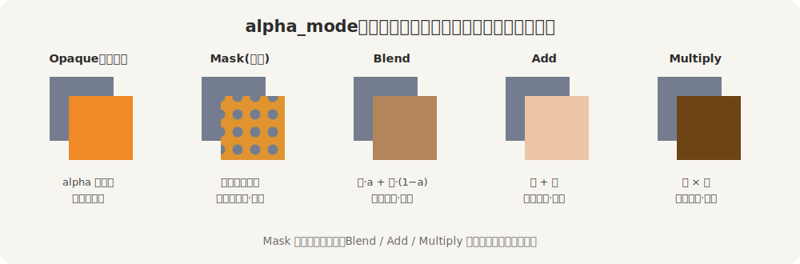
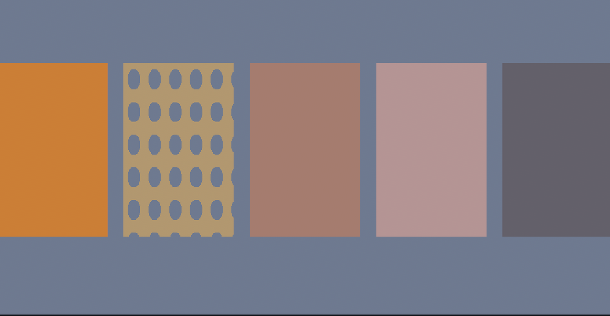

# 透明：玻璃、镂空与叠加

前几节的漆都是实的——挡得严严实实，背后什么也透不出来。这一节让漆透起来：玻璃、水、镂空的窗棂、发光的全息、染色的滤片。管这件事的旋钮叫 `alpha_mode`（透明模式）。

先破一个最常见的误会。你给 `base_color` 配了个带 alpha 的颜色（比如 `srgba(.., 0.5)`），满心以为它就半透明了——结果还是不透明。因为 `alpha_mode` 默认是 `Opaque`（不透明），这一档**根本不看 alpha 通道**。alpha 想起作用，得先把模式切走。

> 有个例外：`StandardMaterial::from(color)` 这种从颜色直接造材质的便捷写法，会替你看一眼——alpha 小于 1 就自动把模式设成 `Blend`。但只要你是用 `StandardMaterial { base_color: .., ..default() }` 结构体字面量写的，模式就还是默认的 `Opaque`，alpha 不生效。

`alpha_mode` 有好几档，先看它们各自怎么把「前景」与「背后」凑到一起：



<span class="caption">Figure 24-4：同一抹半透明橙叠在灰底上，五种 `alpha_mode` 各是各的算法</span>

- **Opaque**（默认）：不看 alpha，前景直接盖住背后。
- **Mask(阈值)**：拿每像素的 alpha 跟阈值比——高于就完全不透、低于就完全透明，一刀切，没有半透。专做镂空：栅栏、铁丝网、树叶。它最省，因为不用排序（下面就说排序是什么）。
- **Blend**：标准 alpha 混合，`前·a + 后·(1−a)`。玻璃、水，最常用的半透明。
- **Add**：前景与背后**相加**，越加越亮（黑色加了等于没加）。发光、全息、激光、能量束。
- **Multiply**：前景与背后**相乘**，越乘越暗（白色乘了等于没乘）。染色玻璃、滤色片、有色液体。

口说无凭，铸一排片：同一抹半透明橙，叠在同一面灰墙上，只换 `alpha_mode`（镂空那片用一张钻了孔的贴图）：

```rust
{{#include ../../code/ch24-pbr-materials/examples/listing-24-04.rs:alpha}}
```

<span class="caption">Listing 24-4：五片同色的橙，只换透明模式（examples/listing-24-04.rs）</span>

```console
cargo run -p ch24-pbr-materials --example listing-24-04
```

```text
小棠：五片同色的橙——头一片把透明吃了，后面几片各透各的：镂空、玻璃、发光、滤色。
```



<span class="caption">Figure 24-5：五片实拍——Opaque 把透明吃了，Mask 镂空见墙，Blend 半透，Add 提亮，Multiply 压暗</span>

五片同色的橙，叠出五个样。头一片 `Opaque`：alpha 0.5 被当没看见，照样一片实心橙——这就是开头那个误会的真身。第二片 `Mask`：贴的那张钻了孔的图，孔里 alpha 为 0、低于阈值，被一刀切掉，于是从孔里直接看见背后的灰墙，孔沿干脆利落、没有半透的虚边。第三片 `Blend`：橙和灰墙各让一半，调成一抹半透的橙褐，像隔着茶色玻璃。第四片 `Add`：橙加到灰墙上，比灰墙更亮、泛起暖白——发光体就这么做。第五片 `Multiply`：橙乘上灰墙，比灰墙更暗、压成深褐——这是给背后染色。

## 一个绕不开的麻烦：排序

`Mask` 之外那几档（Blend、Add、Multiply）都得**先看见背后、才能和背后混**。这就要求：透明的东西必须在它背后的东西画完之后再画，多个透明物之间还得按离相机的远近，从后往前排着画。Bevy 会替你做这排序，但排序是按物体**整体**的距离来的，遇到互相穿插、或同一物体自己绕到自己背后的情形（一颗透明球的前后两半），就可能排错、露出破绽。这是所有实时渲染共同的老大难，不是 Bevy 独有。

记一条经验：能用 `Mask` 解决的（非透即不透的镂空），就别用 `Blend`——`Mask` 不排序，又快又不出错。真要大片半透明的植被，还有一档 `AlphaToCoverage`（依赖 MSAA 多重采样抗锯齿）也能免去排序，本章不展开。剩下 `Premultiplied`（预乘 alpha）是 `Blend` 的一个变体，处理某些贴图的描边瑕疵时才用得上。
