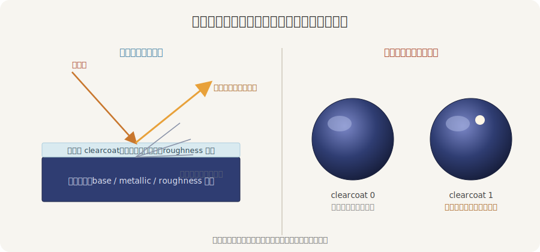
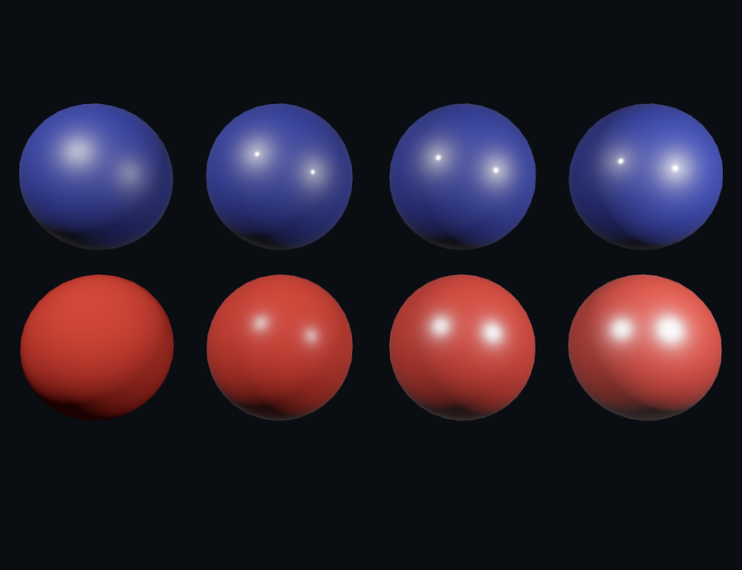

# 清漆与镜面：车漆的光

第 21 章那面材质墙立完，留了个尾巴：金属与非金属的高光不一样——非金属的高光是白的，金属的高光带固有色。这一节再往细处拧两根管「镜面反光」的旋钮，外加 PBR 里专门模拟「漆面」的一层花样：清漆。

## clearcoat：再罩一层薄亮漆

现实里很多漆面是「两层」的：底下一层有颜色的漆，上面再罩一层透明的清漆——车漆、易拉罐、上了清漆的木器、指甲油。那层清漆很薄、很光，会自己反出一道又白又锐的高光，叠在底层本身的反光之上。`clearcoat` 这根旋钮（0 到 1，默认 0）就是给表面加这么一层：



<span class="caption">Figure 24-6：清漆是盖在主材质之上的第二层——薄、透明、很光，多反出一道锐高光</span>

底层照旧按它的 `metallic`、`perceptual_roughness` 算反光；清漆层是另算的一道，自带一根糙度旋钮 `clearcoat_perceptual_roughness`（默认 0.5，调清漆这层光不光，和主层的粗糙度互不相干）。把清漆从 0 拨到 1，你会看见在原有反光之上，多冒出一粒又白又锐的高光点。

## reflectance：非金属也有镜面

非金属（木、瓷、塑料）虽不像金属那样满身反光，却也有一道淡淡的镜面高光——就是瓷器、漆器、塑料壳上那粒白亮点。这道高光的强弱，由 `reflectance`（反射率，0 到 1，默认 0.5）控制。默认的 0.5 对应现实里约 4% 的反射（绝大多数非金属都在 2%–5%），所以平时不动它也合理；真要某个表面更「贼亮」或更「死板」，再来拧它。

两根旋钮，铸两排球看个明白：上排同一抹深蓝漆，`clearcoat` 从 0 拨到 1；下排同一抹红漆，`reflectance` 从弱到强。镜面性质的高光都得有具体光点才照得出来，所以这一节点了两盏点光：

```rust
{{#include ../../code/ch24-pbr-materials/examples/listing-24-05.rs:clearcoat}}
```

<span class="caption">Listing 24-5：上排拨 clearcoat，下排拨 reflectance（examples/listing-24-05.rs）</span>

```console
cargo run -p ch24-pbr-materials --example listing-24-05
```

```text
小棠：上排越往右越像刷了清漆的车壳，多一层亮；下排越往右镜面斑越扎眼。
```



<span class="caption">Figure 24-7：上排清漆从无到有，多出一粒锐高光；下排反射率从弱到强，镜面斑越来越亮</span>

上排（清漆）：最左 `clearcoat` 为 0，只有底层那点随粗糙度摊开的软高光；越往右，一粒又白又锐的清漆高光越清楚，到最右像刚打完蜡的车壳。下排（reflectance）：最左反射率为 0，球面几乎没有高光、发闷；越往右高光斑越亮、越精神。两排都说明同一件事：这些旋钮不改固有色，只改「光怎么在表面上反」。

> 还有个搭档 `specular_tint`（镜面染色，默认白）：给非金属那道镜面高光染上颜色——平时是白的，需要时可让反光偏个色调。它只对非金属有效（金属的反光本就带固有色，第 21 章讲过）。

## 别忘了给它一个世界

第 22 章的教训在这里同样成立：清漆和金属一样，反的是**周遭**。只有两盏点光时，清漆高光就是那两个孤零零的亮点；一旦给场景配上第 22 章的环境光照（`GeneratedEnvironmentMapLight`），清漆层会把整片环境都映上去，那种「裹了层玻璃」的高级感才真正出来。本章末尾的材质球画廊就支着这么一个环境，到时候回头看那颗车漆球，比这一节孤灯下的漂亮得多。
