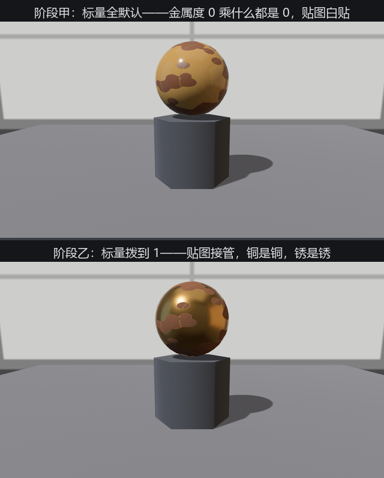
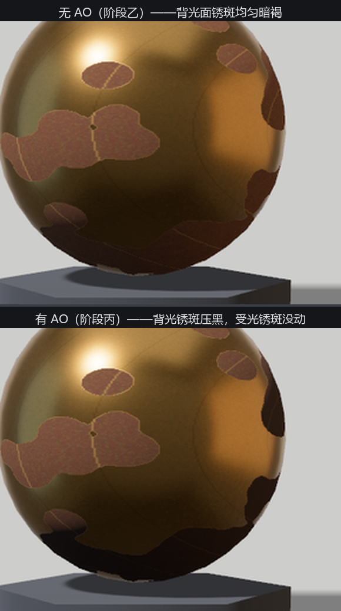

# 贴图接管：一张 ORM 治一颗锈锣

道具单第二件：鎏金锣。老雷从库房翻出来的这面旧锣有讲究——锣面大半还是亮铜，锈斑一块一块咬在上面。**同一个表面上，金属度和粗糙度逐点不同**：铜的地方 metallic 1、糙 0.25，锈的地方 metallic 0、糙 0.9。标量旋钮一颗球只能拧一个值，这活儿得交给贴图。

`StandardMaterial` 里管这事的是 `metallic_roughness_texture`：**绿通道存粗糙度、蓝通道存金属度**（红通道另有去处，一会儿说）。这个通道分配不是 Bevy 自创，是 glTF 的规矩——第 23 章开箱的模型，材质里躺着的就是这种图。素材由 `make_ch24_assets.py` 合成：一张 `gong_base.png` 底色（铜黄与锈褐），一张 `gong_orm.png` 数据图，两张逐像素对位。

装载有一条规矩先立住：**数据图必须按线性读**。PNG 默认按 sRGB 彩图装载（14 章讲过颜色空间的账），粗糙度 0.5 要是被当成颜色做了 gamma 变换，读出来就不是 0.5 了。用 `load_builder` 拨掉：

```rust
{{#include ../../code/ch24-materials/examples/listing-24-04.rs:textures}}
```

<span class="caption">Listing 24-4（其一）：三个阶段的材质——坑、接管、补 AO（examples/listing-24-04.rs）</span>

注意“阶段甲”：两张图都贴上了，metallic 和 perceptual_roughness 留默认。跑起来按空格轮换三阶段：

```rust
{{#include ../../code/ch24-materials/examples/listing-24-04.rs:stage}}
```

<span class="caption">Listing 24-4（其二）：空格换阶段（examples/listing-24-04.rs）</span>

```console
cargo run -p ch24-materials --example listing-24-04
```

```text
小棠：旧铜锣坯来了——底色一张、ORM 一张，全贴上了。空格换阶段。
老雷：说好的鎏金呢？这锣怎么一身塑料相？
```



<span class="caption">Figure 24-8：阶段甲（上）贴了等于白贴——一身塑料相；阶段乙（下）标量拨到 1，贴图接管</span>

## 贴了怎么没反应

老雷的抱怨就是这一节的坑：阶段甲的锣是一颗**塑料球**。原因藏在字段文档的一句话里：贴图值与标量值**相乘**。默认 `metallic: 0.0`——蓝通道存的金属度乘 0，全军覆没；默认粗糙度 0.5，绿通道也被打了对折。这和 `base_color`（白）× 贴图的乘法是同一条规则，但默认值的方向反了：底色默认白（乘法无损），金属度默认 0（乘法全灭）。所以口诀是——**用金属度/粗糙度贴图时，把两个标量都拨到 1.0**，话语权全交给贴图（想整体压一档时才留小数，标量当总闸用）。

阶段乙就是这么修的，铜是铜、锈是锈（Figure 24-8 下联）。

## 第三个通道：AO

ORM 这个名字是三个词的缩写：**O**cclusion、**R**oughness、**M**etallic——红通道存的是**环境光遮蔽**（ambient occlusion，AO）：模型上那些褶皱死角（衣服腋下、砖缝、锈坑）平时晒不到天光，烘焙软件把“这里有多背光”预先画进红通道。Bevy 里对应字段 `occlusion_texture`，可以直接把同一张 ORM 图再喂给它一次——三个字段各读各的通道，一张图三份工，这正是 glTF 生态的打包惯例。

阶段丙补上这一笔。对比阶段乙，变化只在一处——但**位置很讲究**：



<span class="caption">Figure 24-9：AO 只压环境光的份额——背光面的锈斑黑得下去，正对主灯的锈斑纹丝不动</span>

正对主灯的锈斑没变，背光面靠环境光活着的锈斑黑了下去——**AO 遮的是环境光，不遮直接光**。这符合它的物理出身：AO 记录的是“这一点能看到多大一片天”，主灯不是天，照进锈坑照样亮。所以 AO 在环境光为主的场景（阴天、室内、本章影棚）里效果最重，在一盏强主灯的场景里几乎隐形。
