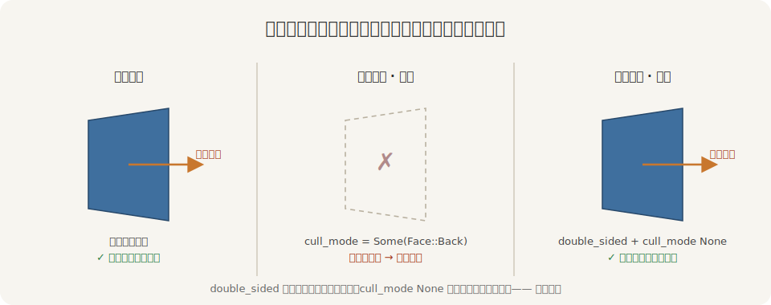
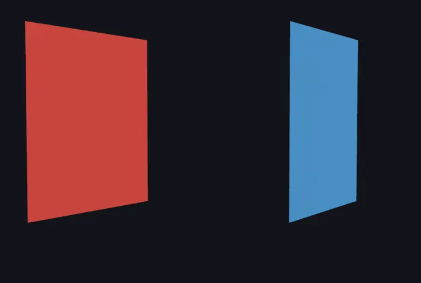

# 双面：背过身还在不在

第 23 章给阿福挂过一面小旗，第 21 章班旗也立在台上——这些薄薄一片的东西，藏着一个一上手就撞的坑：**转到背面，它就没了**。

原因是一条默认规矩：**背面剔除**（back-face culling）。为省一半绘制，渲染器默认只画三角形的正面、把背面直接扔掉。哪面算正面？由顶点的**缠绕顺序**（winding order）定——第 21 章手搓班旗时埋过这个伏笔：顶点逆时针绕的那面是正面、法线朝你，反过来就是背面。`StandardMaterial` 的 `cull_mode` 默认是 `Some(Face::Back)`，意思正是「剔掉背面」。

所以一片单层的旗，正面朝你时好端端，一旦转到背面朝你——背面被剔了，整片凭空消失：



<span class="caption">Figure 24-8：默认只画正面——薄片一背过身就被剔掉；双面把背面也画上、还把法线翻正</span>

要让它两面都在，得拧两样，缺一不可：

- `cull_mode` 设成 `None`——别剔背面了，两面都画；
- `double_sided` 设成 `true`——光把背面画上还不够，背面的法线原本朝里、受光是反的（会黑成一片）；这个开关让引擎给背面自动把法线翻正，两面都正确受光。

两面旗对照着转一圈就清楚了。左旗用默认材质，右旗开了双面：

```rust
{{#include ../../code/ch24-pbr-materials/examples/listing-24-06.rs:double_sided}}
```

<span class="caption">Listing 24-6：左旗默认单面，右旗 double_sided + cull_mode None（examples/listing-24-06.rs）</span>

```console
cargo run -p ch24-pbr-materials --example listing-24-06
```

```text
小棠：两面旗一起转——红的背过身就不见了，蓝的开了双面，正反都在。
```



<span class="caption">Figure 24-9：红旗（默认单面）转到背面就被剔得无影无踪；蓝旗（双面）正反都在、始终受光</span>

红旗（左，默认单面）转到正面好好的，一背过身就整片消失——背面被剔了。蓝旗（右，`double_sided` + `cull_mode: None`）正反都在，转到背面那一刻法线翻正，照样受光、照样是蓝的。

这个坑专挑薄片下手：旗、叶子、纸张、布片、单面墙——凡是「一片、两面都想看见」的，记得开双面。实心的封闭物体（球、箱子）反而不用动它：你永远看不到它们三角形的背面，剔掉正好省一半绘制，这也是默认要剔背面的道理。

> 顺带一提：`cull_mode` 也能反过来设成 `Some(Face::Front)`（只画背面、剔正面），偶尔做特殊效果用得上；日常就 `None`（两面）和默认的 `Some(Face::Back)`（只正面）两种。
