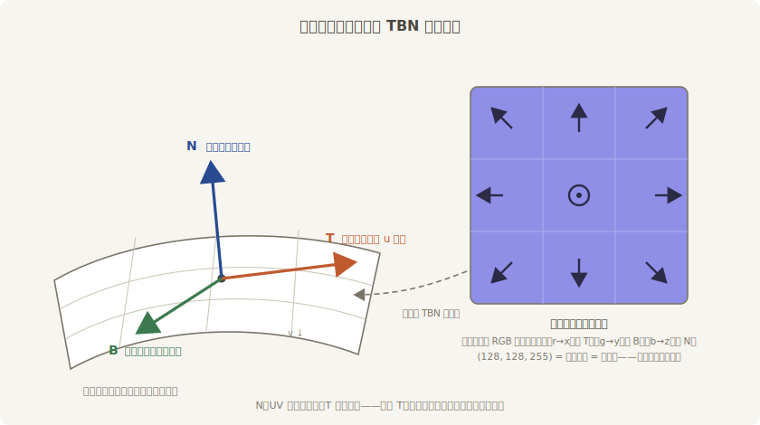
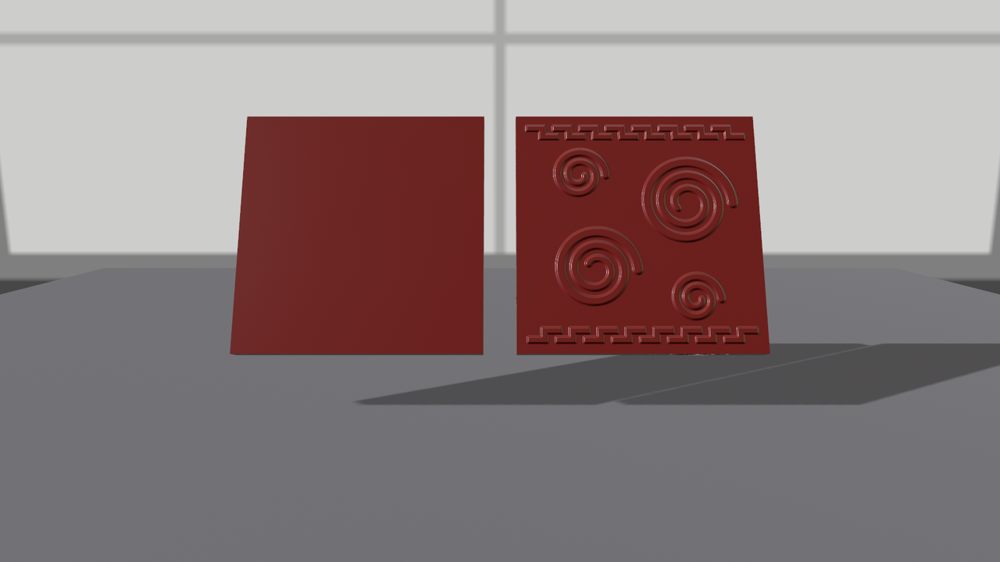

# 法线贴图：往平坯上刻花

道具单第三件：剔红漆盒。盒盖要一整面云纹浮雕——真雕的话每道纹都是几十个三角形，一个盖子几万顶点。第 21 章说过法线是“受光的方向”；顺着这句话想：如果让**贴图逐像素改写法线**，光照就会把凹凸“算”出来——几何上纹丝不动，观感上刀刀见肉。这就是 `normal_map_texture`（法线贴图）。

法线贴图里存的不是颜色，是向量：每个像素的 RGB 编码一根单位法线（r→x、g→y、b→z，0..1 映射到 -1..1）。“不动的地方”编码出来是 (128, 128, 255)——那种标志性的浅紫蓝底。`make_ch24_assets.py` 从一张云纹高度场差分出了 `carve_normal.png`，凸纹的边缘处法线朝四外倾。

但这些向量以谁为坐标系？贴图是平的，能贴上球、盒、任何曲面——所以向量存的是**相对表面本身**的偏转：z 轴贴着表面法线，x 轴顺着贴图的 u 方向。这个“顺着 u 方向”的轴叫**切线**（tangent），它和法线、副切线一起构成每个顶点上的一套局部坐标系：



<span class="caption">Figure 24-10：法线贴图里的向量活在 TBN 坐标系里——N 是老法线，T 顺着贴图的 u 方向，缺了 T 整套坐标系立不起来</span>

法线、UV 坯子里都有（第 21 章亲手写过），**切线却不是标配**。这正是本节的坑。同一罐朱漆、同一张云纹，抹给两块盖子：

```rust
{{#include ../../code/ch24-materials/examples/listing-24-05.rs:lids}}
```

<span class="caption">Listing 24-5：左盖用图元原坯，右盖先“开纹”——with_generated_tangents（examples/listing-24-05.rs）</span>

三处交代。装载走 `load_builder` 拨 `is_srgb = false`——法线是数据不是颜色，上一节立的规矩这里同样管用（这条规矩重要到 `normal_map_texture` 的字段文档里自带示例）。主灯这次压低到侧面（`(-4.0, 2.2, 1.5)`）——浮雕要掠射光才立得起来，顶光会把凹凸照平。右盖的坯子先过一道 `with_generated_tangents()`：它用业界通行的 mikktspace 算法按 UV 的走向逐顶点算出切线，要求坯子是三角形列表、带位置/法线/UV——图元坯子全满足；返回 `Result`，这里 `unwrap()`（什么情况下会炸，马上亲眼看）。

```console
cargo run -p ch24-materials --example listing-24-05
```

```text
小棠：两块盖子，同一罐朱漆、同一张云纹法线，一字排开。
老鲁：左边这块平得像新刨的板——纹呢？我这就去查坯子。
```



<span class="caption">Figure 24-11：同一张法线贴图——没切线的左盖是哑巴，开过纹的右盖刀刀见肉</span>

左盖就是那个坑：**贴了法线贴图、坯子没切线，画面死平，零警告零报错**。管线在这里的取舍是“缺料就静默跳过”（`vendor` 里 `bevy_pbr/src/render/mesh.rs` 只在网格声明了切线属性时才启用法线贴图的着色路径）——和 21.5 节忘写法线的旗子一样，属于哑巴坑。往后遇到“法线贴图不起作用”，第一反应就该是查切线：图元坯子和手搓坯子都不带，`generate_tangents` 补；glTF 模型通常烘焙时已带好。

## 亲眼看它炸

`generate_tangents` 的前置条件里有一条“必须有 UV”。道理不难想：切线要“顺着贴图的 u 方向”，坯子连 UV 都没有，方向无从谈起。老鲁偏不信，拿 21.5 节那种只有位置和法线的素坯来开纹：

```rust
{{#include ../../code/ch24-materials/examples/listing-24-06.rs}}
```

<span class="caption">Listing 24-6：给没画 UV 的素坯开纹（examples/listing-24-06.rs）</span>

```console
cargo run -p ch24-materials --example listing-24-06
```

```text
老鲁：素坯一块，开纹！

thread 'main' (10212) panicked at ch24-materials\examples\listing-24-06.rs:28:31:
called `Result::unwrap()` on an `Err` value: MissingVertexAttribute("Vertex_Uv")
note: run with `RUST_BACKTRACE=1` environment variable to display a backtrace
error: process didn't exit successfully: `target\debug\examples\listing-24-06.exe` (exit code: 101)
```

`MissingVertexAttribute("Vertex_Uv")`——报错把缺的料名指得明明白白。这个例子连窗口都不用开：网格处理是纯 CPU 活，`Mesh` 出了 `App` 照样能用。

收尾记一个小旗子：`flip_normal_map_y: bool`。法线贴图有两种行业方言——OpenGL 风（绿通道朝贴图上方，Bevy 认这种）与 DirectX 风（绿通道反向）。拿到一张外来的法线贴图，若凹凸看起来“光反着走”（该凸的地方像凹），把这个开关拨 `true` 让引擎替你翻绿通道，不用回炉重烤。
