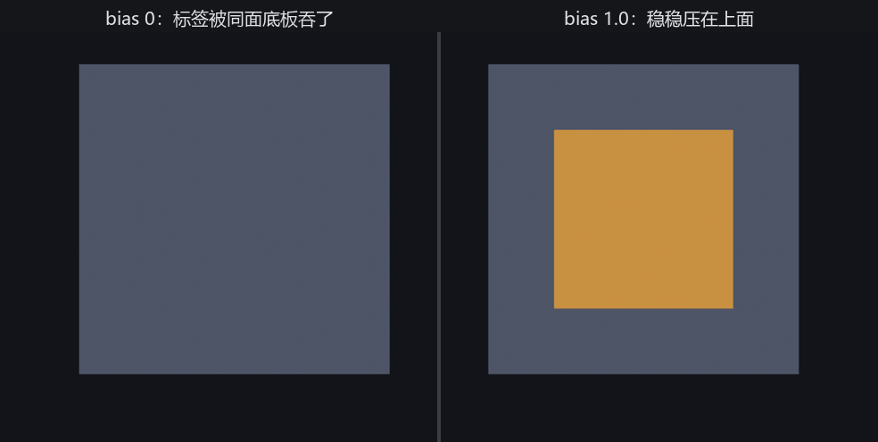

# 深度偏移：贴住同一平面

最后一根旋钮，治一个老毛病。把两片面贴在同一个平面上——给墙贴张海报、给地面铺条路、给箱子糊个标签——你会撞见两种糟心情形：要么标签被墙「吞」了（根本看不见），要么相机一动，标签和墙忽隐忽现地打架闪烁。这种闪烁有个名字：**z-fighting**（深度冲突）。

根子在**深度缓冲**（depth buffer）：渲染器靠它记下每个像素「最近的东西有多远」，来决定谁挡谁。两片面贴在同一平面上，深度几乎一模一样，缓冲区里这点差别小到分不清——于是谁该在前成了一笔糊涂账：有时这片赢、有时那片赢，逐像素、逐帧地反复横跳，就是那片斑驳的闪烁。

`depth_bias`（深度偏移）就是来断这笔糊涂账的。给一份材质一个正的 `depth_bias`，它渲染时的深度会被**往相机这边挪一点**，于是稳稳压在另一片前面（负值则往后退）。注意它只动「排序用的深度」，不真的移动物体——物体待在原地，只是在「谁挡谁」这件事上被判了个先后。

左右两块底板，各糊一张标签。左边标签 `depth_bias` 为 0，右边给到 1.0：

```rust
{{#include ../../code/ch24-pbr-materials/examples/listing-24-07.rs:depth_bias}}
```

<span class="caption">Listing 24-7：两片共面，左标签 bias 0、右标签 bias 1.0（examples/listing-24-07.rs）</span>

```console
cargo run -p ch24-pbr-materials --example listing-24-07
```

```text
小棠：左边俩贴一块儿，橙标签让底板吞了——相机一动还直打架；右边加了 depth_bias，老实压在上头。
```



<span class="caption">Figure 24-10：左板 bias 0，橙标签被同面的底板吞了；右板 bias 1.0，标签稳稳压在上面</span>

左边：标签和底板深度相等，这把糊涂账判给了底板，橙标签整个被吞、一点没露——你明明 spawn 了它，画面上却找不着。右边：标签的 `depth_bias` 是 1.0，深度被挪到底板前头，干干净净压在上面。把相机来回挪几下，你还会看见左边那张被吞的标签时不时挣出几道斑驳（z-fighting 的闪烁），右边的始终安稳。

这根旋钮就是为「共面」而生：墙上的海报、地上的路标、模型表面的贴花（decal）、UI 贴在物件上的标记——凡是两片有意贴在同一平面、又要分先后的，给在前的那片一点正 `depth_bias`。要的偏移量很小（常是个位数），太大反而会让它穿到本不该穿的东西前面去。
