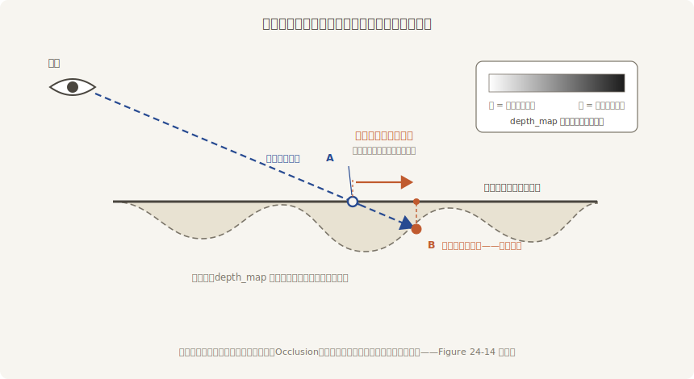
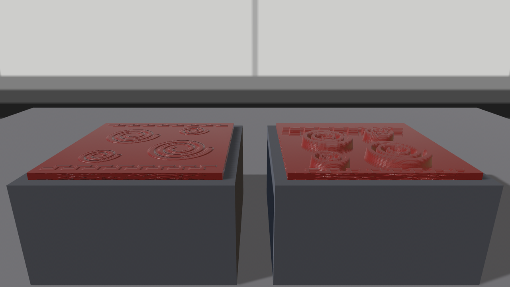
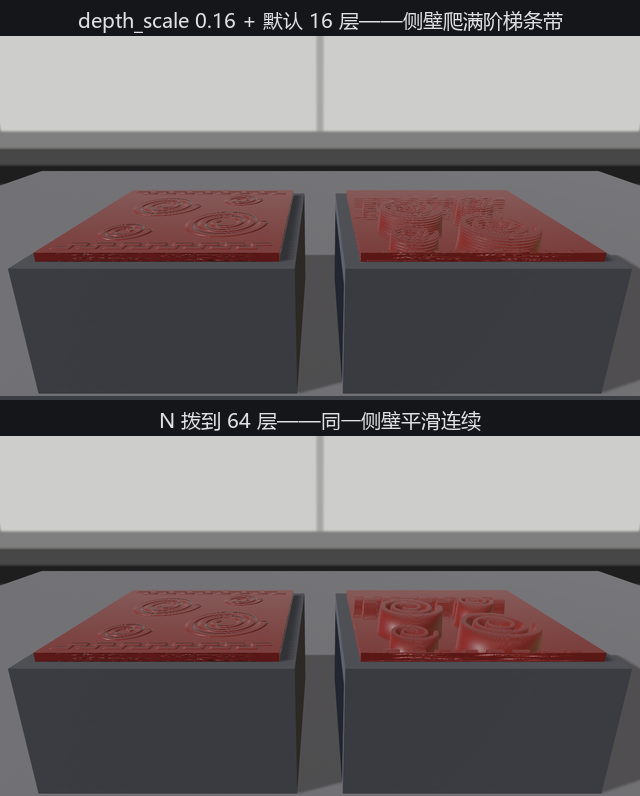

# 视差贴图：连位置一起骗

盯着 Figure 24-11 的右盖多看两眼能挑出毛病：受光是立体的，**轮廓却是平的**——斜着看，凸纹不会遮住身后的凹槽，边缘一条直线出卖了一切。法线贴图只骗了光照，没骗视线。

再进一步的手艺叫**视差贴图**（parallax mapping）：给材质一张深度图，着色器在采样前先顺着**视线**在深度场里走几步，找到视线真正“撞上”表面的那一点，用那一点的贴图坐标代替原坐标。效果是贴图内容随视角**流动**——近处的纹样挪得多、深处的挪得少，凸纹真的会遮住身后的东西：



<span class="caption">Figure 24-12：视差贴图的原理——沿视线在深度场里找真正的交点，越斜偏移越大；几何本身从头到尾没动</span>

对应四个字段，配方如下：

```rust
{{#include ../../code/ch24-materials/examples/listing-24-07.rs:parallax}}
```

<span class="caption">Listing 24-7（其一）：左盖只有法线，右盖加 depth_map——两块平躺对比（examples/listing-24-07.rs）</span>

逐个交代。`depth_map` 是灰度深度图，约定和直觉相反：**白 = 深，黑 = 凸**——我们的云纹高度场取个反就能直接用（`carve_height.png`），线性装载的规矩照旧。`parallax_depth_scale: 0.08` 是深度的幅度，单位挂在贴图上：贴图铺满 1 个世界单位时，0.08 就是 0.08 米深——默认 0.1，文档提醒超过这个量级容易露馅。这一回两块盖子**平躺**在条案上、机位压成约 20° 的斜视角：视差是“斜着看”的效果，垂直俯视时没有偏移可言（写作时先试了 7° 的掠射机位，伪影糊满一屏、纹样根本读不出来——角度是这门手艺的命门）。

```console
cargo run -p ch24-materials --example listing-24-07
```

```text
小棠：左盖只有法线，右盖加了深度图。压低了看——[ ] 拨深浅，M 换算法，N 换层数。
```



<span class="caption">Figure 24-13：法线贴图（左）与视差贴图（右）——右盖的纹样陷了进去，凸纹开始互相遮挡</span>

## 拨深了会怎样

剩下三根旋钮做成了运行时拨挡：

```rust
{{#include ../../code/ch24-materials/examples/listing-24-07.rs:dial}}
```

<span class="caption">Listing 24-7（其二）：三把运行时旋钮——[ ] 拨深浅，M 换算法，N 换层数（examples/listing-24-07.rs）</span>

按 `]` 把 `parallax_depth_scale` 拨到 0.16，右盖的侧壁立刻爬满**阶梯状条带**：

```text
小棠：刻痕加深——parallax_depth_scale = 0.16
小棠：切层数——max_parallax_layer_count = 64
```



<span class="caption">Figure 24-14：深度 0.16 时默认 16 层露出阶梯（上）；层数拨到 64 抹平（下）——层数是精度，也是每像素的采样开销</span>

条带的来源是算法本身：默认的 `ParallaxMappingMethod::Occlusion`（视差遮蔽映射）把深度切成 `max_parallax_layer_count` 层（默认 `16.0`），视线逐层试探——层数不够、刻痕太深，试探的脚印就露出来。两条修法各有价钱：`N` 键把层数拨到 64（伪影消失，采样次数翻四倍）；或 `M` 键换 `ParallaxMappingMethod::Relief { max_steps: 5 }`（浮雕映射）——先粗找再二分精修，`max_steps` 是二分的步数上限，引擎备了常量 `DEFAULT_RELIEF_MAPPING`（就是 5 步这一档）。同层数下 Relief 的边缘利落得多，字段文档还留了句经验：与其给 Occlusion 堆层数，不如换 Relief 拿更好的性价比。全场同款材质时文档也建议统一用一种算法，免得编译出两套着色器。

界限也要说破（字段文档列了三条，实测都能撞见）：视差在**平坦表面**上最靠谱，包在球、柱这种弯面上会扭曲；深度是“骗”出来的，雾、SSAO 这类按深度做的效果看到的仍是平面；**轮廓线永远是真几何的**——盖子的边缘依旧笔直，凑近了看穿帮。真要几何级的深度，等第 36 章自定义材质里的置换（displacement）思路，或者回老鲁那儿真雕。

> **速查**：法线贴图 = 骗光照，便宜，弯面直面都行；视差贴图 = 骗光照 + 骗位置，贵一档（逐像素多次采样），平面专用；两者都吃切线，都要线性装载。工程上常见的搭配是“法线常开、视差限量给主视角看得见的近景平面”——砖墙、地砖、我们这块盒盖。
