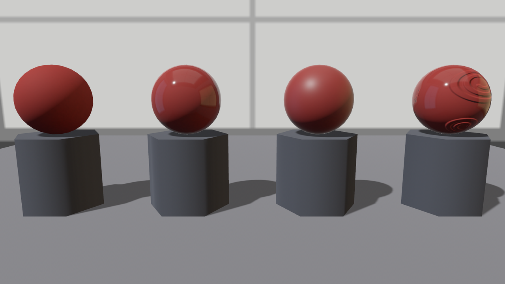

# 清漆：糙底子罩亮壳

剔红漆盒的盖面有纹了，可老雷拿起 24.5 节的盖子还是摇头：真剔红是**雕完再罩明漆**的——底下的朱漆哑着，最外层浮一层清亮的光。一个表面、两层光学性格：底层糙、面层亮。拿手头的旋钮怎么拼？粗糙度拧低，底层的哑光没了；拧高，面层的亮光没了。一根旋钮管一个表面，这是死结。

`StandardMaterial` 给这个死结留了专门的解：`clearcoat`（清漆层）。它在主材质之上叠加**第二层镜面反射**——一层无色、极薄的电介质膜，有自己独立的粗糙度。两个字段：`clearcoat` 是层的强度（0 = 没有这层，默认；1 = 足量），`clearcoat_perceptual_roughness` 是这层膜自己的粗糙度（默认 0.5，刻度与主粗糙度同一套）。三颗球把配方摆开：

```rust
{{#include ../../code/ch24-materials/examples/listing-24-08.rs:coat}}
```

<span class="caption">Listing 24-8（其一）：素身、亮清漆、哑清漆——底漆全是 0.85 的糙朱（examples/listing-24-08.rs）</span>

底漆刻意糙到 `0.85`——清漆的效果全靠这个反差撑着。跑起来：

```console
cargo run -p ch24-materials --example listing-24-08
```

```text
小棠：1号台，素身——clearcoat 0，罩面粗糙度 0.08。
小棠：2号台，亮清漆——clearcoat 1，罩面粗糙度 0.08。
小棠：3号台，哑清漆——clearcoat 1，罩面粗糙度 0.45。
小棠：4号台，雕花罩亮漆——花纹在漆膜底下，膜面自己是平的。
老雷：二号台才是剔红的相——底子糙着，光却亮得起来。
```



<span class="caption">Figure 24-15：同一款糙朱底——素身、亮清漆、哑清漆、雕花罩亮漆；二号底色的哑与罩光的亮同时成立，四号按下不表</span>

二号就是答案：底色的漫反射还是哑的（红色部分没有变亮变瓷），但表面**多出一层**锐利的高光和环境倒影——两层各记各的账。注意高光是**白**的：清漆是电介质膜，反光不沾底色（24.2 节那套物理），这正是真实车漆、漆器、上蜡水果的观感来源。右球演示第二根旋钮：膜还在（反光总量没少），只是膜面糙了，倒影摊成一团柔光。

## 膜下雕花

两层真的独立吗？拿上一节的云纹法线贴图当探针：给一颗糙朱球同时上雕花和亮清漆——如果“清漆”只是障眼法，膜面的高光就该跟着花纹起伏；如果真是两层，**花纹归底层，膜面自平**：

```rust
{{#include ../../code/ch24-materials/examples/listing-24-08.rs:carved_coat}}
```

<span class="caption">Listing 24-8（其二）：四号台——雕花底罩亮漆（examples/listing-24-08.rs）</span>

```text
小棠：4号台，雕花罩亮漆——花纹在漆膜底下，膜面自己是平的。
```

画面给了干脆的答案（Figure 24-15 右一）：云纹的起伏在红底的明暗里清清楚楚，可柔光箱的倒影**平滑地掠过**整颗球面，一丝不乱——一层灌得厚厚的透明漆把刻痕整个封了进去。这是规范行为不是巧合：按 KHR 清漆规范，主法线贴图**不作用于**清漆层；想让膜面也有自己的凹凸（漆面的划痕、桔皮纹），得用单独的 `clearcoat_normal_texture` 再喂一张。

工程口径两句话。这层膜不是免费的：`clearcoat > 0` 会让材质走一条更贵的着色路径（多算一整层镜面），全场景滥用会吃帧率——留给主角道具。另外清漆层的三张贴图字段（逐点强度 `clearcoat_texture`、膜面粗糙度 `clearcoat_roughness_texture`、刚提到的膜面法线）锁在 `pbr_multi_layer_material_textures` 这个非默认 feature 里——标量版不锁，贴图版才要开门。feature 门这回事，下一节就要正面撞上一回。
