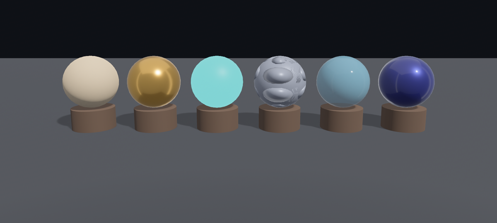

# 材质球画廊

灯也会打了（22 章），漆桶也摊开了（这一章）。最后把这一章的手艺凑成一台：小棠在得月楼支起一面**材质球画廊**——六颗一样的球，坐一样的墩、沐一样的光，只各上各的漆。

先把六样漆排开。每样都挑本章（或前两章）的一手：素胎（哑光非金属）、鎏金（金属，反周遭）、自发光、法线贴图（带切线的球）、玻璃（Blend）、车漆（clearcoat）。末位标 `true` 的那颗车漆球，待会儿能拨清漆：

```rust
{{#include ../../code/ch24-pbr-materials/src/main.rs:gallery}}
```

<span class="caption">Listing 24-8（节选一）：六样漆一字排开（src/main.rs）</span>

金属、清漆、玻璃要好看，得有个可映的世界——这就请回第 22 章的环境光照。skybox 先当普通图加载，等它就位，照第 22 章那两步装配成立方体贴图、挂到相机上：

```rust
{{#include ../../code/ch24-pbr-materials/src/main.rs:assemble}}
```

<span class="caption">Listing 24-8（节选二）：把 skybox 装配成环境光照，同第 22 章（src/main.rs）</span>

开台：

```console
cargo run -p ch24-pbr-materials
```

<figure class="bevy-demo" data-src="demos/ch24/index.html" data-ratio="1200 / 540">



<figcaption class="caption">Figure 24-11：材质球画廊——六样漆各显一手，金属/玻璃/车漆都借环境光照照出周遭。点击可在浏览器里实时运行（球自转着展示，按画面拨清漆）</figcaption>

</figure>

读这一排，正好把这一章串一遍：第一颗**素胎**，哑光非金属，没有抢眼的高光，全靠漫反射（21 章）；第二颗**鎏金**，金属度拉满、磨得光，照出了背后的影棚环境（22 章的环境光照）；第三颗**自发光**，自己亮成一团青、不靠光（24.1）；第四颗**法线贴图**，一颗球面浮起一格格铆钉，其实是张光滑的球被法线图骗出的凹凸（24.2）；第五颗**玻璃**，Blend 半透、隐约见得着背后（24.3）；第六颗**车漆**，深蓝底上罩一层清漆，环境在那层薄漆上拉出一道亮（24.4）。

## 一份代码，台上台下通跑

上面那面能转着看、点着拨的画廊，不是录屏，是这一章的 `main.rs` 当场跑出来的——只不过编到了浏览器里。和第 23 章一样，秘密在 `main` 给 `DefaultPlugins` 多带的一段 `WindowPlugin`：

```rust
{{#include ../../code/ch24-pbr-materials/src/main.rs:web_window}}
```

<span class="caption">Listing 24-8（节选三）：让同一份程序也能渲染进网页里的一块 `<canvas>`</span>

`canvas`、`fit_canvas_to_parent` 这两个字段在桌面平台**没有任何效果**——`cargo run` 的桌面窗口照旧。可一旦把这个 crate 编到 `wasm32-unknown-unknown`、用 `wasm-bindgen` 包好，它就把画面渲进网页里 `id="bevy-ch24"` 那块 `<canvas>`。桌面与网页是同一份代码，一行业务逻辑都没改。

画廊里那点交互也一样两头通跑：球各自缓缓自转（立体的东西、镜面的高光，都要转着看才看得真），按空格——网页里则是按下鼠标左键——给那颗车漆球开关清漆，亲眼看高光多一层、少一层：

```rust
{{#include ../../code/ch24-pbr-materials/src/main.rs:toggle}}
```

<span class="caption">Listing 24-8（节选四）：空格 / 点画面，开关车漆球的清漆</span>

> 把 Bevy 程序编上网页的全套流程（装 `wasm32` 目标与 `wasm-bindgen`、再跑 `scripts/build_ch24_wasm.py` 一键脚本生成产物）属于部署话题，这里点到为止。

一面画廊就齐了：六样漆，从最朴素的哑光到罩着清漆的车壳，全是 `StandardMaterial` 这一个结构体、十来根旋钮拧出来的。漆桶到此摊完——往后你看到任何一种表面，多半都能想到它是哪几根旋钮的组合。

## 小结

- **自发光**：`emissive`（类型是 `LinearRgba`、值可超过 1.0）把颜色直接加到表面上，灯灭了照旧亮，但**不照亮周遭**；`unlit` 则让材质彻底不认光、平涂 `base_color`
- **法线贴图**：`normal_map_texture` 用一张图逐像素地拐法线，把平板照得像有凹凸；务必 `is_srgb = false` 按线性图加载，且网格要有**切线**（`with_generated_tangents`）——少了切线会静悄悄渲成平板，一句警告都没有
- **透明**：`alpha_mode` 默认 `Opaque` 根本不看 alpha；`Mask` 按阈值镂空（不排序、最省），`Blend` 标准半透（玻璃），`Add` 相加提亮（发光），`Multiply` 相乘压暗（滤色）；非 Mask 的透明都要按距离排序，互相穿插时可能露馅
- **清漆与镜面**：`clearcoat`（+ `clearcoat_perceptual_roughness`）在主材质上再罩一层薄亮漆，多一道锐高光（车漆）；`reflectance` 调非金属的镜面强度（默认 0.5 ≈ 4%），`specular_tint` 给非金属反光染色
- **双面**：薄片背过身就没了，是默认 `cull_mode: Some(Face::Back)` 在剔背面；要两面都在，`double_sided: true`（翻正背面法线、受光对）配 `cull_mode: None`（背面也画），两样缺一不可
- **深度偏移**：两片共面会 z-fighting（闪烁）或互相吞没；给在前那片一点正 `depth_bias`，把它排序用的深度往相机挪、稳稳压在上面（贴花、海报、路标常用）
- 这些旋钮**只描述物理性质，画面交给光算**——这正是 PBR：换灯、换环境，材质照样成立

## 练习

1. **拨拨画廊**：把 `main.rs` 跑起来，按空格（或点画面）开关车漆球的清漆，盯着那粒锐高光的出没。再把 `Coatable` 标记加到鎏金球上，看金属配清漆是什么样。
2. **自发光配 bloom 的预演**：把自发光球的 `emissive` 通道值从 2.0 一路调到 20.0，看画面上有没有变化——你会发现没有 bloom 时，超过某个值就「亮到头」了。记住这个现象，第 26 章开了 bloom 再回来调。
3. **法线图反了**：把 Listing 24-3 右片材质的 `flip_normal_map_y` 设成 `true`，看铆钉是不是从「鼓起」变成了「凹陷」。体会这个开关治的是什么。
4. **忘了切线**：把 `main.rs` 里那颗法线贴图球的网格，从 `studded` 换成不带切线的 `ball`，跑一遍——铆钉没了、变回光球，且毫无报错。亲历一次「无声的坑」，再换回来。
5. **透明排序露馅**：把画廊里那颗玻璃球的 `Sphere::new(0.62)` 调大到 `1.2`，让它罩住邻座的球，转着看——留意透过玻璃看邻球时，有没有排序错乱的破绽。
6. **给地面贴张影子贴花**：在画廊地面上，于每只木墩正下方贴一片深色的圆 `Rectangle`（同地面共面），不加 `depth_bias` 跑一次看它怎么 z-fighting，再加上正的 `depth_bias` 把它压稳。
7. **凑一种新材质**：照着现实里一样东西（青瓷、黄铜、磨砂塑料、霓虹灯管……），只动本章这些旋钮把它调出来，加进画廊的 `gallery` 数组里。

## 下一章

画廊里那点「按住转、点一下拨」的交互，是我们自己用鼠标位移、按键一手搓出来的。可要是想**点中画面上某一颗球**——精确地知道鼠标点到的是哪个实体——这手搓的法子就不够了。下一章 `bevy_picking` 专管这件事：鼠标拾取 3D 物体、配合第 8 章的 Observer 收发点击事件；再加上 `bevy_camera_controller` 现成的自由视角相机，让你能真正地点选、拖拽、绕着场景飞。
