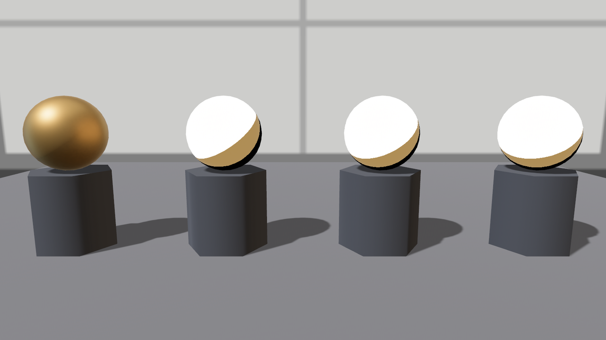
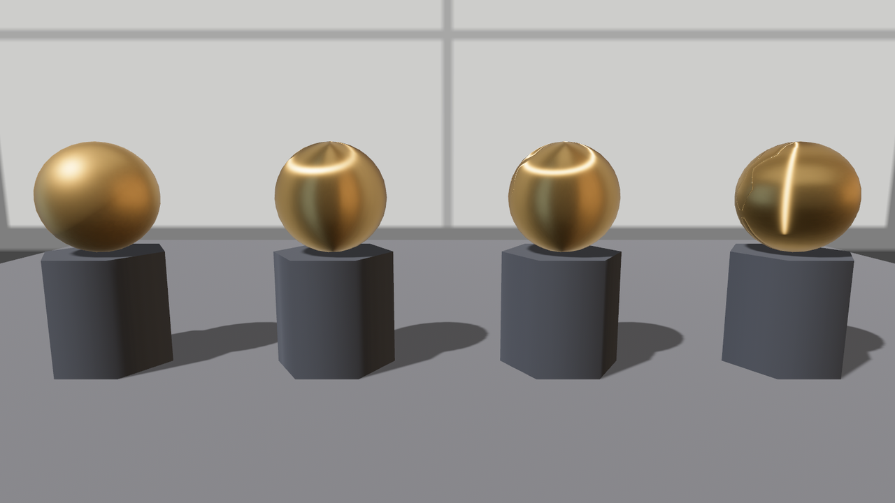

# 拉丝：把高光抻成一条线

新铸的锣坯出炉，老鲁上车床旋了一遍——锣面立刻有了“拉丝金属”的相：高光不再是一粒圆点，而是**顺着旋纹抻开的一条亮线**。物理不难想：车刀留下的万千道同向细沟，让表面沿沟的方向光滑、垂直沟的方向粗糙——粗糙度有了**方向性**。这就是各向异性（anisotropy）。

`StandardMaterial` 用两个标量描述它：`anisotropy_strength`（力度，0 = 各向同性的圆高光，1 = 抻到最开）与 `anisotropy_rotation`（丝路的方向，弧度）。方向以什么为准？又是**切线**——0 弧度 = 高光顺着贴图 u 方向抻，转多少弧度就在表面上拧多少。所以球坯照例要先 `with_generated_tangents()` 开纹。

## 先踩坑：炸白的锣

按 24.7 节末的伏笔，直接拨 `anisotropy_strength` 跑一把。本章 crate 的 `Cargo.toml` 里那段 feature 声明现在揭晓：

```toml
{{#include ../../code/ch24-materials/Cargo.toml:deps}}
```

<span class="caption">Listing 24-9（其一）：crate 把 bevy 的 pbr_anisotropy_texture 转发成自己的默认 feature（Cargo.toml）</span>

先**关掉**它跑——`--no-default-features` 模拟“不知道有这回事”的普通项目：

```console
cargo run -p ch24-materials --example listing-24-09 --no-default-features
```



<span class="caption">Figure 24-16：不开 feature 就拨 anisotropy_strength——受光面整片炸白，力度 0.6 和 1.0 炸得一模一样</span>

任何非零力度都把受光半球炸成死白，而且**各档炸得一模一样**——这不是“高光抻得太开”的物理，是二值式的坏。控制台一声不吭。翻源码能找到闭环：各向异性的完整着色器路径（读取力度与方向、装配切线坐标系）整段锁在 `pbr_anisotropy_texture` 这个 feature 门后（`vendor` 里 `bevy_pbr/src/render/pbr_fragment.wgsl` 的 `#ifdef PBR_ANISOTROPY_TEXTURE_SUPPORTED` 段），但“要不要走各向异性光照”只看 `anisotropy_strength > 0`——门没开、路却选了，灯光函数拿着没装配的数据算，画面就是这幅样子。官方 `anisotropy` 示例在清单里写着 `required-features = ["jpeg", "pbr_anisotropy_texture"]`，不是摆设。

这也是第 22 章 `area_light_luts`（RectLight 静默零输出）之后，本书第二次撞上“**旋钮在默认 feature 里，机件不在**”——症状一次是没画面，一次是坏画面，成因同一句话：拨之前查一眼这根旋钮的机件锁没锁在 feature 门后（附录 B 有全清单）。修法照 16.4 节的手法，crate 把 bevy 的 feature 转发成自己的默认 feature（上面那段 Cargo.toml），平时全绿、想复现坏样随时 `--no-default-features`。头一回开这扇门要重编 `bevy_pbr`，一两分钟，别慌。

## 再看戏：四档丝路

门开了，正身上台：

```rust
{{#include ../../code/ch24-materials/examples/listing-24-09.rs:aniso}}
```

<span class="caption">Listing 24-9（其二）：拉丝四连——力度三档，末一颗把丝路拧转 90°（examples/listing-24-09.rs）</span>

```console
cargo run -p ch24-materials --example listing-24-09
```

```text
小棠：不拉丝——anisotropy_strength 0，rotation 0.00。
小棠：半拉丝——anisotropy_strength 0.6，rotation 0.00。
小棠：全拉丝——anisotropy_strength 1，rotation 0.00。
小棠：全拉丝拧转 90°——anisotropy_strength 1，rotation 1.57。
```



<span class="caption">Figure 24-17：力度 0 → 0.6 → 1.0，高光从圆斑抻成亮带；末一颗 rotation = π/2，丝路当场转向</span>

球面上的丝路走向来自 UV 球的切线布局：u 方向顺着纬线绕，所以默认亮带贴着纬线走（锅底、黑胶唱片的相）；`rotation: FRAC_PI_2` 把它拧成经线向。真实资产里方向大多不是全局统一的常数——发丝順着头皮流、锅底绕着圆心转——那要靠 `anisotropy_texture` 逐像素给方向（红绿通道存方向、蓝通道存力度，KHR 规范格式），它就锁在我们刚开的这扇 feature 门里，贴图版与标量版**相乘**的规矩同 24.4 节。
