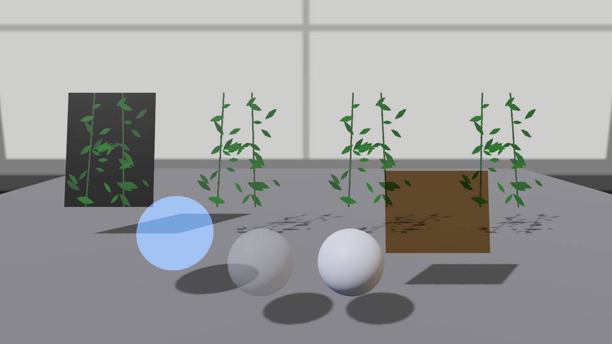

# 透明七款：alpha_mode

道具单第四件：纱幕。第 15 章的 2D 精灵天生认 alpha 通道，3D 材质却要先回答一个问题：**alpha 到底怎么用**？答案是 `alpha_mode` 字段，一个七个成员的枚举。先把“像素级抠形”的四款摆上台——同一张带 alpha 的竹影图（`bamboo_alpha.png`，枝叶不透明、余处全透），裁四幅纱幕只换这一个字段：

```rust
{{#include ../../code/ch24-materials/examples/listing-24-10.rs:curtains}}
```

<span class="caption">Listing 24-10（其一）：竹影纱四态——Opaque、Mask、Blend、AlphaToCoverage（examples/listing-24-10.rs）</span>

纱幕要两面看，所以顺手预支了 24.11 节的两个字段（`cull_mode: None` 关背面剔除、`double_sided: true` 修背面光照——到那节拆细账）。四款的脾气：

| 款 | 规则 | 相 |
|---|---|---|
| `Opaque`（默认） | alpha 一律当 1.0 | 透明处糊成实底 |
| `Mask(0.5)` | 逐像素二选一：alpha ≥ 0.5 完全实、否则完全透 | 硬剪影，边缘锯利 |
| `Blend` | 按 alpha 与身后颜色加权混合 | 软边，真半透明 |
| `AlphaToCoverage` | 把 alpha 摊给 MSAA 的采样点 | 似 Mask 而边缘抗锯齿 |

```console
cargo run -p ch24-materials --example listing-24-10
```

```text
小棠：1 号纱幕——alpha_mode::Opaque。
小棠：2 号纱幕——alpha_mode::Mask(0.5)。
小棠：3 号纱幕——alpha_mode::Blend。
小棠：4 号纱幕——alpha_mode::AlphaToCoverage。
小棠：前排左幽灵右茶镜；居中一对“同款半透明”——右边那颗怎么是实心的？
```



<span class="caption">Figure 24-18：透明全家福——四幅纱幕四种脾气，前排加法幽灵与乘法茶镜，正中的双胞胎按下不表</span>

一号幕最能纠偏直觉：**默认款无视 alpha**——贴图里明明有透明度，画面上是一整块黑底招牌（透明像素的 RGB 是黑，乘上白底色就这样）。想抠形，至少要 `Mask`。`Mask` 与 `AlphaToCoverage`（A2C）与 `Blend` 的取舍在后面“排序”一段见分晓。

`Premultiplied`（预乘 alpha）按下不表——它解决的是 Blend 贴图边缘泛边的老问题，用到再查；剩下两款脾气完全不同，它们不描述“透明的物体”，而是**光学叠加**：

```rust
{{#include ../../code/ch24-materials/examples/listing-24-10.rs:add_multiply}}
```

<span class="caption">Listing 24-10（其二）：Add 幽灵与 Multiply 茶镜（examples/listing-24-10.rs）</span>

`Add` 把自己的颜色**加**到身后画面上——黑处等于没画、亮处叠光，做幽灵、激光、能量场的路数（配 `unlit: true` 免得光照搅局；顺带一句，字段文档声称 unlit 会忽略 alpha_mode，实测这颗幽灵球好端端地在混合——以画面为准）。`Multiply` 反过来，把身后画面**乘**上自己的颜色——白处等于没画、深处压暗，就是琥珀滤光片、有色玻璃纸。Figure 24-18 里茶镜后的一切都变深了一档。

## 双胞胎悬案：为什么它不透

正中那对球才是本节的坑。两颗用的“同一款”半透明白，写法只差一处：

```rust
{{#include ../../code/ch24-materials/examples/listing-24-10.rs:trap}}
```

<span class="caption">Listing 24-10（其三）：from() 的球是幽灵，struct 字面量的球是实心（examples/listing-24-10.rs）</span>

谜底在 `From<Color>` 的实现里：**转换函数看到 alpha < 1.0 时会顺手把 `alpha_mode` 换成 `Blend`**——第 21 章以来 `materials.add(Color::srgb(...))` 这个惯用法一直在享受这项服务。而 struct 字面量绕开了转换函数，`..default()` 给的是 `Opaque`，alpha 被默认款无视（一号纱幕的旧账）。口诀：**给了半透明底色，就亲手写上 `alpha_mode: AlphaMode::Blend`**——从便捷写法换到 struct 字面量时最容易掉这一跤。

## 排序、影子与选型

`Blend` 的软边不是白拿的。半透明物体不写深度，引擎得把它们**按距离排序**后从远到近画——物体一多排序有开销，交叉重叠时还可能排错（两片互相穿插的纱幕没有正确顺序可言）。`Mask` 和 `A2C` 走的是不透明管线，不排序、不怕交叉，代价是没有“半透”只有“全透/全实”。所以工程口径：**大批量的植被、栅栏、镂空用 Mask 或 A2C（开着 MSAA 时后者边缘更体面），少量真正需要半透的（纱、烟、幽灵）才用 Blend**。A2C 还有一条脚注：MSAA 关闭时它自动退化成 `Mask(0.5)`。

影子是另一本账。Figure 24-18 里可以对答案：Mask、A2C、Blend 三幅纱幕投下的都是**叶形影**（影子按 alpha 抠形），Opaque 幕投整块方影——这些都合直觉；出乎直觉的是 Add 幽灵和 Multiply 茶镜，它们在画面上“透”，影子却是**实心**的。光学叠加模式只管怎么往画面上混色，阴影贴图那套（22.6 节）根本不认识它们。幽灵不该有影子？给实体挂 `NotShadowCaster`（22.6 节的老朋友）。
