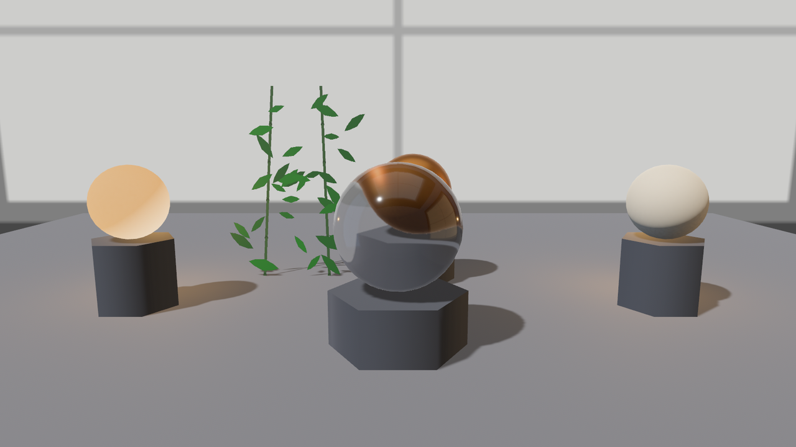
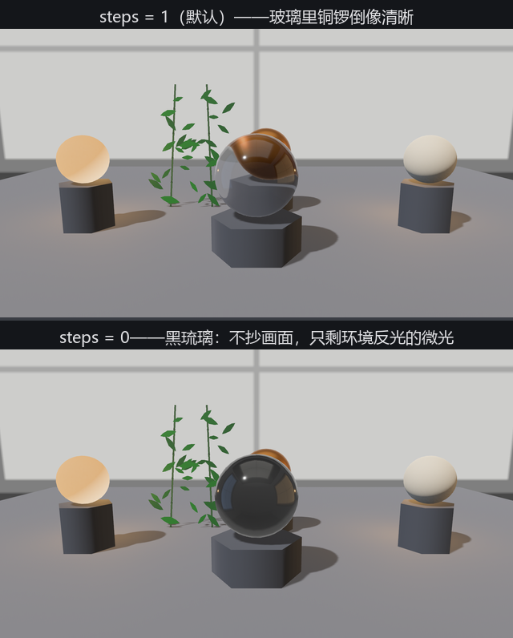

# 琉璃盏：让光穿过去

压轴道具：琉璃盏。`Blend` 做不出玻璃——它只是把两层颜色掺在一起，而真玻璃会**弯折**穿过它的光：盏后的东西透出来是变形的、倒立的、随视角流动的。账单上的第四路（透射）分两条道走，价钱差一个量级。

## 便宜的那条：diffuse_transmission

`diffuse_transmission`（漫透射，默认 0.0）描述**薄而不透亮**的材质：纸、树叶、瓷、蜡。光从背面进来、在材质里散乱、从正面糊成一团柔光出去——没有成像、没有折射，实现上只是给光照模型加一个反向的漫反射瓣，几乎不要钱。0 = 不透，1 = 全透；超过 0.5 时背光面会比受光面还亮（逆光的树叶就是这个相）。

对照实验是一对灯笼，各自身后藏一盏点光：

```rust
{{#include ../../code/ch24-materials/examples/listing-24-11.rs:lantern}}
```

<span class="caption">Listing 24-11（其一）：纸灯笼（0.9）与瓷灯笼（0.0）——灯都在身后（examples/listing-24-11.rs）</span>

```text
小棠：纸灯笼——diffuse_transmission 0.9，灯在它身后。
小棠：瓷灯笼——diffuse_transmission 0，灯在它身后。
```

Figure 24-19 左右两端就是它俩：纸灯笼整面朝镜头的一侧洇着暖光——那是**从背后穿过来的**；瓷灯笼只有轮廓边缘沾光，正面黑着。一根旋钮，纸和瓷分了家。这条道再记两笔小账：想让透射面接住影子（叶影投在纸窗背面透过来），给实体挂 `TransmittedShadowReceiver` 组件；漫透射材质在 deferred 管线下走不通，引擎会在 `opaque_render_method` 留默认 `Auto` 时悄悄替它改走 forward（这几个词第 37 章展开，现在只需知道有这笔帐）。

## 贵的那条：specular_transmission

`specular_transmission`（镜面透射，默认 0.0）才是玻璃：光**成像地**穿过去，带折射、带变形。配方四件套：

```rust
{{#include ../../code/ch24-materials/examples/listing-24-11.rs:glass}}
```

<span class="caption">Listing 24-11（其二）：琉璃盏本盏（examples/listing-24-11.rs）</span>

逐个交代。`specular_transmission: 1.0`：光全走透射（0.5 就是半透玻璃）。`thickness: 0.36`：材质身后的“玻璃体厚度”，0（默认）表示无限薄的膜——穿过去不弯折；给了厚度才有透镜感。取 0.36 约是球半径 0.45 的八成，写作时对着画面定的。`ior: 1.52`：折射率，窗玻璃的标准值——字段文档里带着一整张材质对照表（水 1.33、钻石 2.42……），照抄就行。`perceptual_roughness: 0.05`：透射也吃粗糙度，拧高就是磨砂玻璃。

```console
cargo run -p ch24-materials --example listing-24-11
```

```text
小棠：琉璃盏当中坐，I 拨折射率，T 拨厚度，R 拨磨砂，S 拨底片步数。
```



<span class="caption">Figure 24-19：琉璃盏——镜中景象倒挂（球形透镜的本分）；注意竹影纱在镜内消失了，这不是 bug，是绘制顺序</span>

盏中景象**上下颠倒**——球形厚透镜的光学本分，`ior` 越高挤压越凶（按 I 逐档试：1.0 空气 = 不弯直透，2.42 钻石 = 边缘几乎成镜）。按 T 把 `thickness` 拨回 0，倒像立刻还原成平移的直透——厚度才是“弯”的来源。

## 底片、隐形与账单

这条道为什么贵？折射要“看到身后”，而 GPU 画到玻璃时身后的像素早画完了——引擎的办法是把**已画好的不透明画面抄一份当底片**（屏幕空间透射），玻璃着色时按折射方向去底片上取样。管这份底片的是相机上的 `ScreenSpaceTransmission` 组件（`Camera3d` 自带默认值）：`steps: 1` 是抄底片的次数——1 次就够单层玻璃用；玻璃后面还有玻璃就要加步数（每步多一次全屏拷贝，字段文档特意标了“慎用”）；**拨到 0 则完全不抄**，只拿环境光照凑合折射。`quality` 管磨砂玻璃模糊的档次（Low 到 Ultra，默认 Medium）。启动时就把 `steps` 定妥——实测运行中拨到 0，镜里会冻着最后一份旧底片。

```text
老烛：底片 steps = 0（0 = 不抄画面，只折环境图）
```



<span class="caption">Figure 24-20：steps = 1（上）与 0（下）——不抄底片，玻璃就没戏可演</span>

底片机制还解释了 Figure 24-19 里的怪事：**竹影纱（Blend）在玻璃里隐形**。底片抄的是不透明画面，而透射 pass 排在透明 pass **之前**——所有 `Blend`、`Add`、`Multiply` 的东西那时还没上台，自然不在底片里（纱的**影子**倒是透得过去，影子画在不透明的地板上）。字段文档把这条列为明账：隔着玻璃要看的东西，别用混合系的 alpha_mode。

最后一组旋钮管**有色玻璃**：`attenuation_color`（穿行途中光被染成什么色）与 `attenuation_distance`（走多远染够一整份，默认无穷 = 不染）。它们描述的是“光在介质里走得越深颜色越浓”——薄处浅、厚处深，比直接染 `base_color` 高级一档。两个字段要和 `thickness` 配着才生效（没有厚度就没有“途中”）。留作本章练习。透光这一族也有自己的贴图版字段（逐点厚度、逐点透射率），锁在 `pbr_transmission_textures` feature 门后——第三扇门，规矩同前两扇。
