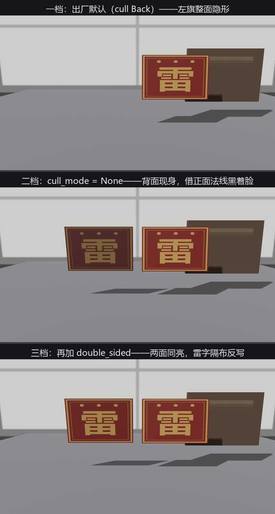
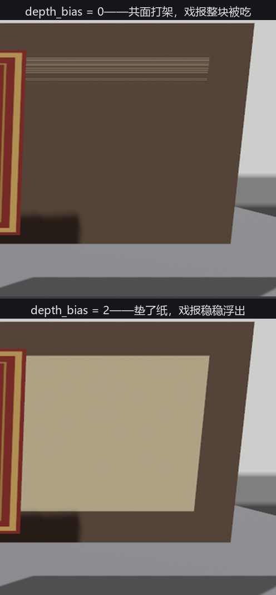

# 双面旗与贴脸戏报

这一节两个开关都不改质感，改的是**几何规则**：面片的背面画不画、共面的两张皮谁贴谁上面。素材一杆双旗、一张戏报。

## 旗的三档

21.5 节转到旗子背面时它凭空消失过一回——当时说这是**背面剔除**（backface culling）：GPU 默认跳过背对镜头的三角形，实心物体的内壁反正看不见，剔了白赚一半。可旗、纱、树叶是**单层面片**，背面是要见人的。这归 `StandardMaterial` 的两个字段管，一杆双旗把三档拨给你看——右旗正对镜头，左旗拧了 180°、拿背面朝你：

```rust
{{#include ../../code/ch24-materials/examples/listing-24-12.rs:flags}}
```

<span class="caption">Listing 24-12（其一）：一杆双旗共用一份材质（examples/listing-24-12.rs）</span>

```rust
{{#include ../../code/ch24-materials/examples/listing-24-12.rs:flip}}
```

<span class="caption">Listing 24-12（其二）：F 键三档——默认、关剔除、关剔除加双面（examples/listing-24-12.rs）</span>

```console
cargo run -p ch24-materials --example listing-24-12
```

```text
小棠：正面旗挂好。
小棠：背面旗挂好。
老雷：左边的旗呢？！——按 F 拨旗的三档，按 B 给戏报垫纸。
小棠：二档，cull_mode = None——背面画出来了，可它借的是正面的法线，黑着脸。
小棠：三档，再加 double_sided——着色器替背面把法线翻个身，两面都受光。
```



<span class="caption">Figure 24-21：旗的三档——隐形（默认剔除）、黑脸（画了背面、借正面法线）、受光（double_sided 翻法线）</span>

三档拆开看。**一档**是默认值 `cull_mode: Some(Face::Back)`：背面剔除，左旗整面隐形——注意它连**影子**都没有（阴影贴图那一趟同样剔背面）。哪面算“背”由顶点的绕向定：镜头看去逆时针排列的是正面——这是铸模时定的，21.4 节手搓坯子时我们亲手排过这个顺序。**二档** `cull_mode: None`：两面都画（还有个 `Some(Face::Front)` 剔正面，做天空盒内壁那类“只看里面”的活）。左旗现身了，却黑着脸——它**借的是正面的法线**，那根法线朝着背离镜头的方向，灯光算下来自然背光。**三档**再加 `double_sided: true`：着色器发现在画背面时，把法线当场翻转——两面各自受光，这才是一杆能看的旗。雷字左右反写不是 bug：你看的就是旗布的透面。

两个字段是搭档不是绑定：`double_sided` 只翻法线、**不管剔除**（字段文档原话）——单开它而不开 `cull_mode: None`，背面根本没画，翻了也白翻。做纱幕、树叶、旗帜，两个一起开（24.9 节的纱幕已经这么干了）。

## 共面打架：depth_bias

戏报贴上告示板。纸没有厚度，建模的本能就是让报纸的面片与板面**共面**——灾难由此而来：

```rust
{{#include ../../code/ch24-materials/examples/listing-24-12.rs:poster}}
```

<span class="caption">Listing 24-12（其三）：戏报与板面共面——z 相同，谁在上面？（examples/listing-24-12.rs）</span>

两个面片每个像素的深度值一模一样，深度测试没有裁决依据，谁赢全看浮点误差和绘制顺序的脸色——这叫 **z-fighting**（深度打架）。实测它有两副面孔：这块告示板上，戏报**几乎整块被吃**、只在纸边残一线花斑；写作时先试过铺在地板上的版本，赢家逐像素乱跳，远端一大片**条纹花斑**。共同点是不可靠：搬个家、换个网格、动一下机位，胜负就可能翻盘。

`depth_bias` 是给这场架的裁决书：**正值把这份材质在深度上拉向镜头**——不动几何，只改深度测试用的数。按 B 给戏报垫上：

```text
小棠：depth_bias = 2——垫了纸，戏报稳稳浮在台面上。
```



<span class="caption">Figure 24-22：共面的戏报几乎整块被吃、纸边残一线花斑（上）；depth_bias = 2 一锤定音（下）</span>

取值的口径：这个数走的是图形 API 的常数深度偏移（取整数），**从 1、2 这样的小值起步**，够用就停——实测同一个 2 在 2.4 米处干脆利落，挪远到 3 米出头就赢不了（深度精度随距离变化，没有万能常数）。它也有副作用的另一面：负值把材质**推离**镜头，偶尔用来强制某些东西垫底。而所有“贴花”类需求（弹孔、血迹、路面标线）终究有专门的正解——decal，第 26 章附近路过时提一句；手头这种一两张纸的场合，`depth_bias` 就是最短的路。
