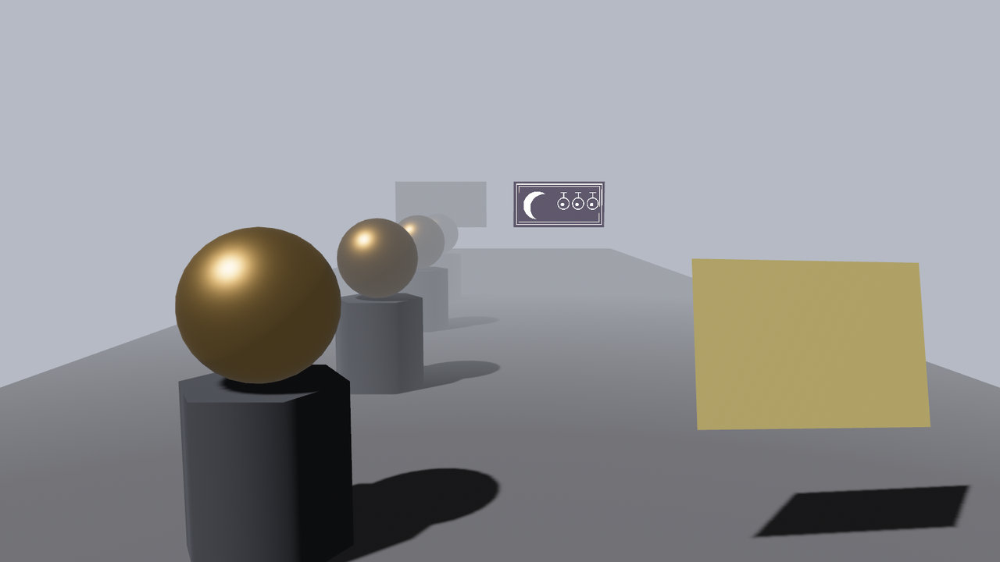
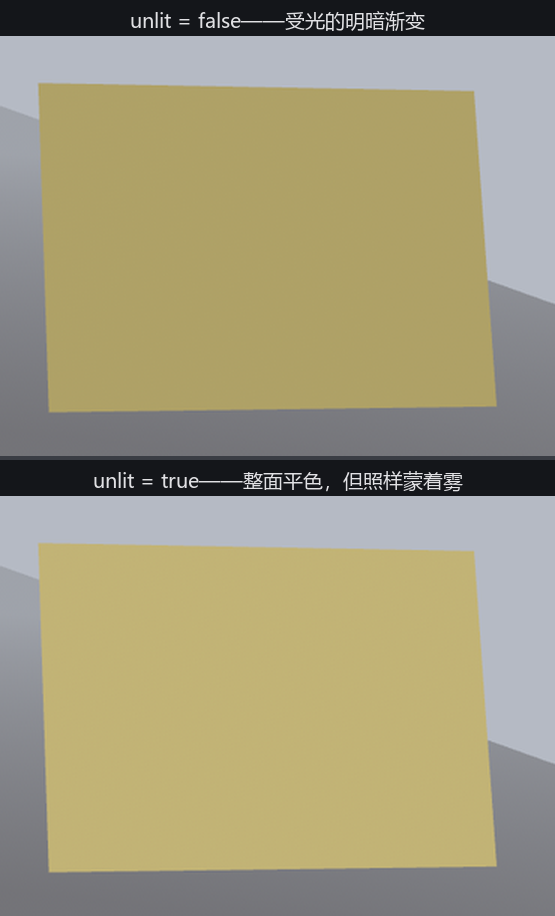

# 不吃光的与不吃雾的

最后两个开关是“豁免权”：`unlit` 豁免光照，`fog_enabled = false` 豁免雾。为了演示后者，先得有雾——顺手把距离雾支起来，它同属 `bevy_pbr` 的地界。

## 晨雾进棚

`DistanceFog` 是挂在**相机**上的组件（谁挂谁看得见雾，和 22 章的环境光照一个道理）：

```rust
{{#include ../../code/ch24-materials/examples/listing-24-13.rs:setup}}
```

<span class="caption">Listing 24-13（其一）：DistanceFog + 一列退进雾里的金球（examples/listing-24-13.rs）</span>

字段过一遍：`color` 是雾色——把 `ClearColor` 调成同一个灰蓝，远处的物体才能“化”进背景里不穿帮。这也是本节不挂影棚墙的原因：`DistanceFog` 只罩**网格**，Skybox 一点雾都不吃——留着墙就会看见展品沉进雾里、背景墙却清清楚楚，当场穿帮；要连天带地一起起雾，得请 22.10 节的大气散射。`falloff` 选了最好讲的 `FogFalloff::Linear { start: 5.0, end: 13.0 }`：5 米内清清楚楚，13 米开外全吞——两个数就是为那列 3、6、9、12 米的金球量的尺寸。另有指数、大气两族衰减模式，参数难拿捏，枚举文档里备着 `from_visibility()` 一类换算函数，用到再查。`directional_light_color` 能让雾在顺着太阳的方向泛出光晕（配套的 `directional_light_exponent` 管光晕收得多紧）——今天用不上，留默认。

## 两块灯箱，一块不吃雾

雾线之外（离机位约 15 米——按 Linear{5, 13} 的尺子早该整块吞掉）挂两块 24.3 节的自发光灯箱，配方只差一行：

```rust
{{#include ../../code/ch24-materials/examples/listing-24-13.rs:signs}}
```

<span class="caption">Listing 24-13（其二）：同款灯箱，右边那块 fog_enabled = false（examples/listing-24-13.rs）</span>

```console
cargo run -p ch24-materials --example listing-24-13
```

```text
小棠：雾最深处两块灯箱——左边老实吃雾，右边那块不吃。G 键让它也进雾。
老烛：晨雾放好了。U 拨提词板的 unlit——看它还认不认我这盏灯。
```



<span class="caption">Figure 24-23：Linear{5, 13} 的晨雾——金球逐级没入；同在雾线外约 15 米，吃雾的灯箱被吞得几乎不剩，不吃雾的独自扎眼</span>

`fog_enabled` 默认 `true`——雾是按深度统一罩下来的，材质不用做任何事。拨成 `false` 的那块灯箱**从雾里豁免**：像素照原样输出，仿佛雾不存在。这份豁免权的正经用途都在“信息层”：准星、路标、任务目标的轮廓光——玩家在浓雾里也必须看见的东西。按 G 把右边那块拨回 `true`，两块一起沉进雾里，画面顿时“谁也不欠谁”。

## unlit：只出底色

`unlit: true` 更彻底：**跳过整个光照计算**，直接输出 `base_color`（乘上贴图）。台口的提词板按 U 对比：

```text
小棠：unlit = true。
```



<span class="caption">Figure 24-24：unlit 前后——光影渐变消失、只剩平色；注意它照样吃雾</span>

拨上之后光影渐变消失，只剩一片平色——灯、影子、环境光照从此与它无关。用途两路：**风格化**（卡通、像素风里“光照是画出来的”）与**信息元素**（调试标记、全息投影——24.9 节的 Add 幽灵就配了它）。两笔实测账划清边界：unlit **不豁免雾**（Figure 24-24 下联的板子照样蒙着灰——想全豁免得 unlit 加 `fog_enabled: false` 一起上）；unlit 也**不豁免 alpha_mode**（幽灵球照常混合——字段文档那句“忽略 alpha mode”与实测不符，以画面为准）。
