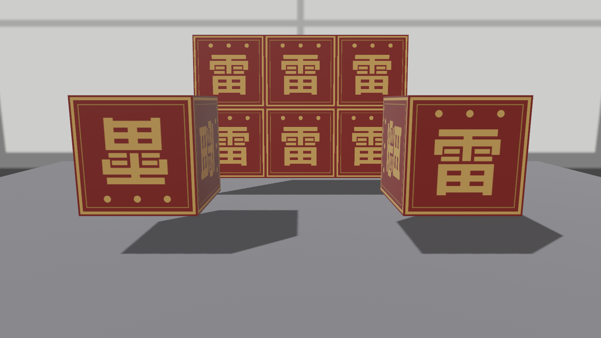

# UV 的手脚与没拨的旋钮

## 倒旗疑案，材质侧结案

21.3 节的悬案该销了：`Cuboid` 正面的雷字是倒的，当时的结论是“UV 是铸模定的，想改自己凿坯子”。现在有了材质侧的第二条路——`uv_transform`：一个 `Affine2`（二维仿射变换），在**采样之前**先对 UV 做手脚。坯子一根手指都不用动：

```rust
{{#include ../../code/ch24-materials/examples/listing-24-14.rs:flip}}
```

<span class="caption">Listing 24-14（其一）：FLIP_VERTICAL——不动坯子，动材质（examples/listing-24-14.rs）</span>

`StandardMaterial` 给 UV 备了两个现成常量（`FLIP_HORIZONTAL`/`FLIP_VERTICAL`）和 `flip(horizontal, vertical)`/`flipped(...)` 两个方法做组合；旁边还躺着 `FLIP_X`/`FLIP_Y`/`FLIP_Z` 三个 3D 常量——那是 `Affine3`，喂不进 `uv_transform`，给三维纹理坐标预备的，别拿错。要注意它对**整份材质**生效：箱子六个面的 UV 全翻了个身——正面正过来的代价是顶面倒了过去（这个机位看不见，但心里要有数）。修一面、不动其余，还是得回老鲁那儿动 UV 本身。

## 铺瓦

`uv_transform` 更常干的活是**平铺**：把 UV 放大 N 倍，让一张小图在大面上重复。光放大还不够——UV 出了 0..1，取样按什么规矩“兜回来”归**采样器**（sampler）管，而默认采样器是 clamp（贴边拉伸）。用 14 章的 `load_builder` 换成 Repeat：

```rust
{{#include ../../code/ch24-materials/examples/listing-24-14.rs:tile}}
```

<span class="caption">Listing 24-14（其二）：Affine2 放大 3×2 + Repeat 采样器（examples/listing-24-14.rs）</span>

```console
cargo run -p ch24-materials --example listing-24-14
```

```text
小棠：左箱原样——雷字倒着；右箱 FLIP_VERTICAL——不动坯子，字正了。
小棠：后墙铺了一面 3×2 的旗瓦——UV 放大三倍，出界的部分靠 Repeat 采样兜回来。
```



<span class="caption">Figure 24-25：FLIP_VERTICAL 销了 21 章的倒旗案；后墙的瓦由 Affine2 缩放加 Repeat 采样器铺成</span>

留意代码里的路径是 `banner_tile.png`——同一张图的第二份拷贝。这不是手滑：左右两箱已经按**默认** settings 装载过 `banner.png`，而 23.5 节立过的规矩这里原样应验——**一条路径只认一套 loader settings**。写作时第一版就是直接 load 同一个 `banner.png`，Repeat 采样器没生效，墙上只有一格旗、余下全是拉伸的贴边。两种开法，两个路径。

顺带把“每张贴图都有的小尾巴”交代了：`base_color_channel`、`normal_map_channel` 这些 `UvChannel` 字段管**用哪一套 UV**——网格可以携带第二套贴图坐标（`ATTRIBUTE_UV_1`，`UvChannel::Uv1` 选它），常见于光照贴图或“细节纹理”与主纹理各铺各的场合。默认 `Uv0`，不用不看。

## 没拨的旋钮清单

整罐漆倒到这里，还剩几根旋钮属于别的章的地界，一句话备案，免得你在文档里撞见时没数：

| 字段 | 一句话 | 去处 |
|---|---|---|
| `lightmap_exposure` | 烘焙光照贴图（`Lightmap` 组件）的亮度换算 | 烘焙工作流本书不专章，见官方 `lightmaps` 示例 |
| `opaque_render_method` | 不透明部分走 forward 还是 deferred 管线 | 第 37 章渲染架构 |
| `deferred_lighting_pass_id` | deferred 路径选灯光 pass 用的编号 | 同上 |
| `specular_texture` / `specular_tint_texture` | 反光度/高光色的贴图版 | 锁在 `pbr_specular_textures` feature |
| 透光三贴图 / 清漆三贴图 / 各向异性贴图 | 对应标量的贴图版 | 各自的 feature 门（24.7、24.8、24.10 节点过名） |

至此 `StandardMaterial` 的每一行账都有了着落。收摊，画廊开张。
