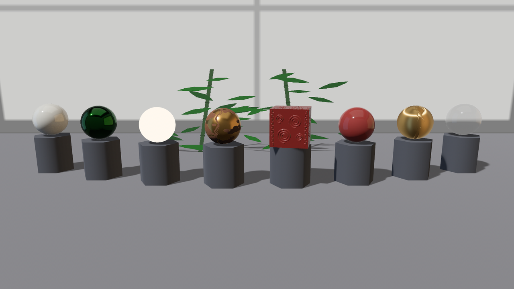

# 画廊开张

全章合龙。《琉璃记》的道具单逐件交货，八件展品沿浅弧排开，配上数字键巡展、拖动转台、展品自转——这就是本章 crate 的 `main.rs`（Listing 24-15），照例分段过。

```rust
{{#include ../../code/ch24-materials/src/main.rs:exhibits}}
```

<span class="caption">Listing 24-15（其一）：八件展品即八份配方——每份都是本章某一节的成品（src/main.rs）</span>

这段最值得读的是**配方本身**：白瓷（24.2 的 reflectance 顶档）、黑釉石绿（24.2 的染色高光）、灯箱球（24.3 的 40 尼特）、锈锣（24.4 的 ORM 全家）、雕花漆盖（24.5 + 24.6 的法线加视差）、剔红（24.7 的清漆）、拉丝金（24.8）、琉璃盏（24.10）。工程细节两处：所有球坯出自同一份**开过纹**的网格——法线、视差、拉丝三件都吃切线，其余展品带着切线也不碍事；八份配方装在一个数组里循环生成，位置沿一条浅弧收拢（`z = -0.045x²`），端头的展品稍微朝里，全景机位一眼收齐。

```rust
{{#include ../../code/ch24-materials/src/main.rs:tour}}
```

<span class="caption">Listing 24-15（其二）：数字键巡展与展品自转（src/main.rs）</span>

巡展的实现薄得很：数字键只改 `Tour` 里的“当前展位”，真正动镜头的还是那套转台系统——圆心与半径换成当前展品的，拖动照旧。`spin_exhibits` 让每件展品以 0.35 弧度/秒自转：**高光、拉丝、视差全是视角的函数**，转起来才活。

```console
cargo run -p ch24-materials
```

```text
老雷：《琉璃记》验货——数字键 1~8 逐件看，0 退回全景，左键拖着转。
小棠：7 号台《拉丝金》——anisotropy_strength 1.0——高光拉成纬线。
小棠：8 号台《琉璃盏》——specular_transmission 1.0，ior 1.52，thickness 0.36。
老雷：退回全景——八件齐活，这单货我认。
```

<figure class="bevy-demo" data-src="demos/ch24/index.html">
  
  <figcaption><span class="caption">Figure 24-26：《琉璃记》验货现场。读的是网页版就别只看剧照：点击画面入场——数字键 1~8 逐件上前，0 退回全景，左键拖着转台看高光流动。一句实话：浏览器（WebGL2）没有 compute，引擎会自动停掉环境图的现场滤波——网页里金属与清漆的映照比上面这张桌面剧照素一些，主灯高光、玻璃折射、拉丝亮带照常</span></figcaption>
</figure>

按 8 凑近琉璃盏，倒挂的地平线随拖动流转；按 7 看拉丝金的亮带绕着球脊走——这两件是静态截图亏欠最多的展品，务必亲手转一转。

## 小结

整罐漆的账本：

- **一束光四路去向**：漫反射（`base_color`）、镜面（`metallic`/`perceptual_roughness`/`reflectance`/`specular_tint`）、自发光（`emissive`，尼特计价、不照亮邻居、默认不过曝光的秤）、透射（`diffuse_transmission` 便宜糊光，`specular_transmission` 贵价成像）
- **贴图接管标量**：一律相乘——底色默认白（无损），金属度默认 0（全灭，标量拨 1 让贴图说话）；ORM 三通道一张图三份工；数据图一律 `is_srgb = false` 线性装载
- **切线三客户**：法线贴图、视差、各向异性都在 TBN 坐标系干活——图元坯子不带切线，`with_generated_tangents()` 开纹（要 UV，缺了当场 `MissingVertexAttribute` 给你看）；法线贴图缺切线是**静默死平**
- **feature 门**：各向异性的机件整段锁在 `pbr_anisotropy_texture` 里——门没开就拨旋钮，受光面炸白；透光贴图、清漆贴图、高光贴图各有各的门（附录 B）
- **透明是七款不是一款**：Mask/A2C 走不透明管线扛量，Blend 排序脆弱留给真半透，Add/Multiply 是光学叠加还投实心影；半透明底色配 struct 字面量**不会**自动 Blend
- **几何规则组**：`cull_mode` 管画不画背面、`double_sided` 管背面法线翻不翻（搭档不绑定）；共面必打架，`depth_bias` 小值起步一锤定音
- **豁免权**：`unlit` 免光照（不免雾、不免 alpha_mode），`fog_enabled: false` 免雾——信息层元素的标配
- **UV 手脚**：`uv_transform` 翻面、平铺（配 Repeat 采样器）；同路径只认一套 loader settings，两种开法两个路径

## 练习

1. **湿地板**：把样品间的台面改成“雨后”——`perceptual_roughness` 拨低、`reflectance` 拨到 1.0，看展台的倒影浮出来。再想想：为什么真实雨地的倒影只在低角度明显？（提示：菲涅耳——24.2 节的 F0 只是垂直入射时的反射率，掠射角下会飙到接近 100%。）
2. **青琉璃**：给琉璃盏配上 `attenuation_color` 石青与 `attenuation_distance: 0.5`，对比 `thickness` 0.1 与 0.8 的颜色深浅——验证 24.10 节末“厚处染得深”的说法。
3. **锈上无丝**：给 24.8 节的拉丝金加上 24.4 节的 ORM 贴图（`metallic_roughness_texture`），观察锈斑处的拉丝高光怎么变。先押注：锈斑是糙面，亮带经过时会怎样？
4. **双面出错**：24.9 节的纱幕如果只写 `double_sided: true`、不写 `cull_mode: None`，画面会怎样？先推理（24.11 节的“搭档不绑定”），再实测。
5. **一格准星**：用本章的旋钮组合出一个“永远看得见”的 3D 准星材质：不受光、不吃雾、隔墙也不被挡（提示：最后一条用哪个字段把深度“作弊”到最前？它的负值和正值谁是你要的？）。

## 下一章

画廊里的展品还只能远看。点一下就能拿起来端详、拖着满台走、镜头凑上去围着看——选中与拾取是 `bevy_picking` 的地界，现成的相机控制器住在 `bevy_camera_controller`。下一章：Picking 与相机控制。
