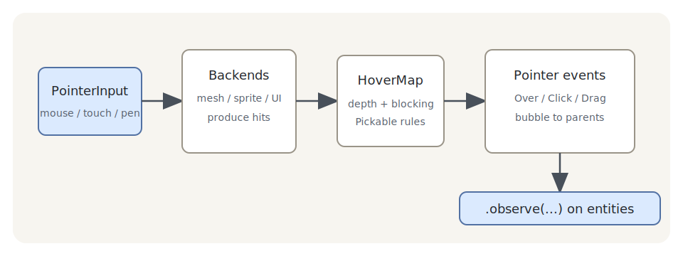

# Picking 与相机控制

第 24 章收摊时，《琉璃记》的八件货在画廊里只能远看。这一章让客人上手：指到哪件哪件亮、点一下报名字、按住拖走、装进货箱——这些交互背后是同一套机制，**picking（拾取）**：判断指针此刻落在哪个实体上，并把这件事变成实体身上的事件。它住在 `bevy_picking`。章末再配两台现成的相机脚架——`bevy_camera_controller` 的 FreeCamera 与 PanCamera，镜头也能凑上去围着看。

「点哪儿」这件事，第 17 章其实已经办过一半：`cursor_position()` 拿窗口坐标，`viewport_to_world_2d` 反算世界坐标，令旗插在哪儿阿燕跑到哪儿。但那套三步走回答的是「点中了世界里的**哪个位置**」，本章要回答的是「点中了**哪个实体**」——这一字之差，多出一整层学问：

- **命中检测**：光标底下可能是琉璃盏的球面、鎏金锣的环带，也可能正好从锣的中孔穿过去落在台面上。得沿着视线真正地打一条射线，跟每件货的几何体算交点；
- **遮挡**：纱幕挡在锣前面，点一下算谁的？答案不该总是「最近的」——纱幕是布景，不该抢戏；
- **事件语义**：「点了一下」在交互里从来不是一个事件，而是一族——按下、抬起、成交、双击、拖起、拖动、拖放……每一个都有自己的名分和时序。

`bevy_picking` 把这三层都包了。你在第 8 章练熟的 observer 在这里终于迎来主场——每件货挂上自己的观察者，指针事件直接送上门；第 8 章末尾预告过的**事件冒泡**也在本章见真章：账单沿着第 9 章的父子链一路向上，直到窗口实体兜底。

## 拾取是一条流水线

动手之前先看一眼全局。拾取管线分四段，每段只管一件事：

Figure 25-1：拾取流水线——指针归拢输入，后端各自报命中，悬停裁决谁被指着，事件派发到实体门上

- **指针（pointer）**：把鼠标、触摸、手写笔归拢成统一的「指针」抽象，每帧更新它落在屏幕的哪一点。你甚至可以自造一枚由手柄驱动的虚拟指针；
- **后端（backend）**：真正做命中检测的车间。**mesh 后端**朝 3D 场景放射线，**sprite 后端**查 2D 图片的像素，**UI 后端**走界面节点的排版账——三家可以同时开工，各自把「指针打到了谁、多深」报上去；
- **悬停（hover）**：把各家报来的命中按深度排序、按遮挡规则裁决，得出「此刻指针真正悬停在谁身上」的权威名单；
- **事件（events）**：拿悬停名单的逐帧变化，加上按键状态，翻译成一族高层事件——`Over`、`Click`、`Drag`……并派发到目标实体身上，一路冒泡。

这条流水线整个跑在 `PreUpdate`（第 6 章的调度地图上、你的游戏逻辑之前）——所以在 `Update` 里看到的世界，永远是「本帧拾取已处理完」的世界。

四段里你日常打交道的只有两头：给实体挂事件观察者（末段），偶尔调一调 `Pickable` 组件改遮挡规矩（中段）。中间的脏活引擎全包。

## 本章路线

前九节全在 3D 画廊里：第一次点中（25.1）、悬停一族（25.2-25.3）、按压与连击（25.4）、冒泡见真章（25.5）、`Pickable` 的四种规矩（25.6）、拖拽与拖放（25.7-25.8）、亲手放射线（25.9）。然后移师 2D 与 UI，看另外两个后端的地方规矩（25.10-25.11）。末了配脚架：FreeCamera 在画廊里飞（25.12）、PanCamera 巡 2D 长街（25.13），收场戏《上手验货》把全部交互装进一台由指针事件驱动的转台相机里（25.14）。

> 本章示例在 `code/ch25-picking` 下。它的 `Cargo.toml` 里有一段 feature 声明是给两台相机脚架开门用的，25.12 节会讲它为什么存在、不开门会撞上什么报错。
