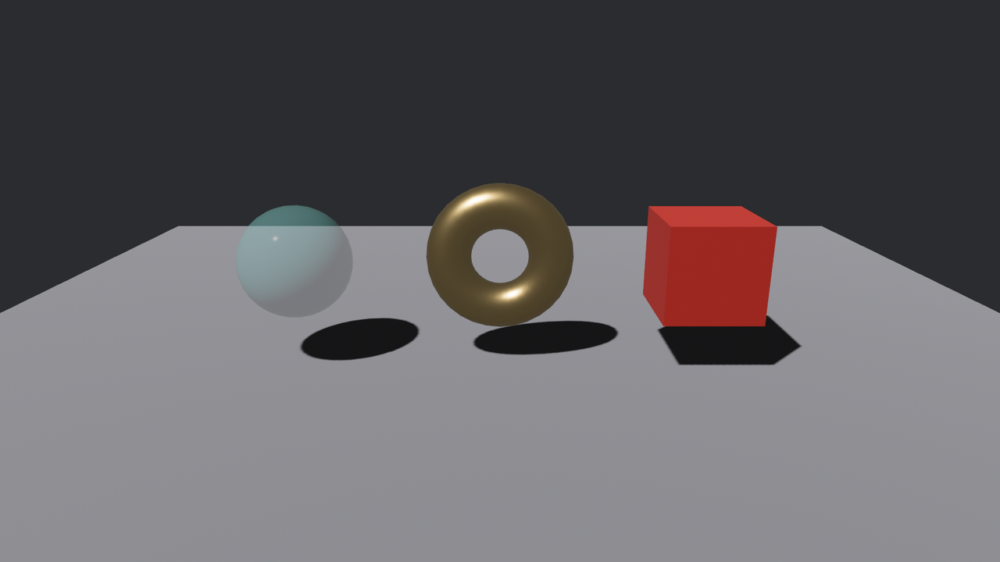

# 第一次点中

陆掌柜进门，老雷把三件货摆上台：琉璃盏、鎏金锣、剔红漆盒。第一个需求最朴素——**点哪件，哪件应一声**。

## 请后端进场

先把 App 搭起来。拾取流水线的指针、悬停、事件三段都随 `DefaultPlugins` 自动就位，唯独 mesh 后端要自己请：

```rust
{{#include ../../code/ch25-picking/examples/listing-25-01.rs:app}}
```

<span class="caption">Listing 25-1（其一）：MeshPickingPlugin 不在 DefaultPlugins 里——3D 拾取要自己开（examples/listing-25-01.rs）</span>

**`MeshPickingPlugin`** 就是 Figure 25-1 里那间「朝 3D 场景放射线」的车间。它不默认开，是因为射线检测真金白银地花 CPU——每根射线要跟场里每个 mesh 的三角形算交点，而很多游戏（纯 UI 的、纯 2D 的）根本用不上。相比之下 sprite 与 UI 后端各有便宜的算法，就随各自的插件默认注册了（25.10、25.11 节见）。

> **忘了请会怎样？** 这是本章第一口坑，也是最阴的一口：把下文的观察者全挂好、`MeshPickingPlugin` 忘加——**编译全绿、运行零警告、点破屏幕也没反应**。没有后端报命中，悬停名单永远是空的，事件一封都不会发。全场装聋，日志一个字不提。遇到「拾取没反应」，第一件事永远是查这行插件在不在。

## 三件货挂观察者

场景是第 21 章的老手艺：台面一块 `Plane3d`，三件货用图元充当——琉璃盏是半透明的 `Sphere`，鎏金锣是立起来的 `Torus`，剔红漆盒是 `Cuboid`：

```rust
{{#include ../../code/ch25-picking/examples/listing-25-01.rs:setup}}
```

<span class="caption">Listing 25-1（其二）：三件货各自 `observe` 一个点击观察者</span>

值得停一停的有三处：

- **`.observe(report_click)` 挂在实体身上**。这是第 8 章的实体观察者原样上岗：`spawn` 返回的 `EntityCommands` 直接链式调用，这件货的拾取事件只送这一家，不广播。三件货挂的是同一个函数——observer 是普通系统，可以复用；
- **`Name` 组件**（第 23 章按命名取实体时的老相识）在这里当报幕牌：观察者拿到实体后查它的名字，台词才有人话可说；
- **琉璃盏是半透明的**（`alpha_mode: Blend`），但这对拾取毫无影响——mesh 后端的射线**只认几何、不认材质**。玻璃再透，球面网格实打实在那里，照样点得中。

## 事件长什么样

观察者本尊：

```rust
{{#include ../../code/ch25-picking/examples/listing-25-01.rs:observer}}
```

<span class="caption">Listing 25-1（其三）：拆开 `On<Pointer<Click>>` 的三层包装</span>

签名 `On<Pointer<Click>>` 一共三层，一层层剥：

- **`On<E>`**：第 8 章的观察者外壳，事件送达时由它递进来；
- **`Pointer<E>`**：拾取事件的统一信封。所有指针事件都套着它，信封上写着四样公共信息：`entity`（目标实体）、`pointer_id`（哪枚指针——`Mouse`、`Touch(id)` 或自定义，多点触控时靠它分辨手指）、`pointer_location`（事件发生时指针的窗口坐标）、`event`（信里的正文，随事件种类而变）；
- **`Click`**：这一封的正文。它自己带四个字段，这里先用两个——`button` 是触发的指针按键（**`PointerButton`** 枚举：`Primary` 主键、`Secondary` 次键、`Middle` 中键，鼠标左/右/中键各自对号入座），`hit` 是命中详情；剩下的 `count` 与 `duration` 留给 25.4 节。

`Pointer<E>` 实现了 `Deref`，所以 `click.button` 能直接点进正文拿字段，不用写 `click.event.button`。`click.entity` 则是信封上的——两层字段在使用处混着点，是这套 API 的日常。

**`HitData`** 是后端交上来的命中单据，四个字段：

- `camera`：这次命中是从哪台相机的视线算出来的（多相机分屏时有用，第 13 章的地界）；
- `depth`：命中点离相机多远——悬停段拿它排序，谁近谁在上；
- `position`：命中点的**世界坐标**，`Option<Vec3>`——mesh 后端给的是射线与表面的真实交点；有的后端给不出（25.5 节会遇到一个），所以是 `Option`；
- `normal`：命中面的法线，也是 `Option`。注意它**不保证归一化**——实体被 `Transform` 缩放过时长度会跟着变，要用先 `normalize()`。

跑起来点一圈：

```console
cargo run -p ch25-picking --example listing-25-01
```

```text
老雷：陆掌柜里边请——今日交货，三件都在台上，能上手。
小棠：mesh 拾取已开，指哪件点哪件，场记记账。
场记：琉璃盏收到一点——Primary 键，落点 (-1.90, 1.26, 0.47)。
场记：鎏金锣收到一点——Primary 键，落点 (0.00, 1.70, 0.16)。
场记：剔红漆盒收到一点——Primary 键，落点 (1.91, 1.11, 0.47)。
```



<span class="caption">Figure 25-2：验货台开张——三件货都在射线的射程里</span>

落点坐标对得上账：琉璃盏坐在 `(-2.0, 1.0, 0.0)`，点中它左上肩，报 `(-1.90, 1.26, 0.47)`——球心加上大约一个半径的偏移，正是球面上的交点，不是球心。`hit.position` 给的是**表面**上那一点，做贴花、放粒子、插旗都直接可用。

> **试一把**：朝鎏金锣的**中孔**点一下——没有任何输出。射线从 `Torus` 的洞里穿过去，落在台面上，而台面没挂观察者。「只认几何」是双向的：几何在，材质再透也点得中；几何不在，画面上看着再像一个整体也点不中。这个孔在本章后面还会两次骗过我们的鼠标。

## 忘了信封会怎样

`Click` 的信封 `Pointer<>` 不是仪式，是类型系统的硬要求。陆掌柜催得急，小棠手一快写成了这样：

```rust
{{#include ../../code/ch25-picking/no-compile/listing-25-02.rs:bare_click}}
```

<span class="caption">Listing 25-2：行不通——`Click` 只是信的正文，不是完整的事件（no-compile/listing-25-02.rs）</span>

```text
error[E0277]: `bevy::prelude::Click` is not an `Event`
  --> ch25-picking\no-compile\listing-25-02.rs:30:26
   |
30 |         .observe(|click: On<Click>| {
   |                          ^^^^^^^^^ invalid `Event`
   |
   = help: the trait `bevy::prelude::Event` is not implemented for `bevy::prelude::Click`
   = note: consider annotating `bevy::prelude::Click` with `#[derive(Event)]`
```

第一行就把话说明白了：`Click` 不是 `Event`。它只是 `Pointer<Click>` 里那页信纸，单独拿出来进不了观察者的门。后面还跟着两条连锁报错（`click.button` 找不到字段、闭包当不了实体观察者），都是同一个根源的回声——修最上面这条，下面的自然消失。

顺带提防那行 `note`：编译器建议你给 `Click` 加 `#[derive(Event)]`——这是条歧路，`Click` 是 Bevy 的类型，你既改不了它，也不该改。正解永远是把信封套回去：`On<Pointer<Click>>`。

> **两条路读同一族事件**：`Pointer<E>` 同时也是 Message（第 7 章）——`InteractionPlugin` 为每种指针事件都注册了消息流，`MessageReader<Pointer<Click>>` 能在普通系统里批量读到全场所有点击。观察者答「**谁被点了**」（挂在谁身上谁应声），消息流答「**这帧发生了哪些点击**」（旁观全局）。日常交互用前者，做全局统计、录像回放这类旁观需求用后者。
