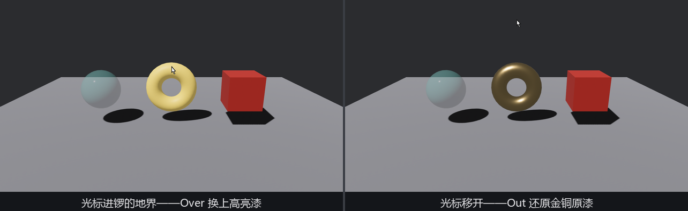

# 指到哪件亮哪件：Over 与 Out

点击之前还有一层更细的交互：光标划过货面，货得先「知道有人在看」。悬停一族的头两员就管这个——**`Over`**，指针进入实体地界那一刻发一次；**`Out`**，离开那一刻发一次。一进一出，恰好装下「高亮迎客、走了还原」这对需求。

## 观察者工厂

三件货都要「进来换高亮漆、出去换回原漆」，逻辑一模一样，只有两罐漆不同。给每件货手写六个闭包太蠢——写一个**观察者工厂**，让它按参数造闭包：

```rust
{{#include ../../code/ch25-picking/examples/listing-25-03.rs:factory}}
```

<span class="caption">Listing 25-3（其一）：一个函数造一族观察者（examples/listing-25-03.rs）</span>

这是官方示例里的惯用手法，值得逐件拆：

- 泛型参数 `E: EntityEvent` 让同一份逻辑吃下任何实体事件——调用处写 `recolor_on::<Pointer<Over>>(高亮漆)` 与 `recolor_on::<Pointer<Out>>(原装漆)`，就得到进出两个方向的观察者；
- 返回值是 `impl Fn(On<E>, Query<...>)`——一个**闭包充当系统**。第 4 章说过系统就是函数，闭包捕获了 `paint` 这个句柄之后依然满足系统签名，`observe` 照收；
- **`event.event_target()`** 是 `EntityEvent` trait 的方法，返回事件的目标实体。在泛型代码里拿不到具体事件的字段，但这个 trait 方法保证任何实体事件都答得出「你打给谁」——泛型观察者的通用钥匙。

挂载处一目了然：

```rust
{{#include ../../code/ch25-picking/examples/listing-25-03.rs:setup}}
```

<span class="caption">Listing 25-3（其二）：每件货四个观察者——进出各管换漆与报幕</span>

一个容易忽略的细节：高亮漆**只 `add` 了一次**，三件货克隆同一个 `Handle`（第 14 章的账——句柄是提货单，克隆单据不复制货）。而每件货的原装漆句柄在 `observe` 之前先存进 `original` 变量，`Out` 的工厂捕获它，退场时才有漆可还。

## 进出的台词

另挂两个报幕观察者，把 `hit.depth` 也念出来：

```rust
{{#include ../../code/ch25-picking/examples/listing-25-03.rs:announce}}
```

<span class="caption">Listing 25-3（其三）：Over 报深度，Out 报离开</span>

跑起来，把光标从琉璃盏划到鎏金锣、再甩到天上：

```console
cargo run -p ch25-picking --example listing-25-03
```

```text
老雷：陆掌柜先过眼——指到哪件，哪件替你亮起来。
场记：指针进了琉璃盏的地界（命中深度 6.31）。
场记：指针离了琉璃盏。
场记：指针进了鎏金锣的地界（命中深度 6.23）。
场记：指针离了鎏金锣。
```



<span class="caption">Figure 25-3：Over 换高亮、Out 还原漆——悬停反馈的最小闭环</span>

两条规律直接从输出里读出来：

- **一次进出，各一封信**。`Over`/`Out` 不是每帧连发的状态汇报，而是**边沿触发**——只在悬停名单变化的那一帧发。悬停期间光标在锣面上怎么蹭都不再有新信（想跟踪悬停中的移动，用另一员 `Move`，它带每帧的 `delta`，25.7 节拖拽时会见到同款字段）；
- **换目标 = 先出后进**。从琉璃盏滑到锣，先「离了琉璃盏」再「进了鎏金锣」，顺序有保证——同一帧内 `Out` 一族先派发、`Over` 一族后派发，绝不会出现两件货同时亮着的瞬间。

顺带记一笔：即便光标**瞬移**（一帧之内从盏跳到锣，中间没有轨迹），这一对进出照样成对出现——事件由悬停名单的**差集**算出，不依赖连续的移动轨迹。

> **悬停一族还有两员**：`Enter` 与 `Leave`，跟 `Over`/`Out` 的差别全在冒泡方式上——那得先讲冒泡本身，按下不表，25.5 节父子货架搭好后一并见分晓。
