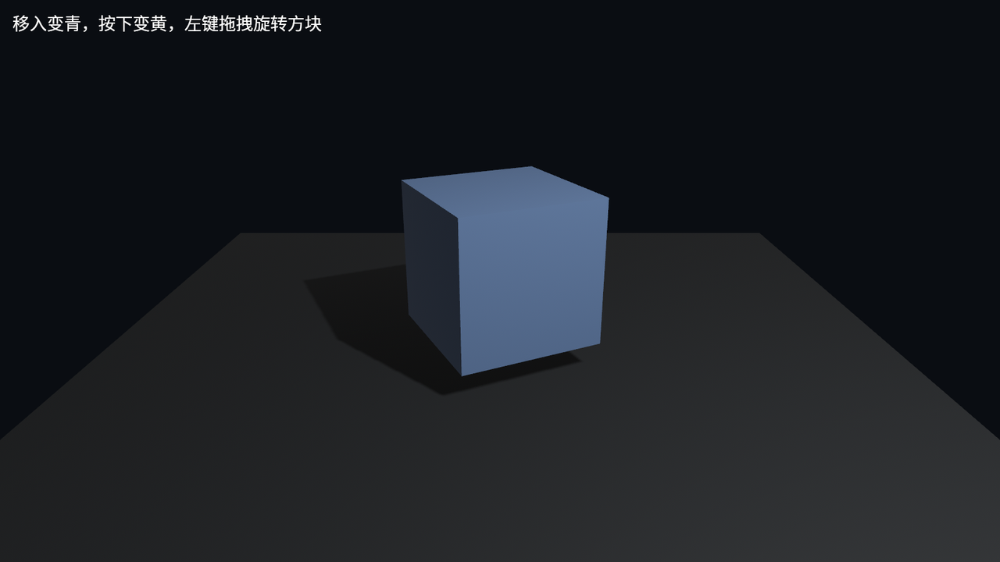

# 点选 3D Mesh

先跑最小 3D 示例：

```console
cargo run -p ch25-picking-camera-control --example listing-25-01
```



<span class="caption">Figure 25-2：最小 mesh 拾取示例——方块是唯一响应指针事件的 3D 实体，地面用 `Pickable::IGNORE` 排除</span>

它的结构很直接：

1. `DefaultPlugins + MeshPickingPlugin` 建好输入和 mesh 后端；
2. 相机把光标位置转成射线；
3. 射线打到方块；
4. 方块身上的 Observer 收到 `Pointer` 事件。

这套流程不要求你手写射线，也不要求你自己维护「当前 hover 的实体」。小示例里，鼠标移入和移出只是在三份材质之间切换；真正值得注意的是**观察者挂在实体上**，不是挂在某个全局系统里到处 `if entity == ...`。

## 点击和拖拽是同一套事件

拖拽也来自同一个指针事件系统。Listing 25-1 的拖拽观察者只做一件事：拿本帧拖动的像素差，转成旋转角度。

```rust
{{#include ../../code/ch25-picking-camera-control/examples/listing-25-01.rs:drag}}
```

<span class="caption">Listing 25-1（节选三）：用 `Pointer<Drag>` 的屏幕像素 delta 旋转方块</span>

`event.button` 是哪颗指针按钮；鼠标左键对应 `PointerButton::Primary`。触摸或笔输入进入 picking 后，同样会以 `Pointer` 的形式出现，所以这里不要把心智模型锁死在「鼠标事件」上。

`event.delta` 是**屏幕像素**，不是世界坐标。上面的代码把它乘一个小系数当角度用，所以没问题；如果你想把物体沿世界平面拖走，就得先定义「屏幕移动要投到世界里的哪个平面/方向」。把它直接加到 `Transform::translation` 上会被类型系统拦住：

```rust,ignore
{{#include ../../code/ch25-picking-camera-control/no-compile/listing-25-02.rs:bad}}
```

<span class="caption">Listing 25-2：`Pointer<Drag>::delta` 是 `Vec2` 屏幕像素，不能直接当 `Vec3` 世界位移</span>

常见做法有三种：像本节一样把 delta 当旋转量；用相机的 right/forward 方向把 delta 投到地面；或者用 `Camera::viewport_to_world` 自己算一条射线，再与一个拖拽平面求交。最后一种最精确，但也最像编辑器工具；本章最终 demo 选中间那种，够清楚，也够游戏里常用。

