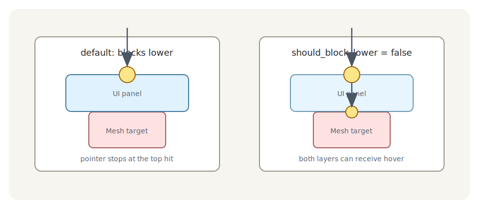

# Pickable：谁能被点，谁挡住谁

默认 mesh 后端会考虑所有可见 mesh。这对调试很方便，但游戏里通常太宽：地面、天空盒、装饰布景都会抢拾取。生产代码更常见的做法是把 mesh picking 改成 opt-in：只有标记过的相机和实体参与。

```rust
{{#include ../../code/ch25-picking-camera-control/examples/listing-25-03.rs:require_markers}}
```

<span class="caption">Listing 25-3（节选一）：让 mesh 后端只拾取显式标记的相机和实体</span>

开了 `require_markers` 之后，相机要挂 `MeshPickingCamera`，目标实体要挂 `Pickable`：

```rust
{{#include ../../code/ch25-picking-camera-control/examples/listing-25-03.rs:camera_and_targets}}
```

<span class="caption">Listing 25-3（节选二）：相机和目标都显式加入 mesh 拾取；右边箱笼用 `Pickable::IGNORE` 排除</span>

`Pickable::default()` 的含义是「我可被 hover，并且会挡住更低层的命中」。`Pickable::IGNORE` 则是「我既不响应事件，也不挡住下面的东西」。地面和透明辅助层常用 `IGNORE`。

## UI、sprite、mesh 会互相遮挡

Picking 的遮挡不是只在同一种后端内部发生。UI 面板画在 mesh 前面，默认也会挡住后面的 mesh；sprite 盖在 UI 前面时也一样。这个规则很重要，因为它让「看到什么就点到什么」成为默认行为。

如果你要做一层不挡操作的 HUD，例如只显示文字、不应该挡住场景点击，可以改 `Pickable`：

```rust
{{#include ../../code/ch25-picking-camera-control/examples/listing-25-03.rs:non_blocking_panel}}
```

<span class="caption">Listing 25-3（节选三）：UI 面板自己可被拾取，但允许更低层实体继续 hover</span>



<span class="caption">Figure 25-3：`Pickable` 管的是“谁挡住谁”，不是事件冒泡；冒泡沿父子层级走，遮挡按命中深度和后端顺序走</span>

这里容易混淆两件事：

- **遮挡**：决定同一指针下哪些实体算 hover，受 `Pickable::should_block_lower` 影响；
- **冒泡**：事件已经生成后，是否沿父实体继续传播，受 `event.propagate(false)` 影响。

遮挡发生在事件生成之前；冒泡发生在事件生成之后。一个 UI 节点可以不挡住下面的 mesh，但它收到自己的点击后仍然可以 `propagate(false)`，不让这个点击继续沿 UI 父子树往上冒。

