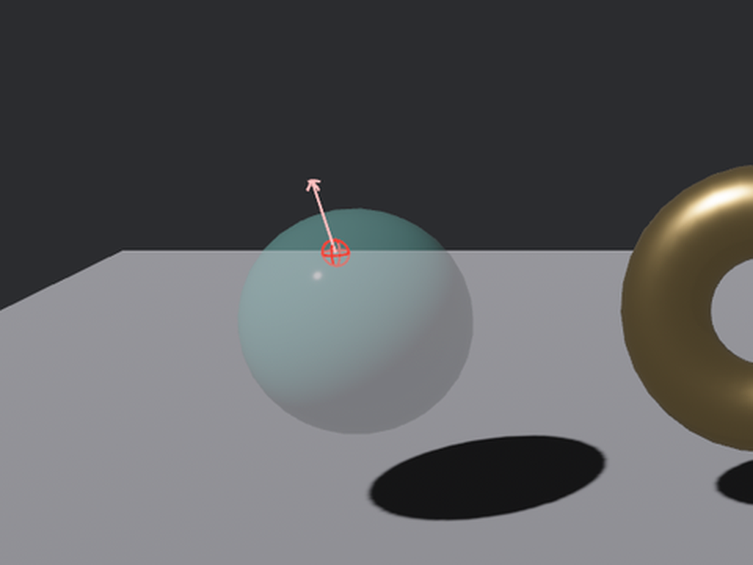

# 不听台词看状态牌

上一节的高亮走的是事件路线：`Over` 一响就换漆。但有些逻辑天生不爱听事件，爱**查状态**——「这帧谁被悬停着？」比如每帧都要跑的描边系统、UI 里根据悬停态选样式的皮肤系统。为此拾取管线在悬停段落了三块状态牌，全是普通组件，用第 4 章的 `Query` 就能查。

## 三块牌，两种发放方式

| 组件 | 记什么 | 谁来发 |
|---|---|---|
| `PickingInteraction` | 三态：`Pressed`（按住）/`Hovered`（悬停）/`None` | **管线自动发**——被指过一次就有 |
| `Hovered` | 两态：`bool`（含子孙——孩子被指着也算） | **自己挂**，管线只更新不发放 |
| `PointerInteraction` | 该指针的完整命中清单（按深度排好） | 挂在**指针实体**上，天生就有 |

前两块挂在**货**身上，第三块挂在**指针**身上——视角相反，用途也相反。写个实验各验一遍。三件货这样布置：琉璃盏和漆盒什么牌都不挂，鎏金锣手动领一块 `Hovered`：

```rust
{{#include ../../code/ch25-picking/examples/listing-25-04.rs:components}}
```

<span class="caption">Listing 25-4（其一）：只有鎏金锣领了 `Hovered`——另两件当对照组（examples/listing-25-04.rs）</span>

两个报幕系统盯着牌面变化——`Changed` 过滤器是第 4 章的老手艺，牌不翻面就一个字不说：

```rust
{{#include ../../code/ch25-picking/examples/listing-25-04.rs:report}}
```

<span class="caption">Listing 25-4（其二）：两态牌与三态牌，各自翻面各自报</span>

留意导入路径：这三个组件都**不在 prelude 里**，要走全名 `bevy::picking::hover::{Hovered, PickingInteraction}` 与 `bevy::picking::pointer::PointerInteraction`——拾取的 prelude 只放了事件一族和常用插件，状态牌算进阶货。

跑起来，光标划锣、划漆盒、再到琉璃盏上按住一下：

```console
cargo run -p ch25-picking --example listing-25-04
```

```text
小棠：这回不挂观察者了——看货的状态牌，谁想知道谁自己来查。
场记：鎏金锣的看客牌翻到——没人看。
场记：鎏金锣的看客牌翻到——有人看。
场记：鎏金锣的三态牌翻到——有人看。
场记：鎏金锣的看客牌翻到——没人看。
场记：鎏金锣的三态牌翻到——没人理。
场记：剔红漆盒的三态牌翻到——有人看。
场记：剔红漆盒的三态牌翻到——没人理。
场记：琉璃盏的三态牌翻到——有人看。
场记：琉璃盏的三态牌翻到——按住了。
场记：琉璃盏的三态牌翻到——有人看。
场记：琉璃盏的三态牌翻到——没人理。
```

这段输出值一行行对账：

- 开场第一条「没人看」发生在谁都没碰它的时候——那是鎏金锣**领牌上岗**的那帧：`Changed` 把组件初次插入也算作变化（第 4 章讲过 `Changed` 含 `Added` 的语义）。想跳过这声开场白，加 `Added` 过滤器反选即可；
- 划到锣上：看客牌、三态牌**双双**翻到「有人看」。可锣分明只领了 `Hovered`——**三态牌是管线塞给它的**。`PickingInteraction` 由悬停段自动插到每个被指中的实体上，此后常驻。漆盒的输出是铁证：它什么都没领，被指的下一帧照样报出三态牌；
- 划到漆盒：**只有三态牌**翻面。看客牌从头到尾一声不吭——`Hovered` 是「自己挂才更新」的牌，管线不代发。两块牌一自动一手动，别记反了；
- 琉璃盏上按住左键：`Hovered`（有人看）→ `Pressed`（按住了）→ 松开回 `Hovered` → 甩开归 `None`。三态齐活，UI 按钮的「常态/悬停/按下」三种皮肤，查这一块牌就够。

> 为什么一块自动一块手动？`PickingInteraction` 是悬停裁决的**副产品**，管线反正每帧都算，顺手写进组件不费事。`Hovered` 则要沿父子树向上聚合「子孙被指也算我被指」（想想装备栏：指到栏里的剑，整个栏位都该亮）——这份账贵，只给声明了「我要」的实体算。

## 指针那头的账本：PointerInteraction

前两块牌各答一句「我有没有被指着」。反过来问「指针此刻指着谁」，去查指针实体上的 **`PointerInteraction`**——里面存着**排好序的完整命中清单**（最近的在前），连每一条的 `HitData` 都在。拿它画个命中指示器，这是官方 `mesh_picking` 示例的原装手法：

```rust
{{#include ../../code/ch25-picking/examples/listing-25-04.rs:gizmo}}
```

<span class="caption">Listing 25-4（其三）：命中点画球、顺法线画箭——Gizmos 先借来一用，正题在第 27 章</span>

- `Query<&PointerInteraction>` 迭代的是**指针**（鼠标一枚、多点触控好几枚），不是货；
- `get_nearest_hit()` 取清单头一条——最近的命中；
- `hit.position.zip(hit.normal)`：两个 `Option` 都有值才继续，一次 `filter_map` 滤干净；
- `normal.normalize()`：上一节说过的账——法线不保证单位长度，画箭头前先归一。

`gizmos.sphere` 与 `gizmos.arrow` 来自第 27 章才正式开讲的调试绘制工具箱，这里只当两支粉笔用：在命中点画个小红球、顺着法线支一支箭。挪动光标，粉笔痕跟着表面走：



<span class="caption">Figure 25-4：PointerInteraction 里的命中数据可视化——点在表面上，箭顺法线走</span>

事件与状态两条路各有主场：**一次性的动作**（点了就办事）交给观察者，**每帧都要问的态**（悬停描边、按住变色）查状态牌。同一套悬停裁决，两种消费口味。
