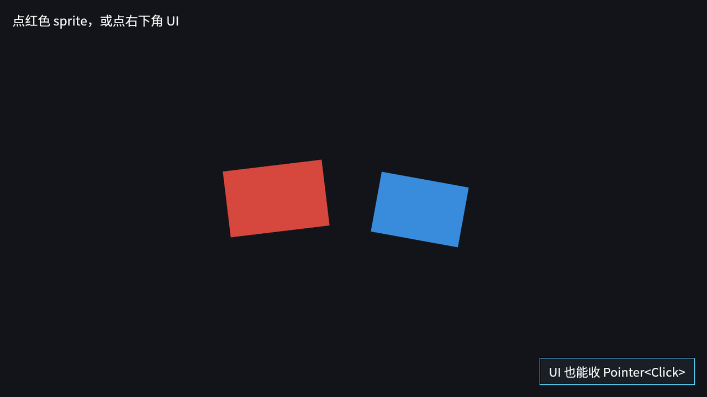

# Sprite 和 UI 也能拾取

3D mesh 只是拾取的一种后端。Bevy 默认的 2D 和 UI 插件也接进了 picking 管线，所以 sprite 和 UI 节点可以和 mesh 用同一种 `Pointer` 事件表达交互。

运行本节示例：

```console
cargo run -p ch25-picking-camera-control --example listing-25-04
```



<span class="caption">Figure 25-4：sprite 与 UI 后端都走同一套 `Pointer` 事件；本例没有添加 `MeshPickingPlugin`</span>

sprite 这边要点是：**sprite 必须有 `Pickable`**，sprite 后端才会考虑它。默认模式还会检查贴图 alpha，透明像素不算命中；如果只是 `Sprite::from_color` 这种纯色 sprite，没有实际图片，也可以被拾取。

```rust
{{#include ../../code/ch25-picking-camera-control/examples/listing-25-04.rs:sprite_pick}}
```

<span class="caption">Listing 25-4（节选一）：给 sprite 挂 `Pickable` 和 Observer</span>

UI 节点更像你平时写按钮：一个 `Node` 加背景色、边框，再挂一个点击观察者。子文本本身不需要响应事件，通常用 `Pickable::IGNORE`，让父节点吃到点击。

```rust
{{#include ../../code/ch25-picking-camera-control/examples/listing-25-04.rs:ui_pick}}
```

<span class="caption">Listing 25-4（节选二）：UI 节点也能直接观察 `Pointer<Click>`</span>

UI 的完整布局系统留到第 28、29 章。本节只要记住：UI 后端已经在默认 UI 插件里；它和 sprite、mesh 后端一起提交命中结果，再由 picking 管线统一排序、统一派发事件。

## 不要把 picking 当成按钮系统

Picking 的抽象比 UI 按钮更底层。它告诉你指针和实体之间发生了什么：hover、press、click、drag、scroll。至于这是不是「按钮」、是不是「拖拽手柄」、是不是「编辑器里的选中框」，是你在 Observer 里赋予它的意义。

这也是为什么 `bevy_picking` 和第 8 章的 Observer 很搭：交互逻辑可以跟实体放在一起。一个箱子知道自己被点了要变红；一个 UI 面板知道自己被点了要发消息；一个父实体知道子节点被点了可以统一收口。全局系统仍然有用，但不再是唯一写法。

