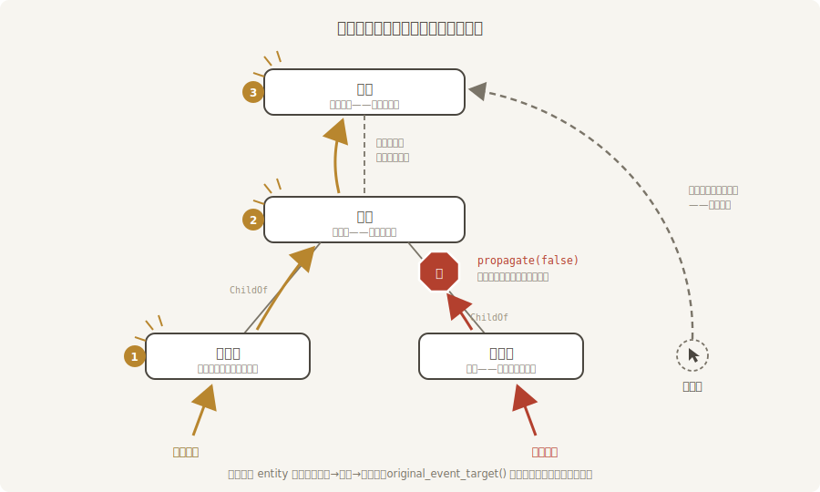

# 账单一路向上：事件冒泡

第 8 章末尾埋过一句预告：EntityEvent 有一手「事件冒泡」，等第 9 章的 `ChildOf` 讲清、等到鼠标拾取的主场再见真章。现在两个条件都齐了——这一节兑现。

**冒泡（bubbling）**：事件在目标实体上处理完后，沿父子链自动向上，把每一级祖先的观察者都敲一遍门。它解决的是交互里最常见的一类账：货架上二十件货，每件都要「被点时记一笔总账」——没有冒泡，就得给二十件货各挂一个观察者；有了冒泡，**总账观察者挂货架上，一个顶二十个**，点任何一件货，账单自己送上门。

## 搭一座父子货架

用第 9 章的手艺搭场：货架是父，琉璃盏与鎏金锣是子（`ChildOf` 直连，子实体的 `Transform` 相对父级）：

```rust
{{#include ../../code/ch25-picking/examples/listing-25-06.rs:shelf}}
```

<span class="caption">Listing 25-6（其一）：货架挂总账（examples/listing-25-06.rs）</span>

```rust
{{#include ../../code/ch25-picking/examples/listing-25-06.rs:children}}
```

<span class="caption">Listing 25-6（其二）：两件子货——锣照单全记，琉璃盏记完就拦</span>

记账的观察者一处写、四处挂：

```rust
{{#include ../../code/ch25-picking/examples/listing-25-06.rs:ledger}}
```

<span class="caption">Listing 25-6（其三）：每一站报两个名字——当前站与原始目标</span>

这里出场了本节最重要的一对 API，先立正认识：

- **`click.entity`**：事件**当前**打在谁门上。冒泡每上一层，这个字段就更新成那一层的实体——挂在货架上的观察者收到时，它是货架；
- **`click.original_event_target()`**：这单账**起头**是谁——最初被点中的那个实体，冒泡全程不变。`On` 专为可传播的事件提供这个方法。

第 25.1 节里两者恰好相等（观察者挂在被点的货自己身上），区别显不出来；一旦冒泡，各是各的。总账系统几乎总是要 `original_event_target()`——货架想知道的是「哪件货被点了」，不是「我自己被敲了门」。

## 窗口兜底

冒泡到根实体还没完。`Pointer` 事件的传播规则（源码里叫 `PointerTraversal`）比普通的父链多一步：**没有父级可爬时，跳到该指针所在的窗口实体，然后停**。窗口（第 2 章说过它也是实体）是所有指针事件的终点站。

不止如此——窗口还有自己的**直接进账**：拾取管线里有一个窗口后端（`PickingSettings` 的 `is_window_picking_enabled` 管它，默认开），指针只要在窗口上，窗口就永远以「垫底命中」的身份挂在悬停名单末尾。指针底下什么货都没有时，事件的目标就是窗口本身——**「点空处」不再是没有事件，而是窗口收到事件**。给窗口挂个观察者，「点空白取消选中」这种交互一行逻辑就位：

```rust
{{#include ../../code/ch25-picking/examples/listing-25-06.rs:window}}
```

<span class="caption">Listing 25-6（其四）：窗口实体也能 observe——冒泡终点站兼空处收件人</span>

顺带一笔：窗口后端给的 `HitData` 里 `position` 是屏幕坐标凑的数、`normal` 干脆是 `None`——上一节说 `HitData` 的字段是 `Option`，就是为这类后端留的门。

## 一口气看四种账单

点锣、点琉璃盏、点货架板、点空处，四种走向一次跑全：

```console
cargo run -p ch25-picking --example listing-25-06
```

```text
老雷：账房新规矩——每件货的账，一路抄送到台口。
场记：鎏金锣的账本记了一笔——这单起头是鎏金锣。
场记：货架的账本记了一笔——这单起头是鎏金锣。
场记：台口的账本记了一笔——这单起头是鎏金锣。
琉璃盏：易碎——这笔账到我为止，不上货架总账。
场记：货架的账本记了一笔——这单起头是货架。
场记：台口的账本记了一笔——这单起头是货架。
场记：台口的账本记了一笔——这单起头是台口。
```



<span class="caption">Figure 25-5：四种账单的走向——冒泡三连、拦截、从中层起头、空处直达</span>

对着输出把四种走向数一遍：

1. **点鎏金锣**：三连账。锣自己→货架→台口，`entity` 一路在变（三行的记账人不同），`original_event_target()` 一路不变（起头都是鎏金锣）；
2. **点琉璃盏**：只有一句拦截词。它的观察者调了 **`click.propagate(false)`**——按下停止键，这单账不再上行，货架与台口都不知情。注意 `On` 参数得写 `mut`：停止传播改的是事件的派发状态。易碎品的点击自己消化，正是这个开关的用途：**目标自己处理完、不想让祖先的通用逻辑再掺和**；
3. **点货架板**（两件货之间的裸板）：账单从货架起头，两连账——冒泡不问你是树的哪一层，从哪层起头就从哪层向上；
4. **点空处**：台口一条账，起头就是台口——这是窗口后端的直接命中，不是冒泡来的。

第 3、4 条对照着看有个实用推论：窗口观察者若想区分「点到空处」与「点到货冒泡过来」，比对 `original_event_target()` 是不是窗口自己即可——收场戏的转台相机就靠这一条判定（25.14 节）。

## Enter 与 Leave：另一种冒泡口味

兑现 25.2 节的预告。悬停一族其实是两对四员：`Over`/`Out` 逢冒泡**必到**，`Enter`/`Leave` 只认「**进没进这片地界**」——某实体（连同它的子孙）从「界外」到「界内」才发 `Enter`，彻底退出才发 `Leave`；在它的两个孩子之间挪动，不算出入。给货架把四员全挂上：

```rust
{{#include ../../code/ch25-picking/examples/listing-25-06.rs:enter_leave}}
```

<span class="caption">Listing 25-6（其五）：四员悬停事件同挂货架，冒泡口味立见分晓</span>

光标从场外进到锣上，再滑到琉璃盏，最后甩出场外：

```text
货架：Enter——看客头回进本柜地界。
货架：Over 到账（起头鎏金锣）。
货架：Out 到账（起头鎏金锣）。
货架：Over 到账（起头琉璃盏）。
货架：Out 到账（起头琉璃盏）。
货架：Leave——看客彻底离柜。
```

规律全在这六行里：进锣那刻 `Enter` 与 `Over` 双响（还能看出 `Enter` 先派发）；**锣滑到盏——同柜挪动——货架收到一对重复的 `Out`/`Over`，`Enter`/`Leave` 一声不吭**；甩出场外，`Leave` 才补上那一响。写「整个货柜的悬停高亮」，用 `Over`/`Out` 会在子货间挪动时闪一下（先还原再高亮），用 `Enter`/`Leave` 则稳如老狗——这对事件对标的是网页开发里 `mouseenter`/`mouseleave` 的语义，前端出身的读者可以直接对号入座。

> `Enter` 的正文里还有个 `is_in_bounds` 字段（`Leave` 对应 `was_in_bounds`）：孩子的地界超出父级边界时，指针可能「进了柜（孩子算柜的地界）却没进柜体本身」——要分辨这种边角情况时查它。
