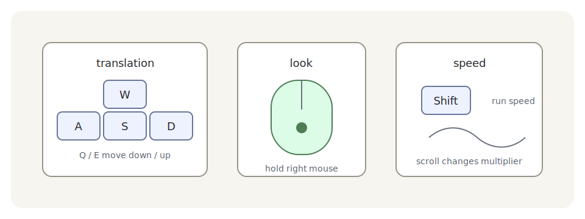

# FreeCamera：现成自由视角相机

点选 3D 物体前，你还得能看清它。第 13 章我们手写过相机移动和跟拍；调试 3D 场景、查看大模型、做简单编辑器时，更常用的是一只自由相机：鼠标看向，WASD 平移，Q/E 升降，Shift 加速。

Bevy 0.18.1 把这类现成控制器放在 `bevy_camera_controller` 里。它不是默认 feature，所以本章 Cargo.toml 开了 `free_camera`。代码里要加 `FreeCameraPlugin`：

```rust
{{#include ../../code/ch25-picking-camera-control/examples/listing-25-05.rs:plugin}}
```

<span class="caption">Listing 25-5（节选一）：启用 FreeCamera 控制器插件</span>

然后把 `FreeCamera` 组件挂到你要控制的 `Camera3d` 实体上：

```rust
{{#include ../../code/ch25-picking-camera-control/examples/listing-25-05.rs:camera}}
```

<span class="caption">Listing 25-5（节选二）：相机实体上的 `FreeCamera` 组件保存按键、速度、摩擦等设置</span>



<span class="caption">Figure 25-5：`FreeCamera` 的默认思路是调试/编辑器自由视角，不是角色相机；本章把看向键改成右键，给左键 picking 让路</span>

本章特意把 `mouse_key_cursor_grab` 改成右键。原因很实际：左键已经留给 picking 里的点选和拖拽了。如果相机控制器也用左键抓光标，它会和拾取争同一颗按钮，读者一按就不知道到底是在转相机还是拖物体。

`FreeCamera` 适合开发、调试、编辑器和查看器，不太适合作为最终游戏相机。它能穿墙、能飞出场景、没有碰撞约束，也没有角色手感。真正游戏里的相机往往要自己写，或按项目需求改造控制器。但在学习 3D 章节时，它非常合适：不用每章都重写一只临时相机。

