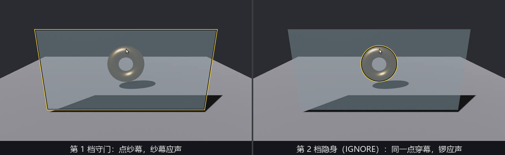

# 纱幕的四种规矩：Pickable

戏台前挂一道半透明纱幕，验货的射线该拿它怎么办？点纱幕算点中纱幕，还是穿过去算点中后面的锣，还是两个都算，还是谁都不算——四种答案都有正经用途，而这正好是 **`Pickable`** 组件两个布尔字段的二二得四：

```rust
{{#include ../../code/ch25-picking/examples/listing-25-07.rs:modes}}
```

<span class="caption">Listing 25-7（其一）：两个开关，四档规矩（examples/listing-25-07.rs）</span>

两个字段各管一件事，名字都起得直白：

- **`should_block_lower`**：**挡不挡下家**。悬停裁决把各后端报来的命中按深度排队，从最上层往下走名单：走到一个「挡下家」的实体就收队——它身后的货全部出局。这跟父子冒泡毫无关系，纯看深度队列；
- **`is_hoverable`**：**自己收不收**。设 `false`，这实体从悬停名单上除名——不发事件、不进状态牌，但（按上面那条）仍可以站着位置挡人。

没挂 `Pickable` 的实体走默认规矩：**能收也能挡**（相当于 `Pickable::default()`，两个字段全 `true`）。第四种组合「不挡也不收」有个现成常量 **`Pickable::IGNORE`**——拾取眼里彻底隐身，官方 `mesh_picking` 示例给地面挂的就是它（我们的收场戏 25.14 也这么干）。

纱幕立在镜头与锣之间，数字键换档：

```rust
{{#include ../../code/ch25-picking/examples/listing-25-07.rs:veil}}
```

<span class="caption">Listing 25-7（其二）：纱幕本尊——半透明只是长相，拾取规矩全看 Pickable</span>

```rust
{{#include ../../code/ch25-picking/examples/listing-25-07.rs:switch}}
```

<span class="caption">Listing 25-7（其三）：数字键直改组件字段——`Pickable` 是普通数据</span>

**实验**：光标不动（对准纱幕后面的锣顶环带），四档各点一下：

```console
cargo run -p ch25-picking --example listing-25-07
```

```text
老雷：验货加一道纱幕——数字键 1234，给它换四种规矩。
小棠：第 1 档，守门（默认）——挡下家，自己收。
场记：纱幕收到一点。
小棠：第 2 档，隐身（IGNORE）——不挡下家，自己不收。
场记：鎏金锣收到一点。
小棠：第 3 档，吸音——挡下家，自己不收。
场记：鎏金锣收到一点。
小棠：第 4 档，通透——不挡下家，自己也收。
场记：纱幕收到一点。
场记：鎏金锣收到一点。
```



<span class="caption">Figure 25-6：同一个点位，纱幕的规矩决定谁应声</span>

先记三条正常账，再算一笔坏账：

- **守门**（默认）：纱幕收下这一点，锣毫不知情——弹窗、面板挡住场景的标准行为；
- **隐身**（`IGNORE`）：纱幕形同虚设，锣直接应声——装饰性布景、调试辅助线的归宿；
- **通透**：一针两账，纱幕和锣**都**收到——「框选时穿透玻璃选中里面的货」这类需求就靠它。两封信按深度先近后远派发。

## 第三档的坏账

按表格，「吸音」档（挡下家 + 自己不收）该是**谁都不应**——纱幕把射线吃掉又不出声，弹窗蒙层的理想行为。但输出明明白白：**鎏金锣应声了**，第三档跑成了第二档的样子。

这不是我们代码的锅，是 mesh 后端的实现使然。翻源码（`mesh_picking/mod.rs` 的 `update_hits`）：mesh 后端在**放射线之前**先按 `is_hoverable` 过滤实体——`is_hoverable: false` 的纱幕压根不参与射线检测，自然也轮不到它的 `should_block_lower` 出场。裁决「挡不挡」的悬停段倒是把四档都支持得好好的（走到吸音实体：不收，但收队）——可惜 mesh 后端根本没把纱幕报上去。

结论记牢：**mesh 后端下，「吸音」档实际等于「隐身」档**。真需要 3D 里的吸音蒙层，两条路：给蒙层挂守门档再把它的观察者留空（收了不办事，效果等同吸音），或者换个后端——sprite 后端的四档就是全的，25.10 节会拿同一档在 2D 里验个正着。

> **试一把**：把第 1 档的点位从锣顶挪到锣的**中孔**正前方——守门档下点一下，纱幕照样应声。纱幕自己的几何是完整的一片，它挡不挡你、跟它身后是锣是孔毫无关系。然后切第 2 档同一点位再点——这回连锣都不应（射线穿幕又穿孔，落在台面上）。25.1 节那个孔，第二次骗到人了。
