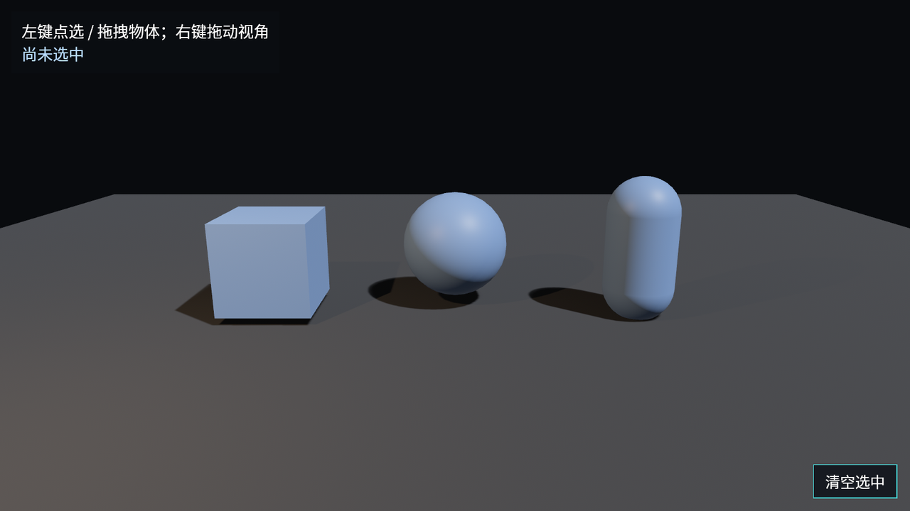

# 点选拖拽舞台

最后把本章的几条线合在一起：一个 3D 小舞台，三件可拾取物体，左键点选、拖拽；右键交给 `FreeCamera` 控制视角。

先看 App 入口。`DefaultPlugins` 仍然负责窗口、渲染、UI、输入和 picking 基础管线；我们额外加 mesh 后端和自由相机插件，并把 mesh picking 改成 opt-in：

```rust
{{#include ../../code/ch25-picking-camera-control/src/main.rs:plugins}}
```

<span class="caption">Listing 25-6（节选一）：最终 demo 的插件组合——mesh picking + FreeCamera</span>

三个可点物体共享一组材质：平时蓝色，hover 青色，按下黄色，选中红色。

```rust
{{#include ../../code/ch25-picking-camera-control/src/main.rs:actor_materials}}
```

<span class="caption">Listing 25-6（节选二）：同一组材质表达 hover、press、selected 三种交互状态</span>

spawn 时给每个物体都挂 `Pickable::default()` 和一组观察者。正文只截调用处，完整观察者在 `src/main.rs`：

```rust
{{#include ../../code/ch25-picking-camera-control/src/main.rs:spawn_actors}}
```

<span class="caption">Listing 25-6（节选三）：三件可拾取物体入场</span>

相机同时是 `Camera3d`、`MeshPickingCamera` 和 `FreeCamera`。第一项让它渲染 3D；第二项让 mesh picking 后端用它发射光标射线；第三项让相机被现成控制器驱动：

```rust
{{#include ../../code/ch25-picking-camera-control/src/main.rs:camera}}
```

<span class="caption">Listing 25-6（节选四）：同一个相机实体承担渲染、拾取和自由视角控制</span>

点击观察者负责更新选中状态，并阻止事件继续冒泡：

```rust
{{#include ../../code/ch25-picking-camera-control/src/main.rs:click}}
```

<span class="caption">Listing 25-6（节选五）：点击哪个实体，就把哪个实体标为选中</span>

拖拽观察者则把屏幕像素 delta 投到相机的地面方向：横向拖动沿相机 right 方向走，纵向拖动沿相机 forward 的地面投影走。这里不是精确编辑器 gizmo，只是一个清楚的游戏式拖拽示例：

```rust
{{#include ../../code/ch25-picking-camera-control/src/main.rs:drag}}
```

<span class="caption">Listing 25-6（节选六）：把 `Pointer<Drag>::delta` 投到地面，推动 3D 物体</span>

运行：

```console
cargo run -p ch25-picking-camera-control
```

<figure class="bevy-demo" data-src="demos/ch25/index.html" data-ratio="16 / 9">



<figcaption class="caption">Figure 25-6：点选拖拽舞台——左键点选/拖拽物体，右键拖动视角；点击可在浏览器里实时运行</figcaption>

</figure>

网页 demo 仍然和前两章一样走同一份 `src/main.rs`。`WindowPlugin` 只多了 `canvas` 与 `fit_canvas_to_parent`：

```rust
{{#include ../../code/ch25-picking-camera-control/src/main.rs:web_window}}
```

<span class="caption">Listing 25-6（节选七）：同一份程序编到网页时渲染进 `#bevy-ch25`</span>

第 17 章说过，浏览器里的原始鼠标位移容易踩坑。本章最终 demo 的**物体拖拽**没有直接读 `AccumulatedMouseMotion`，而是通过 picking 的 `Pointer<Drag>` 事件走；`FreeCamera` 是 Bevy 自带控制器，桌面调试最稳，网页里是否能顺利抓光标取决于浏览器和 iframe 权限。即便右键视角在某些浏览器里受限，左键点选/拖拽仍能展示本章的 picking 主线。

## 小结

- `bevy_picking` 是一条管线：Pointer input → backend hit test → HoverMap → `Pointer<E>` 事件 → Observer；
- `DefaultPlugins` 已有 picking 基础、sprite/UI 后端；3D mesh 需要额外加 `MeshPickingPlugin`；
- `Pointer<Over>`、`Pointer<Click>`、`Pointer<Drag>` 都是 EntityEvent，适合直接 `.observe(...)` 挂在实体上；
- `Pickable` 决定实体是否可 hover、是否挡住更低层命中；`Pickable::IGNORE` 常用于地面、纯装饰和不挡场景的 UI 子节点；
- `Pointer<Drag>::delta` 是屏幕像素，不是世界坐标；要移动 3D 物体，先定义投影规则；
- `FreeCameraPlugin + FreeCamera` 提供开发/调试用自由视角；本章把看向键改成右键，避免和左键 picking 冲突。

## 练习

1. **改成只旋转不移动**：把最终 demo 的 `on_actor_drag` 改成 Listing 25-1 的旋转逻辑，比较「拖拽改变姿态」和「拖拽改变位置」两种交互。
2. **让地面接收落点**：不要给地面 `Pickable::IGNORE`，改成观察 `Pointer<Click>`，打印 `event.hit.position`。点地面时能拿到世界坐标，点物体时又会怎样？
3. **做一个穿透 HUD**：把右下角“清空选中”按钮改成 `Pickable { should_block_lower: false, ..default() }`，观察点按钮时是否也会点到后面的 3D 物体。再用 `event.propagate(false)` 比较遮挡和冒泡的区别。
4. **给选中物体加轮廓替身**：选中时在物体脚下 spawn 一个扁圆环，取消选中时 despawn。不要直接用材质变红，做出更接近编辑器选择框的反馈。
5. **相机键位配置**：把 `FreeCamera` 的 `key_up` / `key_down` 改成空格和 Ctrl，或把 `walk_speed`、`friction` 调到你觉得舒服的值。确认这些都是组件字段，不是插件里的全局常量。

## 下一章

我们已经能看、能点、能拖。接下来要让画面本身更接近成品：HDR、tonemapping、bloom、景深、抗锯齿。第 26 章进入画质开关台，讲 `bevy_core_pipeline`、`bevy_post_process` 和 `bevy_anti_alias`。

