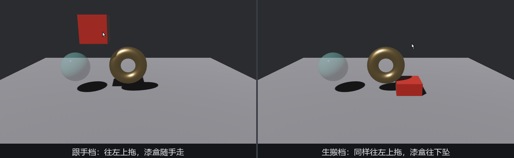

# 拖着挪：DragStart、Drag、DragEnd

陆掌柜要自己摆货。「按住拖走」在事件家族里也是三部曲：**`DragStart`** 按住后一动就发（按下不动不算拖，动了才算），**`Drag`** 拖动期间每有位移发一封，**`DragEnd`** 松手收尾。三封信挂上三件货：

```rust
{{#include ../../code/ch25-picking/examples/listing-25-08.rs:observers}}
```

<span class="caption">Listing 25-8（其一）：拖拽三部曲报到；Drag 每帧都响，台词只留给头尾（examples/listing-25-08.rs）</span>

字段清单：

- `DragStart` 带 `button` 与 `hit`——从哪个键、哪一点拖起；
- `Drag` 带 `button`、**`delta`**（自上一封 `Drag` 以来的位移）与 **`distance`**（从拖起点到当前的累计位移）——一个是增量、一个是总量，挪东西用前者，判断「拖出了多远」用后者；
- `DragEnd` 只带 `button` 与 `distance`——总结陈词。

`Drag` 逐帧连发，观察者里别放 `println!`——那是刷屏。台词留给头尾两封，中间那封干正事：挪 `Transform`。

## 屏幕像素怎么换成世界米

`drag.delta` 的单位是**屏幕像素**，坐标系是窗口的：x 向右、**y 向下**。要把它加到世界坐标（y 向上）的 `Transform` 上，两笔账绕不开——方向要翻，尺度要换：

```rust
{{#include ../../code/ch25-picking/examples/listing-25-08.rs:drag}}
```

<span class="caption">Listing 25-8（其二）：换算的两笔账——y 翻转与 0.008 的由来</span>

`0.008` 不是拍脑袋：镜头离台面约 6.4 米、竖直视角是默认的 45°，一屏 720 逻辑像素装下约 `2 × 6.4 × tan(22.5°) ≈ 5.3` 米世界高度，5.3 ÷ 720 ≈ 0.0074——取 0.008 凑个整头，拖起来大致「指哪儿跟哪儿」。这个系数只在这一档镜头距离下准确；镜头一推拉就得重算。想要任何距离都严丝合缝的跟手，用第 17 章的 `viewport_to_world` 把光标反算到拖拽平面上求交点——本章末尾的练习留了这道题。

y 的翻转做成了可拨的开关，**这是本节的实验**：按 R 切到「生搬」档（把 `delta.y` 原样往世界 y 上加），拖着漆盒**往上**挪：

```console
cargo run -p ch25-picking --example listing-25-08
```

```text
老雷：陆掌柜要自己摆——按住哪件拖哪件；R 键切「生搬」手感对照。
场记：剔红漆盒离台（Primary 键拖走）。
场记：剔红漆盒落定——屏幕上共挪了 (-141, -122) 像素。
小棠：手感切到「生搬 delta——试试往上拖」。
场记：剔红漆盒离台（Primary 键拖走）。
场记：剔红漆盒落定——屏幕上共挪了 (-128, -86) 像素。
```



<span class="caption">Figure 25-7：同样往左上拖——跟手档漆盒随手走，生搬档漆盒往下坠</span>

两处对账：

- `DragEnd` 报的 `distance` 是 `(-141, -122)`——往**左上**拖，两个分量都是负的。x 负是向左，没毛病；y 负是**向上**——再次确认屏幕系 y 朝下，「上」是负方向；
- 生搬档往上拖，漆盒**往下走**（右幅它坠到锣跟前）——屏幕的负 y 增量直接加到世界 y 上，就是反的。第 12 章讲两套坐标系时的那句「换算是一次平移加 y 翻转」，在拖拽手感上兑现成了最直观的一课：**忘了翻 y，手感上下颠倒**。

> `Move` 事件（25.2 节提过一嘴的悬停家族成员）也带一模一样的 `delta` 字段、一样的屏幕坐标系——不按键、纯悬停划过时的逐帧位移用它。同一笔换算账通用。
