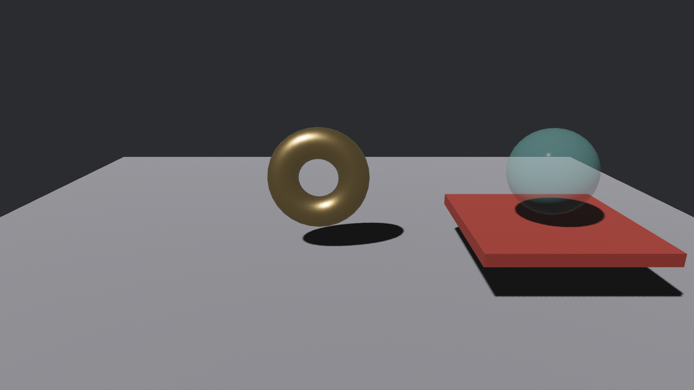

# 装箱成交：拖放四件套

拖着挪只是把货搬来搬去，交易要闭环还差最后一步：**拖到货箱上撒手，算成交**。这就是拖放（drag & drop），事件家族里专门有四员伺候它——视角很特别：**这四封信不发给被拖的货，发给被拖过、被放下的「地界」**。

- **`DragEnter`**：有人拖着东西**进入**我的地界；
- **`DragOver`**：拖着东西在我地界上**移动**（逐帧连发，同 `Drag` 一个脾气）;
- **`DragLeave`**：拖着东西**离开**了我的地界；
- **`DragDrop`**：在我的地界上**松手**——成交。

四封信的正文都带着一个关键字段：`DragEnter`/`DragOver`/`DragLeave` 的 **`dragged`**、`DragDrop` 的 **`dropped`**——被拖/被放的那件货是谁。地界收信，信里点名货，两个当事人齐了。

朱漆托盘当货箱，四件套挂上，进出换色、成交移货：

```rust
{{#include ../../code/ch25-picking/examples/listing-25-09.rs:tray}}
```

<span class="caption">Listing 25-9（其一）：托盘的四件套——Enter 亮、Leave 还原、Drop 成交（examples/listing-25-09.rs）</span>

成交的观察者里有个查询技巧值得一记：`trays: Query<&Transform, With<Tray>>` 与 `wares: Query<&mut Transform, Without<Tray>>`——同一帧里既要读托盘的位置、又要写货的位置，两个查询都碰 `Transform`，`With`/`Without` 一对过滤器把它们隔成不相交的两群，借用检查这才放行（第 4 章的老账）。

## 拖起让路

货这边照旧挂 25.7 的拖挪三部曲，但**多了一道关键工序**：

```rust
{{#include ../../code/ch25-picking/examples/listing-25-09.rs:yield}}
```

<span class="caption">Listing 25-9（其二）：DragStart 换 IGNORE、DragEnd 复牌——不让路，托盘一辈子收不到信</span>

为什么必须让路？想想拾取的裁决规则：被拖的琉璃盏**始终跟在指针正下方**，它自己就是悬停名单的第一名，把身后的一切都挡了——托盘永远轮不到悬停，`DragEnter`/`DragDrop` 一封也不会发。解法就是上一节的 `Pickable` 现学现用：**拖起那刻给货挂 `IGNORE`（拾取里隐身让路），松手再换回默认牌**。这是拖放交互的标配工序，漏了它，四件套全体哑火——而且同样是零报错零警告的静默失灵。

跑起来，把琉璃盏拖进托盘：

```console
cargo run -p ch25-picking --example listing-25-09
```

```text
老雷：验完装箱——拖到朱漆托盘上撒手。
场记：琉璃盏落定。
托盘：琉璃盏悬到我上头了。
托盘：成交——琉璃盏装箱。
场记：琉璃盏落定。
托盘：琉璃盏又挪开了。
```

（第一行「落定」是先拖了一段没进托盘就松手的对照；后四行才是进托成交的完整回执。）



<span class="caption">Figure 25-8：成交——DragDrop 的观察者把货吸附到托盘正中</span>

成交那一段的派发顺序抄下来是：`DragEnter`（悬到上头）→ `DragDrop`（成交）→ `DragEnd`（货自己的落定）→ **`DragLeave`（又挪开了）**。最后那声「挪开」乍看多余——货明明放进来了——但它是状态机的**必然收尾**：拖拽结束，「有东西悬在托盘上」这个状态随之终结，`DragLeave` 负责关灯。实战里这封信正好用来撤销高亮（本例托盘的还原色就挂在它身上），所以这声「多余」恰是设计使然：**成交也好、拖走也好，Leave 保证高亮总会熄**。

> **试一把**：把 `DragStart` 里那行 `insert(Pickable::IGNORE)` 注释掉再拖一次——托盘全程哑火，四件套一封不发，验证「让路」确实是命门。再看一个细节：拖动期间货换了 `IGNORE` 牌，可 `Drag` 事件照发不误——拖拽的目标在 `DragStart` 那刻就锁定了，中途换牌影响的是**悬停裁决**（谁挡谁），不影响已开始的拖拽会话。
