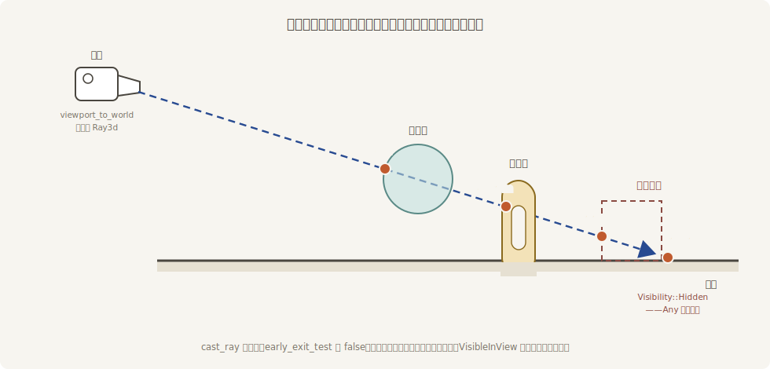

# 亲手放线：MeshRayCast

拾取管线替你放线、裁决、发信，一条龙。但有些需求只要「放线」这一件事，跟指针毫无关系：子弹的弹道检测、AI 的视线判断、把新展台贴着地面摆正。为这类活儿，mesh 后端把自己的射线工具单独敞开卖——**`MeshRayCast`**，一个系统参数（第 4 章的概念：写进系统签名就能用的取数口），你给它一条射线，它还你一串命中。

这一节干脆不请 `MeshPickingPlugin`——只用工具，不用管线，顺便证明两者确实是分开的两层：

```rust
{{#include ../../code/ch25-picking/examples/listing-25-10.rs:cast}}
```

<span class="caption">Listing 25-10（其一）：viewport_to_world 造线，cast_ray 收账（examples/listing-25-10.rs）</span>

从上往下过一遍。

**造线**。`camera.viewport_to_world(camera_seat, cursor)` 是第 17 章「三步走」的 3D 版：那时 `viewport_to_world_2d` 反算出一个**点**（2D 世界摊平在一个平面上，一个点够了）；3D 里同一个屏幕像素对应纵深上的无穷多点，所以反算出一条 **`Ray3d`**——从相机出发穿过那个像素的射线，有起点有方向。返回 `Result`，相机未就绪的角况照例 `let-else` 早退。

**放线**。`ray_cast.cast_ray(ray, &settings)` 返回 `&[(Entity, RayMeshHit)]`——**按距离从近到远排好序**的命中清单。`RayMeshHit` 比 25.1 节的 `HitData` 详细得多：`point` 命中点、`normal` 法线、`distance` 距离之外，还有 `triangle`（命中的那个三角形的三个顶点）、`uv`（命中处的纹理坐标——第 21 章的 UV 在这里能反查）、`barycentric_coords`（重心坐标，做插值用）。贴弹孔要 `point`+`normal`，在模型表面画画要 `uv`——单据比拾取事件的细一个档次。

**`MeshRayCastSettings`** 是放线的规矩单，三个字段一个不能少（它没有 `Default`，就是要你逐项表态）：

- **`visibility`**：拿不拿「看不见的」开刀。`RayCastVisibility` 三档——`Any` 全都算、`Visible` 按可见性组件算、`VisibleInView`（拾取管线用的默认档）只算镜头里真出现的；
- **`filter`**：一个 `Fn(Entity) -> bool` 的闭包，谁有资格参与检测。要「只打敌人不打友军」，在这里按标记组件筛；
- **`early_exit_test`**：走到哪个实体算「到头」。返回 `true` 的实体挡住射线（拾取管线的 `should_block_lower` 就是从这儿接的线）；恒 `false` 则一穿到底，收整串命中。

## 一线串糖葫芦

场景故意摆成纵队：琉璃盏、鎏金锣、一只 `Visibility::Hidden` 的备用漆盒（第 12 章的可见性开关——画面上没有它），前后错开列在相机的视线上：

```rust
{{#include ../../code/ch25-picking/examples/listing-25-10.rs:lineup}}
```

<span class="caption">Listing 25-10（其二）：三件货沿视线列队，备货隐着身</span>

瞄准画面正中放一线（`early_exit_test` 恒 `false`——不早退，穿到底），再按 V 把 `visibility` 从 `VisibleInView` 拨到 `Any` 放第二线：

```console
cargo run -p ch25-picking --example listing-25-10
```

```text
小棠：这回不用拾取管线，自己放线——左键放线串货，V 键换「看不看隐身」。
场记：4.38 米处串到琉璃盏。
场记：6.39 米处串到鎏金锣。
场记：9.29 米处串到台面。
——共 3 件。
小棠：换档——Any：隐身的也串。
场记：4.38 米处串到琉璃盏。
场记：6.39 米处串到鎏金锣。
场记：7.99 米处串到备用漆盒。
场记：9.29 米处串到台面。
——共 4 件。
场记：这一线放空了。
```



<span class="caption">Figure 25-9：一线串到底——距离排序的完整命中清单，隐身实体由 visibility 档决定上不上串</span>

三笔账各有看头：

- **穿透清单是排好序的**：4.38 → 6.39 → 9.29，近的在前——拾取管线只把「最上层」发给你（守门规矩），`cast_ray` 不早退时给的是完整纵深。悬停名单答「谁被指着」，穿透清单答「这条线上都有谁」；
- **`VisibleInView` 档看不见备货**（3 件），拨到 **`Any`** 立刻现形（4 件，7.99 米处）——藏起来的交互机关、隐身状态的敌人，全靠这一档打中；
- 朝天上放的那线「放空了」——`cast_ray` 给了空清单。空清单是正常答案，不是错误。

最后一笔性能账：`MeshRayCast` 做的是**真几何检测**——先用包围盒粗筛，再对候选 mesh 逐三角形算交点。画廊里几件货毫无压力；场景一大（几万实体、百万面），每帧几十条线就是实打实的开销。到那个量级，该请物理引擎的加速结构上场（BVH 一类，附录 D 的生态地图有它们的座次）——`MeshRayCast` 的定位是「零依赖、开箱即用」，不是「大场景高频弹道」。

> **试一把**：把 `early_exit_test` 改成恒 `true`（或用现成的 builder 方法 `.always_early_exit()`）——同一条线只报琉璃盏一件，4.38 米处收队。这正是拾取管线每帧替你干的活儿的裸装版。
