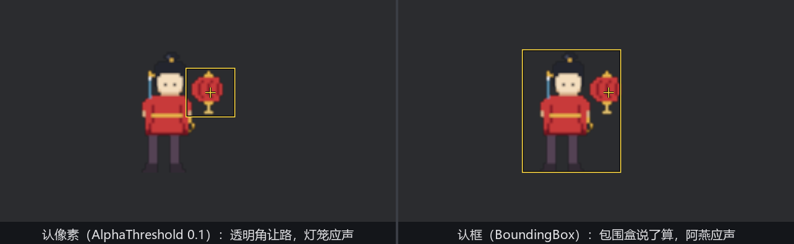

# 2D 这边的规矩：sprite 拾取

移师 2D。阿燕（第 15 章的像素立像）开了间夜市铺面，身后吊一盏灯笼——两张图的包围盒故意叠着，一会儿要在重叠区做文章。sprite 后端的用法九成与 3D 相同：一样的事件家族、一样的 observer 挂法、一样的 `Pickable` 语义；剩下那一成是两条**地方规矩**，条条踩得人一愣。

```rust
{{#include ../../code/ch25-picking/examples/listing-25-11.rs:sprites}}
```

<span class="caption">Listing 25-11（其一）：前排阿燕（z=1）、后排灯笼（z=0），包围盒相叠（examples/listing-25-11.rs）</span>

`SpritePickingPlugin` 随 `DefaultPlugins` 自动注册——2D 拾取**不用**手动请插件（sprite 的命中检测便宜：查矩形、抽像素，没有 mesh 射线那笔账）。台口兜底照旧挂上（25.5 的手法，判定用 `original_event_target`——冒泡来的账单起头是货，不算落空），开跑：

```console
cargo run -p ch25-picking --example listing-25-11
```

点阿燕——

```text
场记：这一点落空了。
```

## 规矩一：sprite 要挂牌才入册

插件在、observer 挂了、点的是人形正中，**落空**。这就是第一条地方规矩：**sprite 后端只把挂了 `Pickable` 组件的 sprite 纳入检测**——跟 mesh 后端「默认全可拾、挂牌只为改规矩」正好相反。源码里 sprite 后端的查询把 `&Pickable` 写成了必备项，没挂牌的 sprite 连参检资格都没有；而 25.1 节的三件货一张牌都没挂，照样点得中。两个后端的出厂哲学相反，切换 2D/3D 项目时这是头号伏击点。

按 P 给两张图补牌：

```rust
{{#include ../../code/ch25-picking/examples/listing-25-11.rs:enroll}}
```

<span class="caption">Listing 25-11（其二）：挂上 `Pickable::default()`，sprite 才算入册</span>

```text
小棠：牌挂上了——两件都在册。
场记：阿燕收到一点。
```

## 规矩二：认像素，不认框

挂牌后做本节的主实验。点那块**重叠区**——阿燕包围盒的右上角（人形之外的透明像素）、恰好也是灯笼的灯体：

```text
场记：灯笼收到一点。
```

前排的阿燕没应声，后排的灯笼应了。这是第二条地方规矩：sprite 后端默认**逐像素判定**——`SpritePickingSettings` 资源的 `picking_mode` 出厂是 `SpritePickingMode::AlphaThreshold(0.1)`，命中点的像素 alpha 得**超过** 0.1 才算摸到。阿燕在那一点是全透明（alpha = 0），后端直接当她不存在，射线（在 2D 里是一根垂直于画面的探针）落到了下一层的灯笼实心处。像素画四周的大片留白、树冠图片的枝叶缝隙，全都自动「点不中」——这是 2D 游戏想要的默认手感。

按 M 把判定换成**认框**再点同一处：

```rust
{{#include ../../code/ch25-picking/examples/listing-25-11.rs:mode}}
```

<span class="caption">Listing 25-11（其三）：AlphaThreshold 与 BoundingBox 两档互切</span>

```text
小棠：换「认框」——包围盒里全算数。
场记：阿燕收到一点。
```

同一个点位，改报阿燕——`BoundingBox` 档只看矩形，前排的包围盒说了算。什么时候用认框？两种情况：一是命中区就该比图形大（小图标点起来费劲，给它认框放宽判定）；二是**被逼的**——alpha 判定要读像素，图片若用了压缩纹理格式（第 14 章提过的 KTX2 一类），CPU 侧读不出颜色，后端会告警并判失手，那时认框是唯一出路。



<span class="caption">Figure 25-10：同一点，认像素报灯笼、认框报阿燕——picking_mode 决定「透明算不算数」</span>

## 顺手验一桩旧案

25.6 节欠着一句话：「吸音」档（挡下家 + 自己不收）在 mesh 后端失灵，**sprite 后端是全的**。按 B 给阿燕换上吸音牌，点她人形实心处：

```text
小棠：阿燕换吸音档——挡下家，自己不收。
```

然后——**什么都没有**。阿燕不应（自己不收）、灯笼不应（被挡）、连台口的「落空」都没有（窗口的垫底命中也被挡在名单之外）。全场沉默，正是吸音该有的样子；同一块牌在 3D 里却等于隐身（25.6 的实测）。机制差异在报账环节：sprite 后端把「不收」的实体**照样报上去**（挡不挡另算），让悬停段按 `is_hoverable` 裁决——裁决层的四档是全的；mesh 后端在自家射线阶段就把 `is_hoverable: false` 的剔了，裁决层想管也没得管。跨后端写通用交互时，别假设这两个字段处处同义。

> 那个 `0.1` 的门槛什么时候要动？对阿燕这类硬边像素画（alpha 非 0 即 255）怎么划都一样；对带抗锯齿边缘、羽化阴影的高清立绘，门槛就是你对「摸到」的定义——调高，半透明的裙边、发梢就点不中；调低，连淡淡的投影都算数。数值含义：alpha **大于**门槛才算命中。
