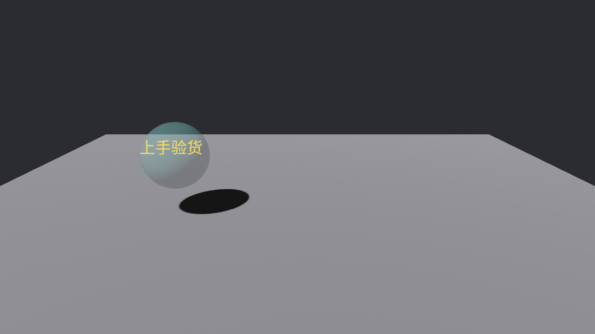

# 第三个后端：UI 也在牌桌上

三个后端到齐的最后一位：UI。这一节只探边界——UI 的正题（Node、布局、控件）排在第 28、29 章，这里先支一块最小的字牌，看它跟拾取怎么打交道、跟 3D 场景怎么分地界。

一块「上手验货」的字牌，钉在琉璃盏的正前方：

```rust
{{#include ../../code/ch25-picking/examples/listing-25-12.rs:sign}}
```

<span class="caption">Listing 25-12（其一）：UI 字牌——Text 是屏幕上的界面文字，观察者挂法与 3D 分毫不差（examples/listing-25-12.rs）</span>

先把新面孔点一遍名，都只点到「能用」为止：

- **`Text`**：屏幕空间的界面文字。第 16 章的 `Text2d` 活在世界里（跟着镜头动），`Text` 钉在屏幕上——两者共用那一套字体机制，`TextFont`/`FontSize` 原样通用，中文照旧得配自带的字模；
- **`Node`**：UI 元素的排版组件——这里只用了「绝对定位 + 距左上角多少像素」把牌子钉到位。它的完整本事（Flexbox、Grid、响应式）是第 28 章的正题；
- **`TextColor`**：文字颜色，悬停变色就改它。

真正的主角是那三个 `.observe()`：**跟 3D 的挂法一模一样**。`Over` 换金色、`Out` 还白色、`Click` 报到——25.2 节的悬停闭环原封不动搬到 UI 上就能跑。UI 后端（`UiPickingPlugin`）随 `DefaultPlugins` 自动注册，UI 节点也**天生入册**（不用像 sprite 那样挂牌）——三个后端三种出厂姿势，到此集齐：mesh 手动请插件、sprite 手动挂牌、UI 全自动。

## UI 压着 3D 的地界

牌子恰好挡着琉璃盏，点牌子——

```console
cargo run -p ch25-picking --example listing-25-12
```

```text
木牌：收到一点。
```

琉璃盏没份。两个后端各自报了命中（UI 后端报牌子、mesh 后端报琉璃盏），悬停段拿**相机次序**排的队——第 13 章的 `order` 账在这里多了半档：UI 后端报账时把自家命中记在 `camera.order + 0.5` 的位置，同一台相机上，界面永远压着场景半层。牌子排前头，又是默认的「挡下家」——琉璃盏出局。界面挡场景，这正是你想要的默认行为：点弹窗按钮，别把子弹发进场景里。

但「挡」的规矩仍归 `Pickable` 管——**它跨后端通用**。按 U 给牌子开洞：

```rust
{{#include ../../code/ch25-picking/examples/listing-25-12.rs:drill}}
```

<span class="caption">Listing 25-12（其二）：给 UI 节点插一块「不挡下家」的牌</span>

```text
小棠：牌子开洞——不挡下家，自己照收。
木牌：收到一点。
场记：琉璃盏收到一点。
```

同一点，**两个后端各成一账**：UI 的牌子和 3D 的琉璃盏都收到了 `Click`。这就是开篇 Figure 25-1 里「三家车间同时开工」的完整含义——后端各自报数，悬停段统一裁决，`Pickable` 是裁决桌上唯一的规则语言，谁家的实体都认。



<span class="caption">Figure 25-11：UI 字牌压在 3D 货上——默认它守门，开洞后一点两账</span>

> UI 这边还有一套自己的交互组件（`Interaction`、焦点系统、现成控件），跟拾取事件是互补的两层——第 29 章开讲。本节的要点只有一条：**拾取的事件模型、冒泡、`Pickable`，三个后端通用**；学会一遍，处处能使。
