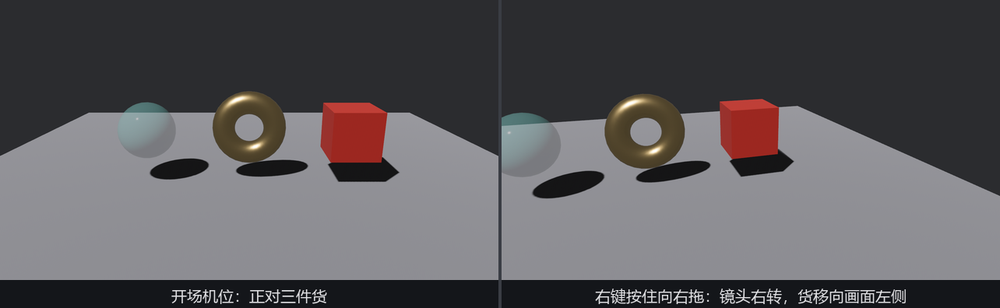

# 现成的自由脚架：FreeCamera

画廊看到这儿，镜头还钉在开场那一机位。想凑近看锣上的高光、绕到纱幕背面查线头——每个 3D 项目都要一台「能自由飞的调试相机」，每次都手搓一台（第 17、18 章的输入和时间知识确实够用）未免辛苦。Bevy 把现成的做进了 **`bevy_camera_controller`**：一台第一人称自由相机 FreeCamera，一台 2D 平移相机 PanCamera（下一节）。

## 先开门，再进门

这个 crate 的 feature **不在 bevy 默认集合里**——控制器不是每个游戏都要，不用的人不该为它付编译时间。本章 crate 的 `Cargo.toml` 因此多了一段：

```toml
{{#include ../../code/ch25-picking/Cargo.toml:deps}}
```

<span class="caption">Listing 25-13（其一）：free_camera 与 pan_camera 两扇 feature 门（code/ch25-picking/Cargo.toml）</span>

门要是忘了开，撞上的报错长这样（拿本 crate 试：`cargo check -p ch25-picking --no-default-features --example listing-25-13`）：

```text
error[E0433]: cannot find `camera_controller` in `bevy`
 --> ch25-picking\examples\listing-25-13.rs:3:11
  |
3 | use bevy::camera_controller::free_camera::{FreeCamera, FreeCameraPlugin, FreeCameraState};
  |           ^^^^^^^^^^^^^^^^^ could not find `camera_controller` in `bevy`
```

E0433「在 `bevy` 里找不到 `camera_controller`」——整个模块随着关上的门一起消失了。第 24 章的 anisotropy 门后是着色器路径、症状是画面炸白；这扇门后是整个模块、症状是编译错。**在 bevy 里「找不到某模块」，第一反应查 feature，第二反应才是查拼写**（附录 B 有全部门牌）。

## 挂上就能飞

用法是三十秒的事——插件加一行、相机挂一件组件：

```rust
{{#include ../../code/ch25-picking/examples/listing-25-13.rs:camera}}
```

<span class="caption">Listing 25-13（其二）：FreeCamera 挂上，相机就归控制器管（examples/listing-25-13.rs）</span>

`FreeCamera` 是**配置**（键位、速度、灵敏度——一张可改的参数表），它 `#[require(FreeCameraState)]` 自动带上**状态**（当前俯仰、偏航、速度——控制器的运行时账本），第 3 章 required components 的教科书应用：配置你来填，状态它自管。出厂键位一览——鼠标转向（**右键按住**抓取光标，或 M 键切换抓取），WASD 沿视线与横轴移动、E/Q 升降、左 Shift 加速跑，滚轮调速，小键盘 1/3/7 把镜头吸附到正交轴向。

这里只改了三个数，每个都有讲头：

- **`walk_speed: 3.0`**（米/秒）：出厂 5.0 是勘景大场面的步速，画廊拢共十几米见方，3.0 才凑得近展品；
- **`run_speed: 9.0`**：按住 Shift 的冲刺档。出厂 15 配的是出厂步速 5 的三倍差——步速改了，冲刺跟着等比缩，Shift 的意义就是「3 变 9」这一脚油门；
- **`friction: 25.0`**：松键后的**指数刹车**系数——数值越大刹得越急，大约每过 1/friction 秒速度余下 1/e。出厂 40 停得脆，25 带一点滑行的缓劲儿。设 0 就是冰面（松键后永不停）。

其余没动的字段里有几个值得知道。`sensitivity`（出厂 0.2）是鼠标像素到转角的倍率，纯口味参数，本节的 Z/X 键就是拨它。`scroll_factor`（出厂 0.0488 ≈ ln 1.05）——滚轮**指数**调速，每格滚轮把速度乘上 e^0.0488 ≈ 1.05 倍。为什么不用线性加减？因为要跨尺度：巡十米的画廊和巡十公里的地形用同一只滚轮，线性步长顾此失彼，指数缩放两头都顺手。`vertical_movement_axis` 管 E/Q 升降沿**世界竖轴**还是**相机自己的上轴**——出厂 `World`（Bevy、UE、Blender 的口味：低着头按 E 也是垂直上升），拨 `Local` 换成 Unity、Godot 的口味（升降跟着镜头倾斜走）。从别家引擎搬过来的手，就拨这一档找乡音。

## 拨着参数找手感

配置是普通组件数据，运行时随改随生效。Z/X 拨灵敏度、C/V 拨刹车，空格报机位（位置读 `Transform`，速度读 `FreeCameraState`——配置/状态分家的直接受益）：

```rust
{{#include ../../code/ch25-picking/examples/listing-25-13.rs:tune}}
```

<span class="caption">Listing 25-13（其三）：运行时拨参</span>

```rust
{{#include ../../code/ch25-picking/examples/listing-25-13.rs:report}}
```

<span class="caption">Listing 25-13（其四）：空格报机位与时速</span>

**实验**：W 前进一秒报一次，把刹车从 25 拨小到 15，右移松键的瞬间再报一次、滑行停稳后补一次：

```console
cargo run -p ch25-picking --example listing-25-13
```

```text
场记：机位 (0.0, 2.8, 6.4)，时速 0.0。
场记：机位 (0.0, 1.9, 3.5)，时速 2.0。
小棠：刹车拨到 15——越小滑得越远。
场记：机位 (0.0, 1.9, 3.4)，时速 0.0。
场记：机位 (2.5, 1.9, 3.4)，时速 1.1。
场记：机位 (2.6, 1.9, 3.4)，时速 0.0。
```

两笔账：**前进一秒，y 从 2.8 掉到 1.9**——「前」是**相机自己的前方**（开场镜头俯着看台面，前进自然带着往下扎）。想要「前进不掉高度」的第一人称行走，这台自由相机给不了，它就是要六自由度乱飞的。**松键瞬间时速 1.1、之后又蹭出 0.1 米才停**——就是 friction 的指数刹车在收尾；拨回 40 重试，滑行距离肉眼可见地缩短。



<span class="caption">Figure 25-12：右键按住即抓取光标——raw 位移直接转镜头，光标不受窗口边框限制</span>

鼠标转向那套（抓取光标、隐藏指针、读 raw 位移）正是第 17 章「导播摇臂」一节手搓过的组合：`CursorGrabMode::Locked` 加 `AccumulatedMouseMotion`。控制器替你把这套连同俯仰限位（抬头低头各卡在 90°，防翻跟头）都写好了。

> **一台就好**：FreeCamera 的控制系统内部用 `single_mut()` 找相机——场里挂两台 FreeCamera，它一台也不理（`Single` 语义，第 4 章）。分屏调试想两台各飞各的，就得抄源码自建，正好是下面这段话的用武之地。

官方对这个 crate 的定位写在文档里：控制器提供的定制点有限，**不合意就把源码抄进项目里改**——`free_camera.rs` 一共五百行，第 17 章的输入、第 18 章的时间、本章的组件套路就是它的全部原料。把它当一篇标准答案读一遍，比多学十个参数有用。
