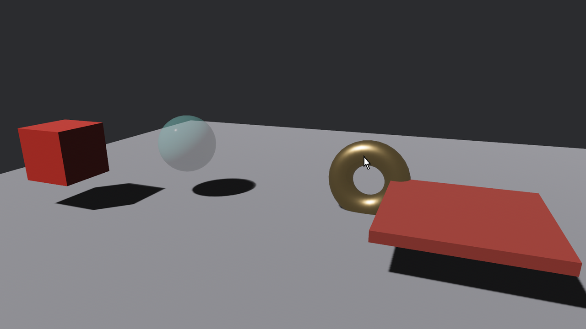

# 收场：《上手验货》

全章的零件拼一台总机。陆掌柜的验货台最终版：指到哪件哪件亮（25.2 的观察者工厂）、点一下报名（25.1）、**双击归位**（25.4 的 `count`）、按住拖挪（25.7 的换算账 + 25.8 的拖起让路）、拖进托盘装箱（25.8 的四件套）——外加一台新脚架：**拖空处转台、滚轮推拉**，全部输入走指针事件，一行 `ButtonInput` 都不用。

## 货这边：全套交互上身

```rust
{{#include ../../code/ch25-picking/src/main.rs:wares}}
```

<span class="caption">Listing 25-15（其一）：一件货挂六个观察者——高亮进出、点名/归位分流、拖挪三件套（src/main.rs）</span>

值得一说的只有新组合，零件本身都是旧的：

- **单击与双击在一个观察者里分流**：`count == 2` 走归位（把 `Transform` 拨回 spawn 时存进 `HomeSeat` 组件的原座），其余走报名。25.4 节说过双击必然先经过一次单击——这里的单击动作只是报一声名，被双击「覆盖」也无妨，分层交互的动作设计要点；
- **拖挪升级了换算**：25.7 节的系数直接加在世界 x/y 上，只在镜头不动时跟手；现在镜头会转，改成沿**相机的右轴与上轴**挪——`camera.right()`、`camera.up()` 取出机位的两根轴，屏幕增量沿轴分解，转台转到哪边拖着都跟手。

## 镜头这边：指针事件当输入

```rust
{{#include ../../code/ch25-picking/src/main.rs:window_rig}}
```

<span class="caption">Listing 25-15（其二）：窗口实体挂两个观察者，就是一台转台相机</span>

```rust
{{#include ../../code/ch25-picking/src/main.rs:seat_camera}}
```

<span class="caption">Listing 25-15（其三）：旋钮变了才重摆机位</span>

这台相机总共两个旋钮：`yaw`（绕场角）与 `dist`（机位距离），装在 `Rig` 资源里。输入侧全是本章的熟面孔：

- **拖空处转台**：窗口实体的 `Drag` 观察者。命门在那个判定——`drag.original_event_target() == stage_door`：拖**货**的事件也会冒泡到窗口（25.5 的账单规则），不筛掉的话拖着琉璃盏挪两步、镜头也跟着晃。「起头是窗口自己」才是真的拖空处。系数 0.008 这回的量纲是**弧度/像素**（与 25.7 那个米/像素的 0.008 只是数值巧合）——拖满一屏 1280 像素约转一圈半（10.2 弧度），横扫一把就能看遍全场的转台手感；
- **台面让路**：台面挂了 `Pickable::IGNORE`（官方 mesh_picking 示例给地面的同款），拖「地板」于是等于拖空处——转台的手感来源。布景退出牌桌，交互立刻宽敞；
- **滚轮推拉**：窗口的 `Scroll` 观察者。`scroll.y` 对鼠标滚轮是格数，对触控板是**像素值**（一划就是几十上百——`scroll.unit` 字段区分两种单位，跨设备要按单位换算，FreeCamera 源码里有现成写法）；步长 0.6 米/格配上 `clamp(3.0, 12.0)` 的行程——不穿模不失联，滚十五格走完全程；
- **摆机位**：`seat_camera` 系统读 `Rig` 算圆轨坐标。`rig.is_changed()` 门控（第 5 章资源变更检测）——旋钮没动就不碰 `Transform`，省掉每帧的无谓写入。

装箱的托盘照抄 25.8，唯一的新意是收进了同一台总机。全场跑起来：

```console
cargo run -p ch25-picking
```

```text
老雷：《上手验货》总场——指看点名，双击归位，拖挪装箱；
老雷：拖空处转台，滚轮推拉。陆掌柜，请。
场记：琉璃盏收到一点。
场记：琉璃盏双击归位。
托盘：成交——鎏金锣装箱。
```

<figure class="bevy-demo" data-src="demos/ch25/index.html">
  
  <figcaption><span class="caption">Figure 25-14：《上手验货》。读网页版的别只看剧照：点击画面入场——指看、点名、双击归位、拖挪装箱，拖空处转台、滚轮推拉，全部交互就是本章的指针事件。桌面版 <code>cargo run -p ch25-picking</code> 同一份代码</span></figcaption>
</figure>

这台总机有个值得回味的架构事实：**相机控制、物件交互、装箱逻辑，三摊事没有共享一行输入代码**——各自挂各自的观察者，靠拾取管线的裁决（谁在指针下、谁挡谁、账单起头是谁）天然分工。第 17 章手搓输入时要自己回答的「这次点击归谁管」，在这里成了框架的分内事。

## 小结

- **管线四段**：指针归拢输入 → 后端报命中 → 悬停裁决名单 → 事件派发冒泡；全程跑在 `PreUpdate`，`Update` 里看到的是尘埃落定的世界。三个后端出厂姿势各异：**mesh 手动请插件（忘了=全场装聋零日志）、sprite 手动挂 `Pickable` 牌、UI 全自动**
- **事件一族**：悬停 `Over`/`Out`（逢冒泡必到）与 `Enter`/`Leave`（只认地界进出，子货间挪动不惊动）；按压 `Press` → `Click` → `Release`（成交先于抬手播报），`Click` 带 `count` 连击计数（按实体各记一本、秒表是 `PickingSettings::multi_click_interval`）与 `duration`；拖拽 `DragStart`/`Drag`/`DragEnd` 发给被拖的货，拖放 `DragEnter`/`DragOver`/`DragDrop`/`DragLeave` 发给地界（信里 `dragged`/`dropped` 点名货）；`Scroll` 滚轮；还有一员冷门的 `Cancel`——触摸被系统打断（来电、手势冲突一类）时的善后信，桌面开发难得一见，做触屏时记得给它留善后逻辑；**拖起让路**（DragStart 换 `IGNORE`、DragEnd 复牌）是拖放的命门工序
- **冒泡**：`entity` 是当前站、`original_event_target()` 是起头人、`propagate(false)` 拦账；父链到头跳**窗口实体**兜底——点空处也是事件
- **`Pickable` 四档**：挡不挡下家 × 自己收不收；`IGNORE` 让布景退出牌桌。「吸音」档 sprite 后端货真价实、**mesh 后端退化成隐身**（射线阶段就剔了人）
- **屏幕坐标的账**：`delta`/`distance` 是屏幕像素、y 朝下——挪世界坐标先翻 y 再乘换算系数
- **`MeshRayCast`**：不走管线的裸射线，`visibility`/`filter`/`early_exit_test` 三项规矩换一串按距排序的 `RayMeshHit`；大场景高频弹道让位给物理引擎
- **现成脚架**：feature 门 `free_camera`/`pan_camera`（忘开门 = E0433 找不到模块）；FreeCamera 配置/状态分家、指数调速、指数刹车；PanCamera 一件组件全包、键位可摘、左键拖动本身就是拾取事件驱动——不合意就抄源码自改，官方原话

## 练习

1. **长按拿起**：用 `Click::duration` 给收场戏加一档交互——按住超过 400 毫秒松开算「端详」（打印货名与端详时长），短按仍走报名。想想为什么这个判定放 `Click` 观察者里就够，不需要计时器。
2. **像素级跟手**：25.7 节的 0.008 是固定镜头下的近似。用 `camera.viewport_to_world()` 把拖动改成精确版：`DragStart` 时记下命中点所在的、正对相机的平面；`Drag` 时把光标射线与该平面求交，货直接钉在交点上。推拉镜头后再拖，验证是否依然指哪儿跟哪儿。（提示：`Ray3d` 有现成的 `intersect_plane`。）
3. **验流水线**：把收场戏的 `MeshPickingPlugin` 换成 `MeshPickingSettings { require_markers: true, ..default() }` 的配置（插件照加、资源覆写），再给相机挂 `MeshPickingCamera`、只给鎏金锣挂 `Pickable::default()`——预测哪些交互还活着，跑一遍对答案。
4. **吸音蒙层**：给收场戏加一层「暂停纱幕」：按 P 罩住全场、再按 P 掀开。罩住期间任何货都不可点、也不许点穿到转台——用本章哪一档 `Pickable` 加哪几句观察者能凑出来？（提示：25.6 节说过 mesh 后端下纯 `Pickable` 凑不出吸音，想想「守门 + 空观察者」。滚轮那路呢？想想账单还会不会冒泡到窗口。）
5. **读源码**：打开 `vendor/bevy/crates/bevy_camera_controller/src/pan_camera.rs`，找到左键拖动平移的那段观察者，回答两个问题：它怎么处理「拖动发生在 UI 元素上」的情形？`zoom_factor` 参与拖动换算的方式和你在 25.13 节实测的 313 像素对得上吗？

## 下一章

货能上手了，画面还差最后一层讲究：泛光的灯箱、景深里的虚化、抗锯齿的边缘。下一章把渲染管线的后处理工具箱打开——HDR、tonemapping、bloom、景深、运动模糊，以及 MSAA/FXAA/TAA 三家抗锯齿的取舍。
