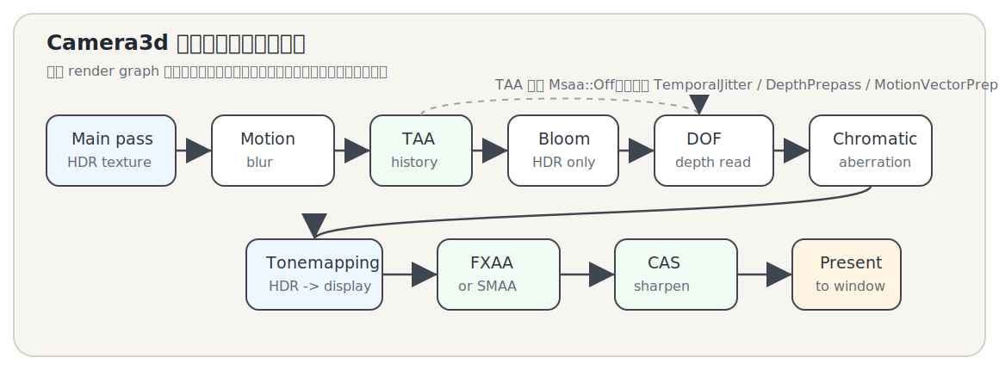
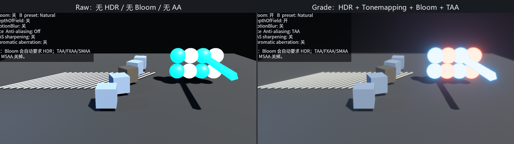

# 画质：后处理与抗锯齿

第 25 章让 3D 场景能被看、被点、被拖。现在同一个场景还要更像一个完成度更高的游戏画面：亮的东西要有溢光，高动态范围要映射回屏幕，边缘要少一点锯齿，快速运动要能留下合理的拖影。

这些能力大多不是换 `Mesh` 或 `Material`，而是在 `Camera3d` 渲染完主画面之后继续处理相机的输出。Bevy 0.18.1 把这一层拆在几个 crate 里：`bevy_core_pipeline` 负责核心 2D/3D 渲染管线和 `Tonemapping`，`bevy_post_process` 负责 Bloom、景深、运动模糊、色差等后处理，`bevy_anti_alias` 负责 FXAA、SMAA、TAA 和锐化等抗锯齿/收尾 pass。

本章配套 crate 是 `code/ch26-post-processing-aa`：

```toml
{{#include ../../code/ch26-post-processing-aa/Cargo.toml:deps}}
```

<span class="caption">Listing 26-0：第 26 章示例只依赖工作区锁定的 Bevy 0.18.1</span>

本章要做四件事：

- 用 `Hdr` 和 `Tonemapping` 管住“相机看到的亮度”和“屏幕最终显示的颜色”；
- 用 `Bloom`、`DepthOfField`、`MotionBlur`、`ChromaticAberration` 认识常见后处理；
- 在 `Msaa`、`Fxaa`、`Smaa`、`TemporalAntiAliasing` 之间做取舍；
- 最后做一个画质开关面板，把每个选项放在同一个场景里逐项对比。



<span class="caption">Figure 26-1：本章只画出要操作的相机组件和大致数据流；真实 render graph 比这张图更细</span>

先看程序骨架。`DefaultPlugins` 在默认 feature 下已经带上 `CorePipelinePlugin`、`PostProcessPlugin` 和 `AntiAliasPlugin`，所以本章不需要额外 `.add_plugins(...)` 某个后处理插件。我们只给窗口起名，指定本章自己的 asset 根目录，并初始化一个 `QualitySettings` 资源。

```rust
{{#include ../../code/ch26-post-processing-aa/src/main.rs:plugins}}
```

<span class="caption">Listing 26-1：默认插件已经带上核心管线、后处理和抗锯齿插件</span>

这个 `QualitySettings` 是本章的“画质菜单”。它不是 Bevy 自带类型，而是我们用来把键盘输入、HUD 文本和相机组件同步起来的普通 Resource。默认 preset 打开 HDR、Tonemapping、Bloom、景深和 TAA；脚本截图还会用 `CH26_PRESET=raw` 和 `CH26_PRESET=motion` 生成对比图。

```rust
{{#include ../../code/ch26-post-processing-aa/src/main.rs:quality_settings}}
```

<span class="caption">Listing 26-2：用一个 Resource 管理本章所有画质开关</span>

场景本身故意很简单：暗背景、灰地面、一些高亮发光体、细线条和运动中的发光条。发光体用来观察 Bloom，细线条用来观察抗锯齿，运动条用来观察 motion blur。

```rust
{{#include ../../code/ch26-post-processing-aa/src/main.rs:scene}}
```

<span class="caption">Listing 26-3：同一个小场景同时提供亮度、边缘和运动三类观察对象</span>

本章不写 WebAssembly demo。原因不是不能把 Bevy 编到网页，而是本章关键点之一 `Bloom` 在 Bevy 0.18.1 源码里明确标注“currently not compatible with WebGL2”。为了不让章节示例在桌面和网页之间出现能力断层，本章选择脚本化截图：`scripts/make_ch26_figures.py` 会构建并启动桌面程序，捕获下面三张图。



<span class="caption">Figure 26-2：同一个场景的“原始画面”和“成品画质”对比；这不是换模型，而是换相机后处理配置</span>

先从最底层的两个开关开始：HDR 和 Tonemapping。
