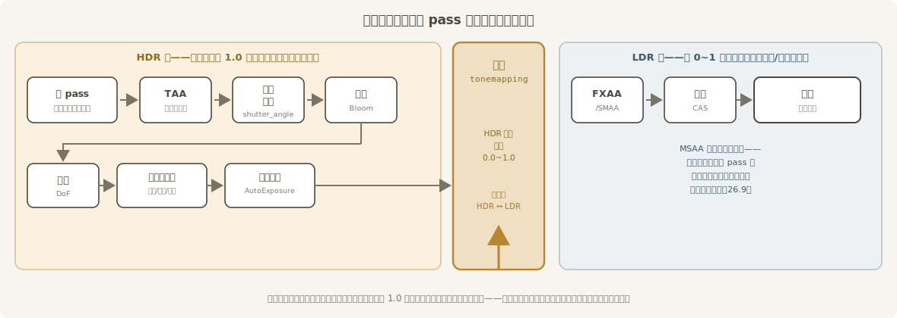
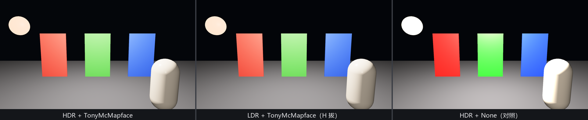

# 底片与冲印：HDR 与 Tonemapping

盛师傅开工不碰灯、不挪机位，先掀开相机后盖看了一眼，摇头：“**底片不行**。”

## 一张只认 0 到 1 的画布

相机把场景画进一张**中间纹理**（intermediate texture）——后处理各道工序的工作台。默认这张画布是标准动态范围（LDR）：每个通道 0.0 到 1.0，再亮也只能记到 1.0 封顶。可物理光照的世界没有封顶：第 22 章的太阳是十万勒克斯，第 24 章的自发光写过 80 尼特——阳光下的白墙和白炽灯丝在真实世界差着几个数量级，挤进 0..1 之后全成了同一个“1.0”。

出路是给相机挂 **`Hdr`** 组件（`bevy::camera::Hdr`）——一个不带任何字段的标记组件，作用只有一件：把中间画布换成**高动态范围**（HDR）格式，亮部从此有账可算：

```rust
{{#include ../../code/ch26-quality/examples/listing-26-01.rs:camera}}
```

<span class="caption">Listing 26-1（其一）：`Hdr` 是标记组件，挂上即换底片（examples/listing-26-01.rs）</span>

源码注释特意划了一道线：`Hdr` 换的是**中间**画布，跟显示器的 HDR 输出没有关系——Bevy 目前不支持后者。它的全部意义，是让“比白更亮”的数值在后处理工序之间**存活**下来。第 15 章那扇“`Color::srgb(4.0, 4.0, 0.5)` 不报错”的门，钥匙就是它。

拿到 HDR 数据后，各道工序按固定的次序在这张画布上接力，最后一步才压回显示器能吃的范围：



<span class="caption">Figure 26-1：后处理各工序在渲染流程里的位置——冲印（tonemapping）是 HDR 与 LDR 的分水岭，本章的工序基本都排在它前面</span>

## 冲印：从 HDR 压回屏幕

把 HDR 数据压进 0..1，术语叫 **tonemapping**（色调映射）。这活儿跟暗房冲印一个道理：负片上宽容度极高的曝光信息，怎么压进相纸那点范围——不同的药水配方，冲出不同的性格。Bevy 的配方是相机上的 **`Tonemapping`** 组件（`bevy::core_pipeline::tonemapping`），一个九变体的枚举。你从没见过它，是因为它是 `Camera3d` 的 required component：不写就自动带上默认配方 `TonyMcMapface`。

盛师傅的验片流程：三匹高饱和绸缎（大红、翠绿、宝蓝）、一只白瓷瓶当中性参照、一盏 emissive 高达 18 的灯笼当考题，顶灯故意打到让绸缎受光面冲出 1.0——然后空格轮换九种配方：

```rust
{{#include ../../code/ch26-quality/examples/listing-26-01.rs:recipes}}
```

```rust
{{#include ../../code/ch26-quality/examples/listing-26-01.rs:swap}}
```

<span class="caption">Listing 26-1（其二）：九种配方排成一张表，空格轮换——换配方就是改组件的值（examples/listing-26-01.rs）</span>

```console
cargo run -p ch26-quality --example listing-26-01
```

```text
盛师傅：三匹绸子一只瓶，一盏灯笼当考题。
盛师傅：空格换冲印配方，H 抽插 HDR 底片。眼下是 TonyMcMapface——默认。
盛师傅：换配方——BlenderFilmic。
盛师傅：换配方——KhronosPbrNeutral。
盛师傅：换配方——None——不冲印，原样硬塞。
```


<span class="caption">Figure 26-2：九种配方冲同一张底片。看两处就够：灯笼的“断崖”处理得体不体面，大红大绿往哪个方向偏</span>

九种配方逐个过堂（点评来自源码注释与 Figure 26-2 的实拍）：

- **`None`**——不冲印，HDR 原样硬塞给屏幕，超过 1.0 的部分一刀切平。灯笼成了没有过渡的白盘子，绸缎受光面死在最饱和的一档。除了调试，没人这么出片；
- **`Reinhard` / `ReinhardLuminance`**——最古典的压缩曲线，简单便宜；代价是色相漂移明显、亮部几乎不脱饱和——Figure 26-2 里 `ReinhardLuminance` 的灯笼还是橙的、绸缎艳得扎眼，正是“不脱饱和”的样子，源码注释直言其短；
- **`AcesFitted`**——影视界的老牌配方（与 Godot 的 Tonemap ACES 同源）。**刻意的**戏剧化偏色：亮红亮绿转橙、亮蓝发品红，对比度显著拉高。Figure 26-2 里大红绸的受光面肉眼可见地烧成了橙色——这不是毛病，是它的美学；
- **`AgX`**——非常中性、几乎不偏色，整体略微低饱和，粉彩气质。要 `tonemapping_luts` feature（默认已开）；
- **`SomewhatBoringDisplayTransform`**——暗部中部不偏色、亮部偏，介于 Reinhard 与 ReinhardLuminance 之间的折中方案；
- **`TonyMcMapface`**——**当前默认**。作者自述“刻意无聊”：不加对比、不加饱和，亮部平滑脱饱和成白。九张里它对灯笼的处理最像一盏真的灯。同样吃 `tonemapping_luts`；
- **`BlenderFilmic`**——Blender 的默认胶片曲线，偏中性、亮部脱饱和，方便与 DCC 工具对片；也吃 `tonemapping_luts`；
- **`KhronosPbrNeutral`**——名字带 Neutral 但源码明说**并不中性**：高饱和、高对比，容易把灰色和低饱和色压死。注意它的设计前提是电商那种**低亮度灰阶打光**下还原品牌色——Figure 26-2 这种故意过曝的场景超出了它的预设，受光面被大举推白，九张里反而显得最淡。配方要在它预设的曝光区间里干活，这也是一课。

挑法很简单：打光克制的产品展示选 `KhronosPbrNeutral` 或 `AgX`，要电影感选 `AcesFitted`，拿不定主意就别动默认——`TonyMcMapface` 就是为“不惹事”设计的。

> **`DebandDither`**：冲印站还捎带一道除色带工序。把连续的 HDR 渐变压进 8 位输出时，暗部平滑过渡容易断成一圈圈“色带”，`DebandDither::Enabled` 用一层肉眼不可见的抖动把带子打散。它也是 `Camera3d` 的 required component，默认就是 `Enabled`——所以这道工序你一直在用，只是今天才知道它的名字。

## 抽掉底片会怎样

`Hdr` 既然是标记组件，`remove`/`insert` 就能现场拔插。H 键试试：

```rust
{{#include ../../code/ch26-quality/examples/listing-26-01.rs:film}}
```

<span class="caption">Listing 26-1（其三）：`Has<Hdr>` 查在不在，`commands` 拔插——换底片不用重启（examples/listing-26-01.rs）</span>

按下 H，预想中的剧变没有发生：



<span class="caption">Figure 26-3：左、中两张——HDR 与 LDR 底片冲同一配方——肉眼找不出差别；右边换 `None` 配方的对照倒是一眼认出。抽底片的代价，这一节还看不见</span>

这是一次诚实的失败实验，结论值得记录：**只论直出画面，HDR 底片在平铺直叙的场景里没有肉眼差**。因为 LDR 模式下冲印工序照样运转（内联在主 pass 里做），压缩发生在数据被 1.0 封顶**之前**——两条路殊途同归。`Tonemapping` 各配方在 LDR 下也照常换得动，实测画面与 HDR 下几乎逐像素一致。

那 `Hdr` 到底买了什么？买的是**后处理的原料**。辉光要知道哪盏灯比白亮多少倍才能决定光晕多大，自动测光要读真实亮度的直方图——这些工序全排在 Figure 26-1 冲印站的前面，吃的就是那批“比 1.0 大”的数。底片一抽，原料断供——下一节把辉光挂上，等 26.4 再按这个 H，你会亲眼看到拔插**不再是**无事发生。
