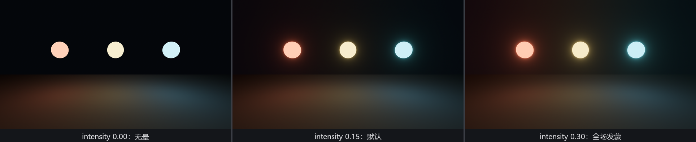
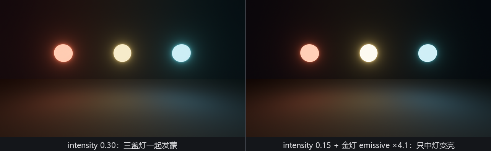

# 灯笼上晕：Bloom

第 24 章给自发光留过一句话的债：emissive 只管自己亮，不照亮四周，“照亮的观感”要等 bloom。今天还债。

**Bloom**（辉光）模拟真实镜头和人眼面对强光时的表现：亮到一定程度的东西会“晕”出一圈光——不是物理上真的把光泼到了墙上，而是光学系统内部的散射。加辉光只要一个组件：

```rust
{{#include ../../code/ch26-quality/examples/listing-26-02.rs:camera}}
```

<span class="caption">Listing 26-2（其一）：挂 `Bloom` 不用挂 `Hdr`——required components 替你补票（examples/listing-26-02.rs）</span>

两个熟面孔在这里碰头。其一，`Bloom` 的定义带着 `#[require(Hdr)]`——第 3 章的 required components 机制：挂辉光时底片自动换成 HDR，因为辉光的原料就是那批“比白更亮”的数值。其二，`Exposure::INDOOR`——第 22 章的测光表。夜戏场景在默认那档“户外白天”的曝光下会欠曝成一团黑；写夜景先拨曝光口径，再考虑加灯，这是 22.2 节的功课在后处理章的直接回用。

灯笼本身也是 23.11 节的老搭配：**灯罩是 emissive 网格，照亮台面的活儿交给挂在同一实体上的 `PointLight`**——辉光负责“看起来亮”，点光负责“真的照亮”，观感与物理各管一摊：

```rust
{{#include ../../code/ch26-quality/examples/listing-26-02.rs:lanterns}}
```

<span class="caption">Listing 26-2（其二）：三盏灯笼——红纱、金纱、青纱，emissive 全部远超 1.0（examples/listing-26-02.rs）</span>

## Bloom 的全套旋钮

`Bloom::NATURAL` 是个预设常量，展开是一整套参数。逐个过：

- **`intensity`**（默认 0.15）——全画面的散射基准。在默认的能量守恒模式下语义是“光被散射出去的概率”，0.0 没有辉光，1.0 散无可散。注释里有句要划线的话：这个值**只该用来定全场的基调**，拉太高整张图都会又糊又过曝；
- **`low_frequency_boost`**（0.7）/ **`low_frequency_boost_curvature`**（0.95）——低频（大范围糊开的那部分光晕）的增益与增益曲线，相当于均衡器上的低音旋钮和 Q 值：往上拨，光晕更“弥漫”；
- **`high_pass_frequency`**（1.0）——散射角的上限，往小拨光晕收得更拢；
- **`prefilter`**——门槛滤波器：低于阈值的像素不参与辉光。默认全 0（不设门槛），它的用法留给下一节的复古档；
- **`composite_mode`**——散射结果与原图的合成方式：`EnergyConserving`（能量守恒，散出去多少原处就减多少）或 `Additive`（直接往上加，画面会变亮）。默认守恒；动了 prefilter 才需要考虑换加法，也是下一节的戏；
- **`max_mip_dimension`**（512）——内部降采样金字塔的顶层尺寸，出画质毛病才需要动；
- **`scale`**（(1,1)）——光晕在两个轴上的拉伸倍率，纯艺术旋钮。

九成场合你只碰第一个。↑↓ 拨着看：

```rust
{{#include ../../code/ch26-quality/examples/listing-26-02.rs:bloom_knob}}
```

<span class="caption">Listing 26-2（其三）：拨的是全场的散射量（examples/listing-26-02.rs）</span>



<span class="caption">Figure 26-4：`intensity` 0.00 / 0.15（默认）/ 0.30——注意它同时改变**所有**发光体的晕，这正是问题所在</span>

## 该调灯，不是调板子

Figure 26-4 暴露了一个真实工程里常犯的错：美术说“中间那盏金灯不够亮”，你顺手把 `intensity` 从 0.15 拉到 0.30——金灯确实晕大了，可红灯青灯也跟着晕大，整张图一起发蒙。源码注释把正确做法写得很直白：**想让某个网格更亮，去加它的 `emissive`，而不是加辉光强度**。

+/- 键只动金灯的材质：

```rust
{{#include ../../code/ch26-quality/examples/listing-26-02.rs:lantern_knob}}
```

<span class="caption">Listing 26-2（其四）：改资产不改后处理——`Assets<StandardMaterial>` 的老手艺（第 14 章）（examples/listing-26-02.rs）</span>

```text
盛师傅：辉光总强度 0.30。
...
盛师傅：辉光总强度 0.15。
盛师傅：金灯自发光 ×1.6——只有它的晕在长。
...
盛师傅：金灯自发光 ×4.1——只有它的晕在长。
```



<span class="caption">Figure 26-5：同样是“让金灯更亮”——左边动 `intensity` 殃及全场，右边动 emissive 指哪打哪</span>

道理一句话：`intensity` 是**镜头**的属性，emissive 是**光源**的属性。镜头散射多少是全画面一视同仁的；哪盏灯该刺眼，是那盏灯自己的事。HDR 底片在这里显出价值——emissive 从 7 乘到 28.7，这些远超 1.0 的数值一路活到辉光工序，晕才有得算。
