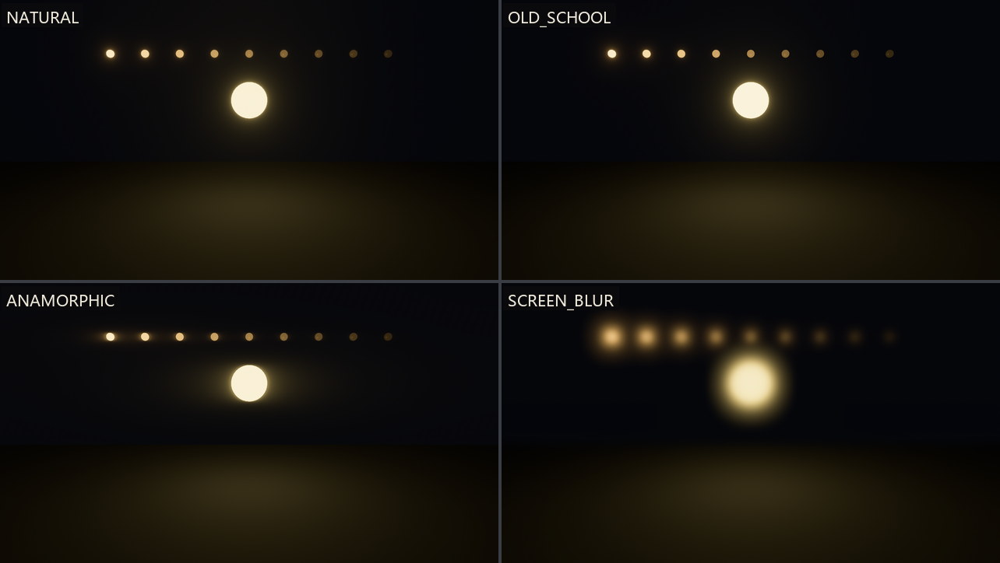

# 四套晕法：Bloom 预设与门槛

`Bloom` 的参数虽多，官方替你调好了四套——四个关联常量，一个常量一种美学。这一节把它们逐个上机，顺带把上一节按下不表的 `prefilter` 与 `composite_mode` 讲透。

试纸是特制的：一盏主灯笼，加九颗**亮度对半递减**的珠灯——emissive 从 8.0 一路砍到 0.03：

```rust
{{#include ../../code/ch26-quality/examples/listing-26-03.rs:beads}}
```

<span class="caption">Listing 26-3（其一）：亮度阶梯 8.0、4.0、2.0、1.0、0.5……0.03——一排现成的“亮度标尺”（examples/listing-26-03.rs）</span>

```rust
{{#include ../../code/ch26-quality/examples/listing-26-03.rs:presets}}
```

```rust
{{#include ../../code/ch26-quality/examples/listing-26-03.rs:swap}}
```

<span class="caption">Listing 26-3（其二）：四个预设是 `Bloom` 上的关联常量；换预设换的是一整套参数，所以整个组件换新（examples/listing-26-03.rs）</span>

```console
cargo run -p ch26-quality --example listing-26-03
```

```text
盛师傅：一盏主灯九颗珠，珠灯亮度从左到右对半砍。
盛师傅：空格换晕法。眼下是 NATURAL——自然档，默认。
盛师傅：换OLD_SCHOOL——复古断档。
盛师傅：换ANAMORPHIC——横拉宽银幕。
盛师傅：换SCREEN_BLUR——满屏蒙纱。
```



<span class="caption">Figure 26-6：四套晕法冲同一排珠灯——看右半排暗珠的待遇就能认出 OLD_SCHOOL，看横向拉丝认出 ANAMORPHIC</span>

## NATURAL：人人有份，按亮论晕

默认档的哲学来自能量守恒：**任何**亮度的像素都参与散射，亮的散得多、暗的散得少，没有门槛、没有突变。所以 Figure 26-6 的 NATURAL 格里，连 0.03 的暗珠也有一丝几乎看不见的柔晕——物理上这是对的，镜头散射不挑客人。

## OLD_SCHOOL：门槛与断档

上世纪末的游戏机时代，辉光是笔奢侈的开销，通行做法是**只让够亮的像素发晕**。`OLD_SCHOOL` 复刻这套味道，核心是两个上一节按下的字段：

- **`prefilter.threshold`**（这档预设 = 0.6）——亮度门槛：低于它的像素完全不参与辉光。九颗珠里 emissive 0.5 以下的后五颗，正好被这道门拦下——Figure 26-6 里它们瞬间“熄灯”，只剩珠子本体；
- **`prefilter.threshold_softness`**（0.2）——门槛的软硬：0 是一刀切，1 是完全渐变。0.2 意味着门口有条窄窄的过渡带，但整体仍是“够格才发光”；
- **`composite_mode: Additive`**——注释的原话只有结论：“动了 prefilter 就必须换加法合成”。道理不难补齐：能量守恒模式假设“散出去的从原处扣”，可门槛已经把物理假设砍了，不如干脆改成往画面上**加**光，亮者更亮——正是老游戏那股子燥。

代价注释也写明：动 prefilter 就是物理不正确，容易调难看。想要 2000 年代的复古气质，它是正解；想要写实，离它远点。

## ANAMORPHIC：横拉宽银幕

`ANAMORPHIC` 模拟变形宽银幕镜头的横向拉丝光斑：`scale: Vec2::new(4.0, 1.0)`——光晕在 x 轴拉四倍。附带一个工程细节：拉伸会放大采样瑕疵，所以这档预设同时把 `max_mip_dimension` 翻倍到 1024，这就是上一节说“出画质毛病才动它”的那种时刻。Figure 26-6 里亮珠的晕明显摊宽压扁——预设的 `intensity` 仍是克制的 0.15，想要电影海报那种夸张的横向光条，在这个底子上把强度和 `scale.x` 一起往上带即可。

## SCREEN_BLUR：满屏蒙纱

第四档是个“破坏性测试”样本：`intensity` 直接 1.0（光散无可散）、低频增益全关、散射角压到三分之一——效果是整张画面蒙上一层柔纱。它演示参数推到极端的样子，也偶尔真有用：梦境、回忆、醉酒镜头，一个组件的事。

四档试完，回味一下模式：**预设不是枚举，是普通常量**。`Bloom::NATURAL` 只是一份写好的字段组合，你完全可以 `Bloom { intensity: 0.08, ..Bloom::OLD_SCHOOL }` 拿预设当底子微调——这跟第 22 章拿 `CascadeShadowConfigBuilder` 起手再改字段是同一个习惯。
