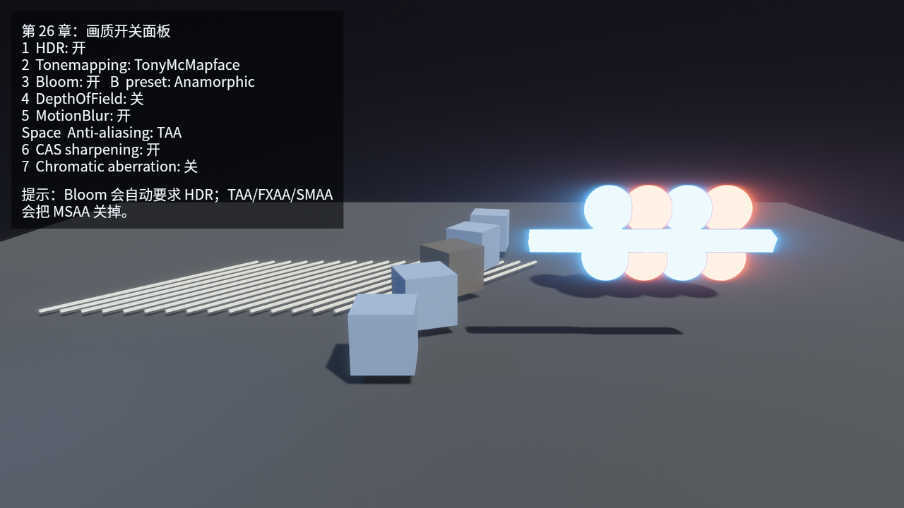

# 景深与运动模糊

`DepthOfField` 模拟镜头对焦：焦平面附近清楚，离焦区域变糊。它依赖深度信息，所以不是简单把整张图模糊一下。Bevy 0.18.1 提供 `DepthOfFieldMode::Gaussian` 和 `DepthOfFieldMode::Bokeh`；本章示例选 `Gaussian`，因为它更适合做稳定的教学示例。

景深最重要的字段是焦距相关的配置。Listing 26-4 里这几行值得单独看：

- `focal_distance`：相机前方多远处最清楚；
- `aperture_f_stops`：数值越小，离焦越明显；
- `max_circle_of_confusion_diameter`：限制最大模糊圈，防止画面过度糊掉；
- `max_depth`：限制景深处理的深度范围。

按 `4` 开关景深。注意前景方块和远处发光体的清晰度变化。景深不是“画质越高越糊”，它只在镜头语言需要时使用：瞄准、检视物品、剧情镜头、照片模式都适合；动作游戏默认视角里过强的景深会影响读图。

`MotionBlur` 模拟曝光时间内物体和相机运动形成的拖影。它需要运动向量和深度信息；Bevy 0.18.1 的 `MotionBlur` 组件通过 required components 自动补齐相关 prepass。本章不手动 spawn 那些 prepass 组件，是为了让示例保持在“相机画质菜单”的层级。

按 `5` 开关运动模糊。脚本截图用 `CH26_PRESET=motion` 打开 HDR、Anamorphic Bloom、TAA、CAS 和 MotionBlur：

Figure 26-3：运动模糊适合快速运动的高亮物体；过强会吞掉输入反馈和边缘细节

运动模糊的两个主要字段是：

- `shutter_angle`：近似曝光时间，越大拖影越长；
- `samples`：采样数，越高越平滑，也越贵。

和景深一样，运动模糊是风格工具，不是默认越强越好。竞速、电影化镜头、快速挥砍可以用；需要精准读帧的动作、射击、编辑器视角要克制。

最后还有一个很小但很显眼的效果：`ChromaticAberration`。它模拟镜头边缘色散，让不同颜色通道略微错开。本章把它放在最终面板里按 `7` 切换。这个效果特别容易“游戏味过重”，适合受击、传送、失真等短时反馈，不适合整局常开。
