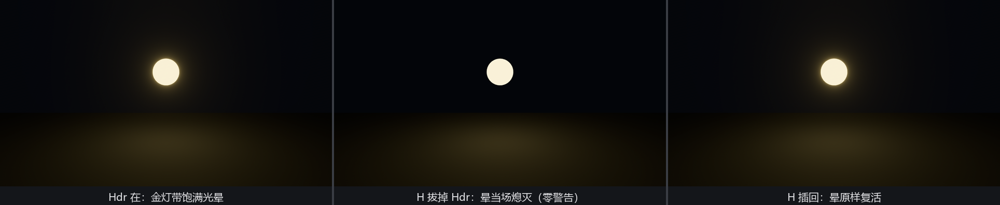

# 抽底片：辉光的静默死法

26.1 节按 H 抽底片时说过“代价这一节还看不见”。现在辉光挂上了，把那口锅端上来。

场景极简：独一盏金灯，`Bloom::NATURAL`，晕圈在不在一眼便知。H 键拔插 `Hdr`，顺带把 `Bloom` 组件的在场证明也打出来：

```rust
{{#include ../../code/ch26-quality/examples/listing-26-04.rs:pull}}
```

<span class="caption">Listing 26-4：`Has<Hdr>` 与 `Has<Bloom>` 同时到庭作证（examples/listing-26-04.rs）</span>

```console
cargo run -p ch26-quality --example listing-26-04
```

```text
盛师傅：金灯一盏，晕圈在场。H 键抽底片试试。
盛师傅：底片抽了。Bloom 组件还在吗？——在。晕呢？自己看。
盛师傅：底片插回去——晕圈原地复活。
```



<span class="caption">Figure 26-7：抽掉 `Hdr` 的瞬间辉光熄灭——`Bloom` 组件还端端正正挂在相机上，终端一声不吭</span>

值得害怕的不是辉光灭了，是**灭的方式**：没有警告、没有报错、没有日志。`Bloom` 组件还在相机上，字段一个没变，效果凭空消失——第 23 章我们管这类故障叫**哑巴坑**。

## 为什么一声不吭

这是行为契约，不是缺陷。`Bloom` 的文档第一句就写着：它作用于“启用了 HDR 的相机”——没有 `Hdr` 的相机在辉光工序眼里**根本不存在**，整道工序直接跳过。跳过是合法状态，所以没有理由报警。类似的“隐形前提”本章还会遇到（TAA 之于 `Msaa::Off`，那位倒是会喊）。

真正容易踩进来的路径是这样的：`Bloom` 靠 require 帮你**挂上**了 `Hdr`，于是你从没意识到自己依赖它；后来某次重构，别处代码一句 `remove::<Hdr>()`——或者干脆是你自己写相机时显式列组件、忘了带 `Hdr`——辉光无声熄灭，你对着材质的 emissive 值排查半天。记住第 3 章的规则边界：**required components 只在插入时补票，之后各组件命运独立**——`Bloom` 不会拦着任何人拆走 `Hdr`，拆了它也不会喊。

排查口诀也就有了：后处理效果无声失踪，先查它 require 过什么、那些东西还在不在——`Has<T>` 一行就能出证词。
