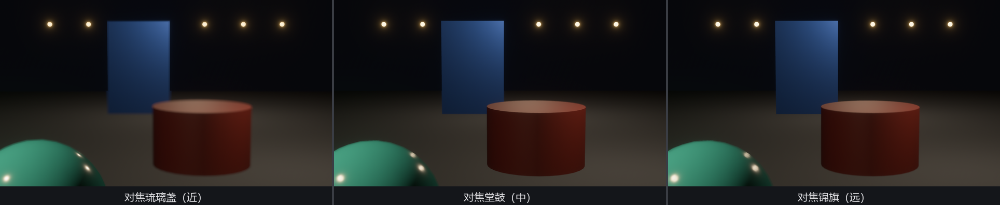
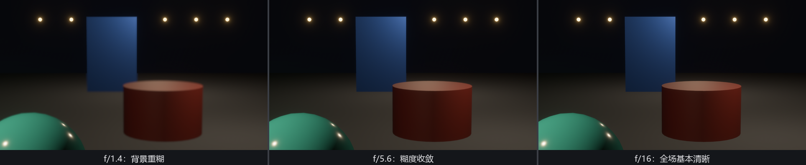
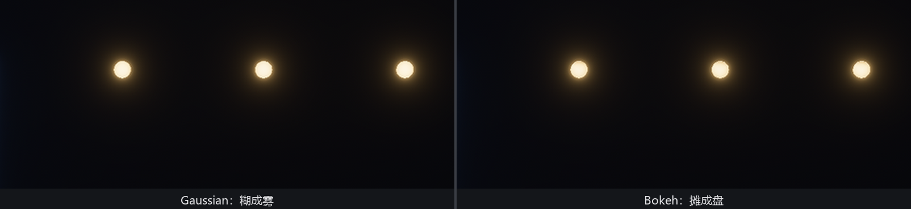

# 对焦台：DepthOfField

到目前为止，Bevy 的相机在光学上是台理想设备：不管离多远，所有东西都完美清晰。真实镜头做不到——对准了 3 米，13 米外就是一片奶油。这层“糊”就是**景深**（depth of field），它不是缺陷，是摄影师最重要的构图语言之一：焦点在哪，观众就看哪。

给相机挂 **`DepthOfField`**（`bevy::post_process::dof`）就有了对焦能力。但在挂之前，先交代一个本书作者亲自踩过的坑。

## 教训先行：广角镜下景深隐形

这个示例的第一版用了默认相机——竖向视场角 45°，等效一支短焦广角镜。`DepthOfField` 挂了、光圈开到 f/1.4、焦点对在 3 米，运行起来却**几乎什么都看不出**：远处的东西就糊了两三个像素，不凑近数根本不算糊。组件没坏，参数没错——**光学本身如此**：焦外的模糊量（术语叫弥散圆，circle of confusion）随镜头焦距的平方增长，广角镜天生什么都清楚，手机主摄拍不出单反大光圈的奶油焦外，同一个道理。

修法是把相机换成长镜头——第 13 章的 `PerspectiveProjection` 旋钮在这里派上新用场：

```rust
{{#include ../../code/ch26-quality/examples/listing-26-05.rs:camera}}
```

<span class="caption">Listing 26-5（其一）：fov 收到 0.35 弧度（约 20°，等效 53mm 人像镜头），景深才有戏可看（examples/listing-26-05.rs）</span>

记住这条依赖链：**景深效果的强弱 = `DepthOfField` 的参数 × 相机的视场角**。挂了组件看不见效果，先查 fov，再怀疑参数。

## 逐个旋钮

`DepthOfField` 六个字段，前四个直接搬照相馆的行话：

- **`mode`**——虚化的算法，两档：`Gaussian`（默认）快而省，焦外均匀糊开；`Bokeh` 更贵也更像真镜头——离焦的亮点会摊成边界清晰的光斑（就是夜景照片里那些圆片），下文实测；
- **`focal_distance`**（默认 10.0）——对焦距离，单位米：离相机这么远的东西最清晰。这是运行时最常拨的旋钮——“拉焦点”拨的就是它；
- **`sensor_height`**（默认 0.01866）——传感器画幅高度，单位米。18.66 毫米对应电影界流行的 Super 35 画幅；焦距由它和 fov 联合推出，一般不动；
- **`aperture_f_stops`**（默认 1.0）——光圈 f 值，摄影里的 f/1.4、f/5.6 就是它。**数值越小孔越大、焦外越糊**；往大拨（f/16）则前后都清楚。方向反直觉，源自光学定义（f 值是焦距除以孔径）；
- **`max_circle_of_confusion_diameter`**（64.0）——弥散圆的像素上限。非物理参数，纯粹防止极端情况下模糊核大到拖垮性能；
- **`max_depth`**（无穷）——参与景深计算的最远距离。它专治一类边角问题：天空盒在渲染器眼里是“无穷远”，不设上限的话弥散圆会直接顶到上一条的天花板，糊成一片难看的浆糊——给它设个场景尺度的值就好。

对焦台三组按键，1/2/3 对焦前中后三件货，Q/W/E 拨光圈，G 换算法：

```rust
{{#include ../../code/ch26-quality/examples/listing-26-05.rs:seats}}
```

```rust
{{#include ../../code/ch26-quality/examples/listing-26-05.rs:desk}}
```

<span class="caption">Listing 26-5（其二）：焦距、光圈、模式，全是组件字段，拨就是了（examples/listing-26-05.rs）</span>

```console
cargo run -p ch26-quality --example listing-26-05
```

```text
盛师傅：三件货三个纵深，最深处挂一排珠灯。
盛师傅：1/2/3 对焦，Q/W/E 拨光圈，G 换虚化模式。开档：对琉璃盏，f/1.4。
盛师傅：对焦堂鼓（中）——8.2 米。
盛师傅：对焦锦旗（远）——13.6 米。
盛师傅：光圈拨到 f/16。
```



<span class="caption">Figure 26-8：f/1.4 下拉三档焦点——清晰带跟着 `focal_distance` 走，带外的前后景各自化开</span>



<span class="caption">Figure 26-9：光圈阶梯——f 值越大孔越小，清晰带越深；f/16 几乎回到“理想相机”</span>

## Bokeh：光斑的形状

G 键把算法换到 `Bokeh`，看最深处那排珠灯：



<span class="caption">Figure 26-10：同一排离焦珠灯——`Gaussian` 糊成雾，`Bokeh` 摊成盘。真镜头是后者：离焦亮点是光圈孔的成像</span>

两种模式都是双 pass：`Gaussian` 一横一竖，`Bokeh` 换成斜向组合，后者显存带宽开销更高——源码注释对 Gaussian 的评语是“不如真镜头准，但省”，对 Bokeh 是“更准更好看，更贵”。夜景、灯串、雨滴这类高光点丰富的场合，Bokeh 的钱花得最值。

## 一份参数，两头对账

f 值这东西，第 22 章的曝光表也认——光圈既决定进光量（曝光），又决定弥散圆（景深）。真相机上这是同一个物理孔径，Bevy 干脆让两个组件吃同一份参数结构：

```rust
{{#include ../../code/ch26-quality/examples/listing-26-06.rs:physical}}
```

<span class="caption">Listing 26-6：`PhysicalCameraParameters` 一份膛口数据，`Exposure` 按它算进光，`DepthOfField` 按它算虚化——光圈改一处，两头同时变（examples/listing-26-06.rs）</span>

```text
盛师傅：f/2、1/50 秒、ISO 800——这套膛口算出 EV100 = 4.64。
```

`ev100()` 的账当场可验：EV = log₂(f²·100 / (t·ISO)) = log₂(4 × 100 / (0.02 × 800)) = log₂25 ≈ 4.64。给拍过照的读者：把你熟悉的机身参数抄进来，Bevy 的画面亮度和景深会同时对上你的直觉——这正是 `from_physical_camera` 这对函数存在的意义。

> **WebGL2 上没有景深**。`DepthOfField` 需要读深度纹理，WebGL2 的限制让它在该平台被整体禁用（启动时一条 info 日志，效果静默缺席——又一位“哑巴”，好在这次日志里有据可查）。本章末尾的网页版 demo 里景深开关是个空挡，原因在此；桌面与 WebGPU 不受影响。
