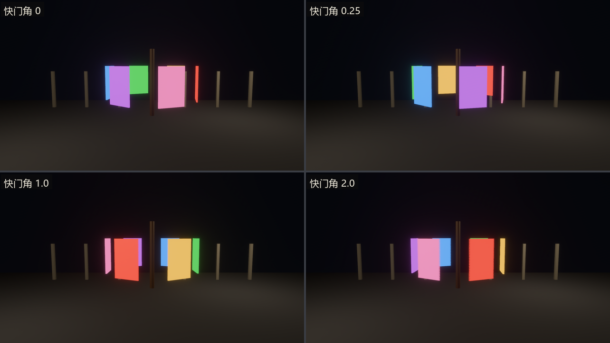
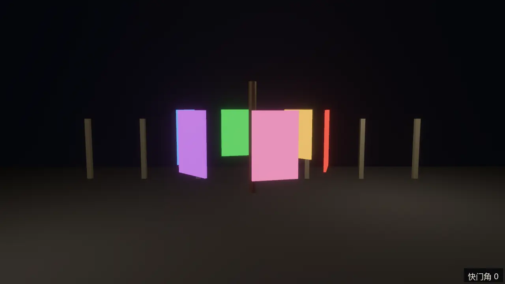
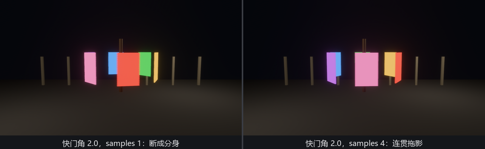
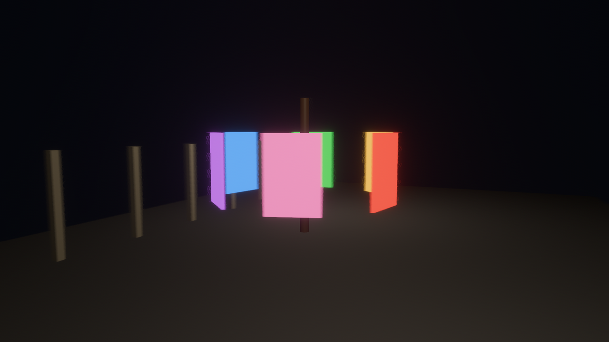

# 走马灯：MotionBlur

看客说走马灯“转着转着反倒不像在转”，病根是每一帧都太清楚了。真实相机的快门要开一小段时间，这期间动过的东西会在底片上留下一道**运动模糊**（motion blur）——大脑读到这道拖影，才认账“它在动”。逐帧清晰的画面反而是一种“频闪感”。

给相机挂 **`MotionBlur`**（`bevy::post_process::motion_blur`）：

```rust
{{#include ../../code/ch26-quality/examples/listing-26-07.rs:camera}}
```

<span class="caption">Listing 26-7（其一）：又一个 require——`MotionBlur` 自动带上 `MotionVectorPrepass`（examples/listing-26-07.rs）</span>

这次 require 补的票叫 **`MotionVectorPrepass`**：主 pass 之前先跑一遍“运动向量预渲染”，给每个像素记下“它上一帧在屏幕哪里”——模糊的方向和长度全靠这份账。这也解释了文档列出的两条先天局限：快速物体的**边缘外侧**糊不出去（那里的像素属于背景，运动向量是背景的），透明物体不写深度和运动向量、无法被糊。

道具是台真走马灯：六片彩绘屏板绕轴排开，父实体匀速自转（第 9 章的层级把整台灯拧成一个转动单元）：

```rust
{{#include ../../code/ch26-quality/examples/listing-26-07.rs:carousel}}
```

<span class="caption">Listing 26-7（其二）：屏板微微自发光——夜里拖影才看得真切（examples/listing-26-07.rs）</span>

## 快门角：唯一要懂的数

`MotionBlur` 只有两个字段，主角是 **`shutter_angle`**（默认 0.5）——快门角，胶片机的行话：快门盘转一圈里开着的那段弧。**0.5 = 180°，快门开半帧时长**，是电影业的标准手感；1.0 = 快门全程敞开；超过 1.0 在物理上不存在——拖影比物体实际走过的还长，纯艺术夸张。文档给了笔有意思的账：想在 60fps 里复刻 24fps 电影的模糊量，拨 60/24 × 0.5 = 1.25 就行，代价是非物理的过度拖影可能让玩家眼晕，最好做成可选项。

空格逐档拨，S 键换第二个字段 **`samples`**（默认 1）——每个方向的采样次数，1 即前中后共 3 次采样，4 即 9 次：

```rust
{{#include ../../code/ch26-quality/examples/listing-26-07.rs:desk}}
```

<span class="caption">Listing 26-7（其三）：两个旋钮全在组件上（examples/listing-26-07.rs）</span>

```console
cargo run -p ch26-quality --example listing-26-07
```

```text
盛师傅：走马灯转起来了，快门角 0.5——电影的 180 度。
盛师傅：空格拨快门角，S 换采样数，按住左右键转机位。
盛师傅：快门角拨到 1。
盛师傅：快门角拨到 2。
盛师傅：快门角拨到 0。
盛师傅：快门角拨到 0.25。
盛师傅：每向采样 4 次。
```



<span class="caption">Figure 26-11：快门角 0 / 0.25 / 1.0 / 2.0——0 等于关掉模糊；2.0 的拖影已超过屏板一帧真实走过的距离，残影开始跟本尊分家</span>

静帧只说了一半的故事。运动模糊的本职是治“频闪感”，这事必须动起来看——同一台走马灯、同一转速，快门角 0 与 0.5 各转一段：



<span class="caption">Figure 26-12（动图）：快门角 0 对 0.5——逐帧锐利反而“卡”，带拖影才“顺”。运动模糊治的不是画质，是运动的观感</span>

那对“分身”不是 bug，是 `samples: 1` 的本相：三次采样撑不起那么长的拖影，离散的采样点各自成像。放大看，这正是 `samples` 的用武之地：



<span class="caption">Figure 26-13：快门角 2.0 下 `samples` 1 对 4——欠采样的拖影要么断成分身、要么起网纹，加密后连成一体。代价按像素计费，拖影越长越该加</span>

## 镜头一动，满台都在动

运动模糊认的是**相对屏幕**的运动——物体动是动，镜头动也是动。按住 ←→ 让机位绕场转：

```rust
{{#include ../../code/ch26-quality/examples/listing-26-07.rs:orbit}}
```

<span class="caption">Listing 26-7（其四）：转的是相机，糊的是全世界（examples/listing-26-07.rs）</span>



<span class="caption">Figure 26-14：按住方向键横摇机位——立柱没动，影子却横着拖了出去：在底片眼里，动没动只论“相对镜头”。赛车游戏的速度感、第一人称的甩头感，正源于此</span>

这也是运动模糊在游戏里的主战场：它让低帧率显得流畅、让高速度显得更快。反过来，竞技射击玩家八成会关掉它——拖影抹掉的正是他们要的每一帧信息。所以老规矩：**做成设置项**，第 29 章的设置界面见。
