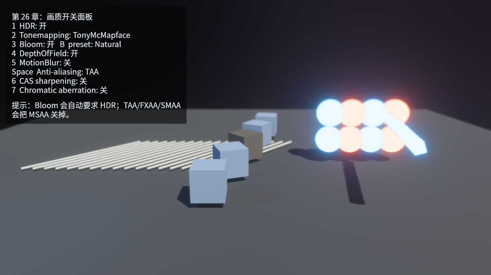

# 画质开关面板

最后把本章的几条线合到一个可运行程序里。左上角 HUD 显示当前配置，键盘切换具体后处理。每次按键只改 `QualitySettings`，随后 `apply_quality_settings` 把状态同步到相机组件。

```rust
{{#include ../../code/ch26-post-processing-aa/src/main.rs:ui}}
```

<span class="caption">Listing 26-6：用 HUD 把当前画质状态直接显示在画面里</span>

运行：

```console
cargo run -p ch26-post-processing-aa
```



<span class="caption">Figure 26-4：画质开关面板——所有选项都作用在同一台 `Camera3d` 上，方便逐项对比</span>

操作表如下：

| 按键 | 作用 |
|---|---|
| `1` | 开关 `Hdr`；关 HDR 时也关 Bloom |
| `2` | 循环 `Tonemapping` |
| `3` | 开关 `Bloom`；开 Bloom 时也开 HDR |
| `B` | 循环 Bloom preset |
| `4` | 开关 `DepthOfField` |
| `5` | 开关 `MotionBlur` |
| `Space` | 循环 Off / MSAA 4x / FXAA / SMAA / TAA |
| `6` | 开关 `ContrastAdaptiveSharpening` |
| `7` | 开关 `ChromaticAberration` |

这不是给玩家看的最终设置菜单，而是一个教学用对比面板。真正游戏里的画质菜单还要考虑平台、分辨率、动态缩放、保存配置、热重启渲染资源、默认档位和性能指标。这里我们只保留相机组件层面的事实。

## 小结

- `DefaultPlugins` 默认已经带上核心管线、后处理和抗锯齿插件；
- HDR 用 `Hdr`，显示映射用 `Tonemapping`，Bloom 依赖 HDR；
- `DepthOfField` 和 `MotionBlur` 都依赖相机的深度/运动信息，适合有明确镜头意图的场景；
- `Msaa`、`Fxaa`、`Smaa`、`TemporalAntiAliasing` 是不同取舍，TAA 要求 `Msaa::Off`；
- `ContrastAdaptiveSharpening` 和 `ChromaticAberration` 是收尾风格工具，不要把它们当成基础照明；
- `bevy_solari` 是实验性的实时光追方向，需要单独 feature 和 GPU 能力，不属于普通后处理开关。

## 练习

1. **做一张自己的画质档位表**：把 `QualitySettings::default()` 拆成 Low / Medium / High 三个 preset，定义每档使用的 AA、Bloom、MotionBlur 和 CAS。
2. **把 Bloom 调到刚好够用**：不要换 preset，只修改 `Bloom` 字段，目标是保留发光体的空气感，同时不让整个地面发灰。
3. **比较运动中的 AA**：让相机慢慢绕场景转动，分别录下 FXAA、SMAA、TAA，观察细白线和远处发光体的稳定性。
4. **关掉 HUD 截图**：给 `scripts/make_ch26_figures.py` 增加一个环境变量，让截图 preset 隐藏左上角 HUD，用来生成更干净的宣传图。
5. **研究 Solari 示例**：只阅读 `vendor/bevy/examples/3d/solari.rs`，列出它比本章主例子多出来的 feature、组件和 GPU 要求；先不要把它并入本章示例。

## 下一章

画质开关解决的是相机输出，下一步要把运行中的世界看得更清楚。第 27 章会进入 Gizmos、诊断与开发工具：用调试线框、性能指标和开发期工具把问题暴露出来，再决定该调整哪一部分。
