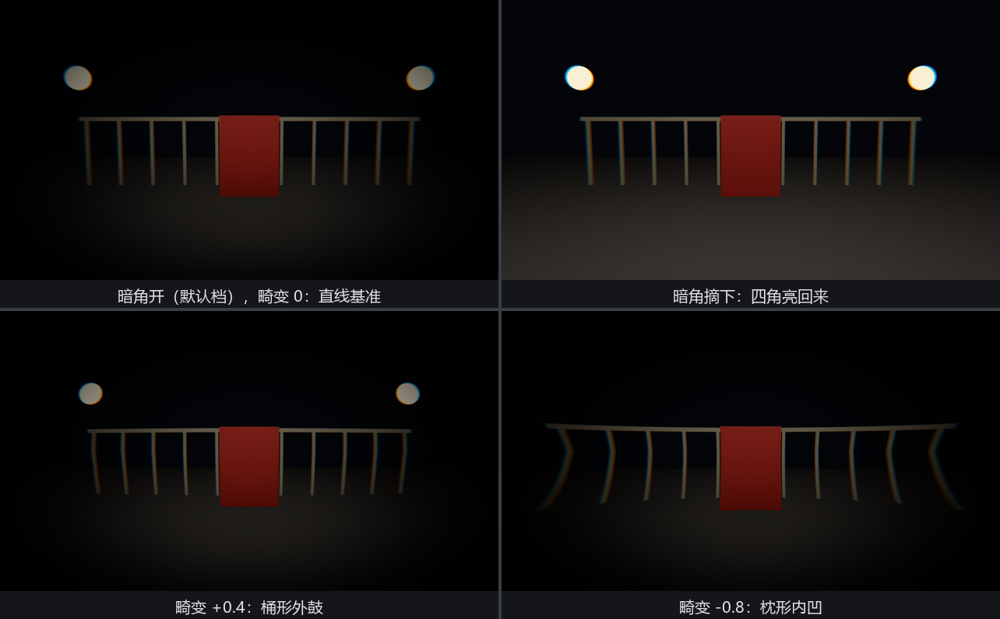
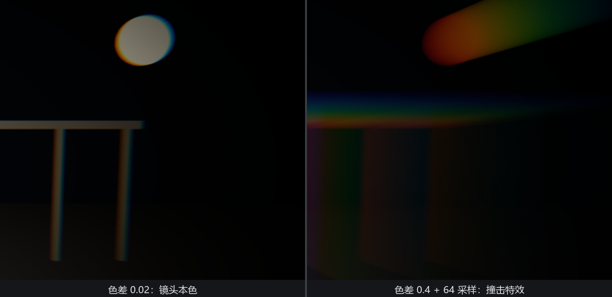

# 镜头三件套：暗角、畸变、色差

真实镜头有三种著名的“毛病”：四角发暗（**暗角**）、直线拍弯（**畸变**）、高反差边缘泛彩虹（**色差**）。光学工程师穷尽百年消灭它们，游戏美术又亲手把它们加回来——因为观众的眼睛早已把这些毛病和“这是镜头拍的”画上了等号。恐怖游戏的受击闪彩、赛车游戏的广角压迫感、复古滤镜的四角晕影，全是这三味药。

Bevy 把三味药装在 `bevy::post_process::effect_stack` 里，模块名直译是“效果栈”——三个组件的活儿在同一道全屏 pass 里叠着算，工序上是一家人。用法照旧，各是相机上的一个组件：

```rust
{{#include ../../code/ch26-quality/examples/listing-26-08.rs:camera}}
```

<span class="caption">Listing 26-8（其一）：想要哪味挂哪味；畸变从 0 起步（examples/listing-26-08.rs）</span>

场景专门为“说谎的镜头”搭：一排白栏杆加一根横梁——**直线是畸变最好的试纸**；两侧各挂一盏亮灯笼——高反差边缘给色差当靶子。

## Vignette：往中心收的一圈暗

**`Vignette`** 模拟镜头边缘的自然失光，七个字段：

- **`intensity`**（默认 1.0）——压暗的力度，0 没有、1 四角全黑。有个贴心的实现细节：强度低于 1e-4 时整段后处理直接跳过，“拨到 0”就是免费的；
- **`radius`**（0.75）——中心保留区的大小，越小暗圈侵入越深；
- **`smoothness`**（5.0）——明暗过渡的软硬，小到 0.01 是一道硬边；
- **`roundness`**（1.0）——暗圈的形状，1.0 正圆，偏离后随画幅拉扁；
- **`center`**（(0.5, 0.5)）——暗圈圆心，UV 坐标；挪开可以做偏心构图的引导；
- **`edge_compensation`**（1.0）——按画幅比例修正暗圈贴合屏幕边缘的程度；
- **`color`**（黑）——“暗”角其实可以是任何颜色，白色暗角就成了老照片的褪色边。

V 键整件拆装，Figure 26-15 的上排就是这一下的前后：默认档的暗角把四角压进夜色，摘掉的瞬间四角亮回来，栏杆两端重新入画。

## LensDistortion：把直线拍弯

**`LensDistortion`** 基于真实镜头标定用的 Brown-Conrady 模型的简化版，五个字段：

- **`intensity`**（默认 0.5）——畸变强度，对应模型里的径向系数 k₁：**正值桶形**（barrel，画面往外鼓，广角镜的味道），**负值枕形**（pincushion，往里收，长焦的味道）。本例从 0 起步，←→ 每按一档拨 0.2；
- **`scale`**（1.0）——整体缩放。强畸变把像素推离（或拽向）画面中心，边缘会出现难看的**拉伸涂抹**，调大它把这圈烂边裁出画外，代价是视野变窄；
- **`multiplier`**（(1,1)）——两轴各自的畸变倍率，置 0 的轴完全不变形，可以做变形宽银幕式的单轴畸变；
- **`center`**（(0.5, 0.5)）——畸变中心；
- **`edge_curvature`**（0.0）——间接控制模型里的 k₂ 系数（边缘处曲线的陡峭度）。注释解释了为什么不直接暴露 k₂：它和 k₁ 强相关，独立拨动会在强度正负过零时产生视觉跳变——绝大多数场合留 0。

```rust
{{#include ../../code/ch26-quality/examples/listing-26-08.rs:desk}}
```

<span class="caption">Listing 26-8（其二）：三件套调参台——组件拆装、字段拨动，两种控制口径并用（examples/listing-26-08.rs）</span>

```console
cargo run -p ch26-quality --example listing-26-08
```

```text
盛师傅：栏杆横梁摆好，直线最怕镜头说谎。
盛师傅：V 暗角开关，左右键拨畸变，C 在 0.02 和 0.4 之间跳色差。
盛师傅：畸变 +0.4。
...
盛师傅：畸变 -0.8。
盛师傅：暗角摘了。
盛师傅：色差 0.40，采样上限 64。
```



<span class="caption">Figure 26-15：上排拨的是暗角（V 键一下的前后），下排拨的是畸变正负——横梁是最诚实的证人，上排右格就是它“说真话”的基准样</span>

## ChromaticAberration：彩虹镶边

**`ChromaticAberration`** 模拟镜头对不同波长聚焦不齐——高反差边缘泛出红绿蓝的错位彩边。实现出处很有来头：源码注释点名致敬游戏《Inside》的 GDC 2016 分享，特点是**颜色模式可定制**。三个字段：

- **`color_lut`**——彩边的颜色查找表。默认 `None` 时用内置的 3×1 像素纹理：一红一绿一蓝，即最经典的色散序列。换成任何自定义的横条渐变图（永远采样它的垂直中线），彩边就换了配色——故障艺术风的青紫错位、老胶片的黄蓝边，一张小图的事；
- **`intensity`**（默认 0.02）——彩边宽度，占窗口尺寸的比例。默认这档是“若有若无的镜头味”；官方示例把上限放在 0.4——那已经是“挨了一记闷棍”的特效档；
- **`max_samples`**（默认 8）——沿彩边方向的采样上限。这个参数和 `intensity` 要**联动**着调：彩边拉宽了还用 8 步采样，渐变会断成一节节色阶。C 键在两档间跳时就照顾了这层关系——0.02 配 8，0.4 配 64。



<span class="caption">Figure 26-16：色差 0.02（镜头本色）对 0.4（撞击特效）——后者正是恐怖游戏受击帧的经典做法</span>

三件套合在一起用时记住共同的脾气：它们都在冲印（tonemapping）**之前**运行，吃的是 HDR 数据——所以彩边会带着灯笼的真实亮度晕开，暗角压的是线性光而非成品像素，叠加顺序由引擎在效果栈里定死，你只管拨各自的旋钮。
