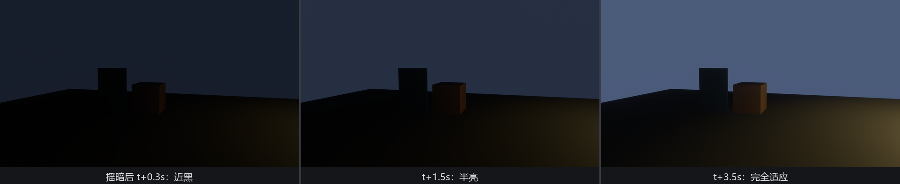

# 自动测光：AutoExposure

第 22 章的曝光表是手动的：`Exposure` 拨到哪档就是哪档。可玩家不会替你拨表——从灯火通明的正厅走进黑黢黢的后台，画面要么黑成一团，要么早就为了后台亮度把正厅拍过曝。人眼的解法是瞳孔自己缩放，游戏的解法同名同姓：**自动曝光**（auto exposure），也叫眼部适应（eye adaptation）。

Bevy 的实现是 **`AutoExposure`**（`bevy::post_process::auto_exposure`），但这次光挂组件不够——它的插件**不在** `DefaultPlugins` 里，得自己请：

```rust
{{#include ../../code/ch26-quality/examples/listing-26-09.rs:camera}}
```

<span class="caption">Listing 26-9（其一）：组件照旧挂相机；require 的还是那张 `Hdr` 底片——测光测的就是真实亮度（examples/listing-26-09.rs）</span>

```rust
{{#include ../../code/ch26-quality/examples/listing-26-09.rs:plugin}}
```

为什么单独放行李架上？文档一句话点破：它靠 **compute shader** 干活，因此与 WebGL2 不兼容。顺着推还有一层：逐帧统计全画面的亮度直方图是笔真实的开销——跑不通的平台加不想掏钱的场合，都不该被“默认全家桶”硬塞，Bevy 一律让你显式点名。忘了挂插件会怎样？组件安安静静躺在相机上，一点效果没有——本章第三位“哑巴”，排查口诀同前：效果失踪，先查插件挂没挂。

## 测光的算盘

`AutoExposure` 的字段读起来像一台真相机的测光菜单：

- **`range`**（默认 -8.0..=8.0）——直方图统计的 EV 范围，出界的像素要么忽略要么归入顶格桶；
- **`filter`**（默认 0.10..=0.90）——测光时**掐头去尾**：最暗的 10% 和最亮的 10% 样本不参与平均。这是防“一盏灯毁全场”的保险丝——画面里一小撮极亮的灯笼不该把整张脸压黑；
- **`speed_brighten`**（3.0）/ **`speed_darken`**（1.0）——适应速度，单位是**每秒几档 F-stop**。**当心这对名字的主语是“场景”，不是画面**：`speed_brighten` 管“场景变亮”（走出隧道，曝光要把画面**压暗**），`speed_darken` 管“场景变暗”（本节的摇镜头，画面**爬亮**的速度归它管）——跟直觉正好拧一圈，本书作者初稿就在这儿记错了账。默认值不对称抄的是人眼：入亮景快（瞳孔收缩，3 档/秒）、入暗景慢（暗适应，1 档/秒）；
- **`exponential_transition_distance`**（1.5）——离目标曝光多少档以内时，从线性逼近切换成指数缓动。作用是抗抖：场景亮度每帧微微波动时，曝光不会跟着神经质地来回蹦；
- **`metering_mask`**——测光遮罩：一张覆盖全屏的灰度图（只读红通道），中心亮四角暗的遮罩就是“中央重点测光”，只给主角脸部留白就是“点测光”。默认全屏均匀；
- **`compensation_curve`**——曝光补偿曲线资产：测光完成后再按场景亮度查一条自定义补偿。夜景故意欠半档、雪地故意过一档，摄影师那套“白加黑减”可以整条曲线交给它。

场地一半天堂一半地狱：右手边三盏灯笼挤作一堆，左手边后台只沾余光。P 键摇机位，F 键换适应速度：

```rust
{{#include ../../code/ch26-quality/examples/listing-26-09.rs:swing}}
```

<span class="caption">Listing 26-9（其二）：P 摇镜头，F 在“人眼档”与“快门手档”之间切换（examples/listing-26-09.rs）</span>

```console
cargo run -p ch26-quality --example listing-26-09
```

```text
盛师傅：右边灯笼堆，左边黑后台，测光表自己转。
盛师傅：P 摇机位，F 换适应速度（默认 入亮景 3 / 入暗景 1，快门手 8/8）。
盛师傅：摇向黑后台——盯住画面，亮度要爬一小会儿。
盛师傅：适应速度 入亮景 8、入暗景 8（F-stop/秒）。
盛师傅：摇向灯笼堆——盯住画面，亮度要爬一小会儿。
```



<span class="caption">Figure 26-17：摇向暗处后的 0.3 秒 / 1.5 秒 / 3.5 秒——场景由亮转暗，管这段爬坡的是 `speed_darken`：每秒 1 档，“一小会儿”就是这本账</span>

Figure 26-17 的三帧就是 `speed_darken: 1.0` 的直观换算：摇向黑后台是“场景由亮转暗”，亮暗两区差着三四档 EV，每秒爬 1 档，三四秒才完全到位——时间轴与截图逐格对得上（这也是核对那对字段主语最踏实的办法：真按 3 档/秒走，一秒出头就该亮透了）。按 F 拨到 8/8 的“快门手”再摇回去，一秒内画面就压稳了。游戏里怎么选？写实向留默认的不对称（进隧道慢慢看清，出隧道晃一下眼）；快节奏射击拉高两个 speed，别让玩家在明暗门口瞎半秒。

还有一处细节值得回味：整套测光-调整都发生在渲染管线内部（直方图和曝光状态都住在 GPU 缓冲里），你的 `Exposure` 组件数值自始至终没动过——自动测光是在冲印之前替你“虚拨”了那只表。这也意味着它和手动 `Exposure` 可以共存：手动档定基准，自动档在基准附近浮动。
