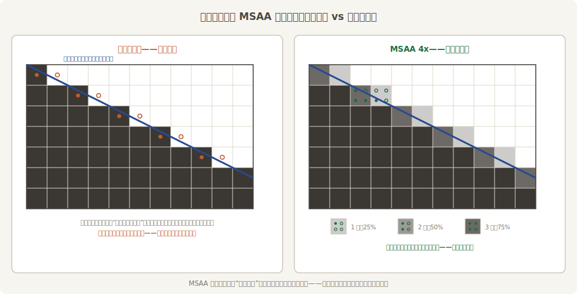
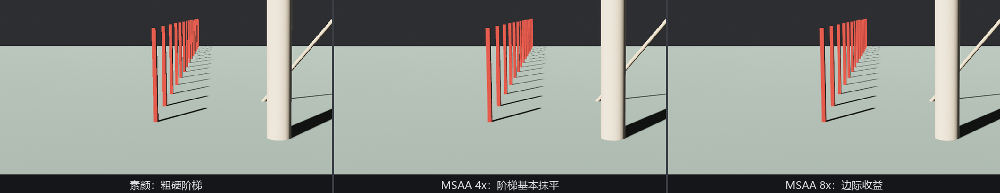

# 锯齿从哪来，MSAA 怎么治

看客挑的最后一根刺：栏杆的边一格一格，“凑近看全是楼梯”。这毛病叫**锯齿**（aliasing），治它的手艺统称**抗锯齿**（anti-aliasing，AA）。Bevy 一口气提供四家方案，各有脾气。要选得明白，得先看清楚病灶。

## 一像素一票

屏幕是离散的格子，三角形的边是连续的斜线。光栅化默认**一个像素只投一票**：像素中心落在三角形内就整格上色，落在外面就整格不上。斜线穿过一排像素时，“整格进、整格出”的交界处就叠出了楼梯：



<span class="caption">Figure 26-18：锯齿的病理与 MSAA 的药理——把“一票定黑白”改成“四票分深浅”，几何边就有了过渡色</span>

**MSAA**（multisample anti-aliasing，多重采样抗锯齿）是最经典的解法：每个像素设多个采样点，各自判断“在不在三角形里”，最后按票数混合颜色。开销的巧妙之处在于**着色仍然每像素只算一次**——多出来的只是覆盖判定和一张更大的中间纹理，所以它比“真的按四倍分辨率渲染”便宜得多。

## Msaa 是组件，不是资源

在 Bevy 里，MSAA 的开关是相机上的 **`Msaa`** 组件（在 `bevy::prelude` 里）——一个枚举：`Off` / `Sample2` / `Sample4` / `Sample8`，而且是 `Camera` 的 required component，**默认 `Sample4`**。也就是说：从第 2 章的第一个窗口起，你的每台相机一直开着 4 倍 MSAA，今天只是认识一下这位老员工。

强调“组件”是有原因的。网上搜 Bevy 抗锯齿，很多老教程教你这么写：

```rust
{{#include ../../code/ch26-quality/no-compile/listing-26-12.rs:wrong}}
```

<span class="caption">Listing 26-12：老黄历——把 Msaa 当全局资源插（no-compile/listing-26-12.rs）</span>

```text
error[E0277]: `bevy::prelude::Msaa` is not a `Resource`
  --> ch26-quality\no-compile\listing-26-12.rs:12:26
   |
12 |         .insert_resource(Msaa::Off)
   |          --------------- ^^^^^^^^^ invalid `Resource`
   |          |
   |          required by a bound introduced by this call
   |
   = help: the trait `Resource` is not implemented for `bevy::prelude::Msaa`
   = note: consider annotating `bevy::prelude::Msaa` with `#[derive(Resource)]`
   = help: the following other types implement trait `Resource`:
             AccessibilityRequested
             AccumulatedMouseMotion
             ...
           and 293 others
note: required by a bound in `bevy::prelude::App::insert_resource`
```

编译器给的第一条建议——“给 `Msaa` 加个 `#[derive(Resource)]`”——是条走不通的歧路：`Msaa` 是引擎的类型，轮不到你加 derive。真正的路标在错误本身：它**就不该是**全局的。多相机分屏（第 13 章）里，小地图那台正交相机也许想省下 MSAA 的显存，主相机却要 8x——每台相机一票，才是这个设计的本意。改法是查到相机实体、改它的组件，26-10 的换挡台马上演示。

## 档位与代价

```console
cargo run -p ch26-quality --example listing-26-10
```

白天彩排的场子：细栏杆一路排向远处、斜旗杆、一根又亮又滑的上釉瓷柱。数字键 1 全下（素颜），2 上 MSAA，Q/W/E 拨 2/4/8 票：

```text
场记：全下——素颜出场，阶梯看个够。
场记：MSAA 4x 上场（Q/W/E 拨 2/4/8）。
场记：MSAA 每像素 8 票。
```



<span class="caption">Figure 26-19：素颜 / 4x / 8x——4 票已解决几何边的大头，8 票是边际收益。注意这三张治好的全是**几何的边**；着色内容里的锯齿它一票也投不进去，下节分解</span>

三条实用结论：

- **默认 4x 是甜点档**。2x 省一点但楼梯犹在，8x 显存带宽翻着涨、肉眼收益极小。Web 平台还有硬限制：浏览器只支持 1（关）或 4；
- **MSAA 只治几何边**。它多出来的票只投“在不在三角形里”，三角形**内部**的着色——纹理细节、高光的细碎亮斑——一票没有。TAA 的文档把这类**高光锯齿**（specular aliasing）专门点了名：它治得了、MSAA 治不了，账留到 26.11 清。顺带认个亲：24.9 节透明模式里的 `AlphaToCoverage`，摊派 alpha 用的正是这里的采样点——那节说“边缘抗锯齿”，抗的就是这份票；
- **有些高级功能会点名要求关掉它**。多重采样的中间纹理和一些逐像素技术天生犯冲——延迟渲染、TAA 都在此列。遇到“某效果要求 `Msaa::Off`”别嘀咕，这是这套架构的正常代价，而且下一节你会亲耳听到不关的下场。
