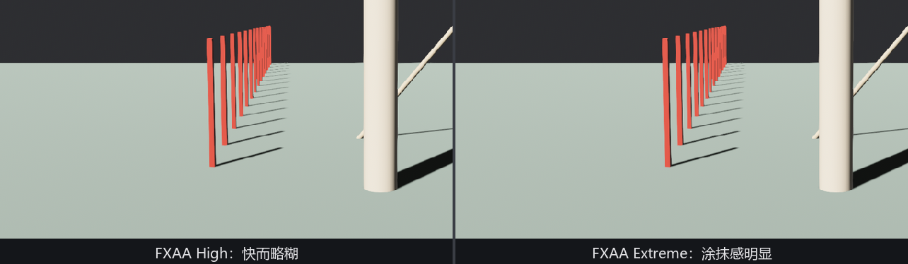
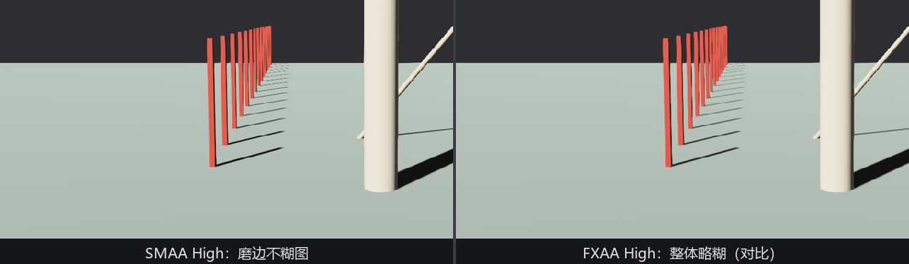

# 后处理磨边：FXAA 与 SMAA

MSAA 在光栅化阶段干活，代价随三角形数量涨。另一路思路完全不碰几何：等整张图画完，**在成品上找边、磨边**——纯后处理，代价只随分辨率涨，场景再复杂也不多花一分钱。Bevy 备了两家，都住 `bevy::anti_alias`。

先说清楚换挡台的规矩（Listing 26-10 全节共用）：四家方案**同场只留一家**，换谁上场都先把别家全请下去，MSAA 也拨到 `Off`。统一清场首先是为了对照公平——磨边的功劳得记到一家头上；也各有实际的账：SMAA 的 MSAA 兼容模式 Bevy 还没实现（源码注释原话），FXAA 叠着 MSAA 跑则纯属重复花钱，TAA 更是下一节那条硬规矩：

```rust
{{#include ../../code/ch26-quality/examples/listing-26-10.rs:taa_bundle}}
```

```rust
{{#include ../../code/ch26-quality/examples/listing-26-10.rs:shift}}
```

<span class="caption">Listing 26-10（其一）：换挡先清场——`Msaa` 拨枚举值，其余三家上下组件（examples/listing-26-10.rs）</span>

那个 `TaaBundle` 类型别名是清场逻辑里最容易漏的一环：TAA 上场时靠 require 自动带上四个搭档，**下场时它们不会自动跟着走**——所以摘除清单得把五件全点名。TAA 本尊和这份清单的来历，下一节细说。

## FXAA：快字当头

**`Fxaa`**（fast approximate anti-aliasing，快速近似抗锯齿）是最便宜的一档：在最终图像上扫描高对比度的边，沿边抹一把。挂上 `Fxaa::default()` 即生效，三个字段：

- **`enabled`**——开关，不想拆组件时用它；
- **`edge_threshold`**（默认 `High`）——判定“这是条边”所需的局部反差下限，枚举五档 `Low`/`Medium`/`High`/`Ultra`/`Extreme`。档越高越敏感，越多的地方被当成边来抹；
- **`edge_threshold_min`**（默认 `High`）——暗部的豁免线，太暗的反差不处理。

灵敏度的取舍源码写得直白：低档“更锐、更快”，`Ultra`/`Extreme` 会带来“明显的涂抹和细节损失”。Q/W/E/R/T 五档拨着看：

```rust
{{#include ../../code/ch26-quality/examples/listing-26-10.rs:tune}}
```

<span class="caption">Listing 26-10（其二）：Q~T 给当前方案拨档——同一组键，谁在场归谁（examples/listing-26-10.rs）</span>

```text
场记：FXAA 上场（Q/W/E/R/T 拨灵敏度）。
场记：FXAA 灵敏度 Extreme。
场记：SMAA 上场（Q/W/E/R 拨质量）。
```



<span class="caption">Figure 26-20：FXAA 的两副面孔——High 是“快而略糊”的正常发挥，Extreme 把不该抹的也抹了</span>

FXAA 的定位：性能预算最紧、或者给移动端兜底时的第一选择。它的糊不是 bug 而是原理——“近似”二字就体现在它分不清“几何的边”和“纹理里画的线”，一律照抹。

## SMAA：形态学的讲究

**`Smaa`**（subpixel morphological anti-aliasing，亚像素形态学抗锯齿）是 FXAA 的讲究版：不是见边就抹，而是先做边缘检测，再**识别边缘的形状**（直边、对角线、拐角），按形状查表混合——三道 pass 的流水线，换来比 FXAA 干净得多的边缘、少得多的误伤。字段只有一个：

- **`preset`**——质量档，`Low`/`Medium`/`High`/`Ultra`，默认 `High`。档位控制边缘搜索的步数与是否启用对角线/拐角检测：`Low` 四步、不认对角线，`Ultra` 三十二步、全都认。源码建议一般留默认。

它吃两张内部查找表纹理（面积表加搜索表），走 `smaa_luts` feature——默认已开，无感。



<span class="caption">Figure 26-21：SMAA High 对 FXAA High——同为后处理，形态学分析买来了“磨边不糊图”</span>

两家怎么选：SMAA 的三道 pass 比 FXAA 的一道贵一些，但仍远比高倍 MSAA 便宜。静态画面质量 SMAA 明显占优；FXAA 赢在实现最简单、运行最快。不过两家共同的软肋和 MSAA 一样——都是**单帧**方案：一旦画面动起来，帧与帧之间各磨各的边，细几何和高光斑就会在连续帧里跳动闪烁，这是任何只看单帧的方案都管不住的。收拾它得引入时间这个维度。
