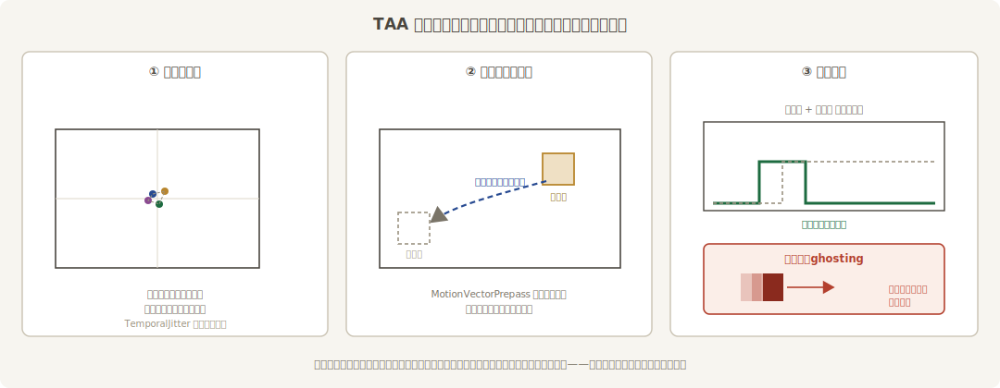
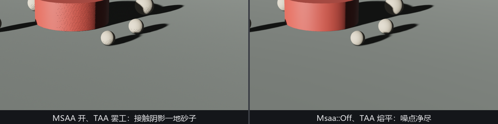
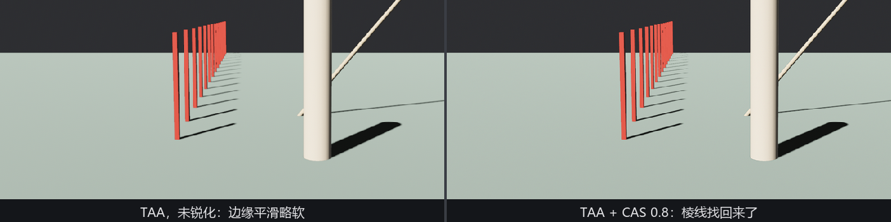

# 时间的磨边：TAA 与 CAS

单帧方案的死穴在于信息不够：一个像素一帧只看得到一次场景。**TAA**（temporal anti-aliasing，时间抗锯齿）的主意是把预算摊到时间上——**每帧把相机偷偷抖动亚像素的一小步，再把当前帧与过去几帧加权混合**。几帧下来，每个像素等效采样了三角形的好几个位置，几何边、纹理闪、高光颗粒一并平滑：



<span class="caption">Figure 26-22：TAA 三件事——抖动采样、按运动向量对齐历史、加权混合；残留的旧影就是它著名的副作用 ghosting</span>

原理里藏着它的全部脾气。混合历史帧的前提是“知道每个像素上一帧在哪”——所以 TAA 依赖运动向量；画面剧变（切镜头）时历史全是废账——所以要能一键清空；快速运动时旧帧残影没洗干净——就是著名的**拖影**（ghosting）。

## 上场与硬规矩

**`TemporalAntiAliasing`**（`bevy::anti_alias::taa`）字段只有一个 `reset`（置 true 清空历史，用于切镜头，帧末自动弹回 false）。真正的门道在它的 require 清单——一口气带上四个搭档：`TemporalJitter`（负责抖）与 `MipBias`（抖动会让纹理采样偏糊，纹理 mip 补偿一档），这两位住 `bevy::render::camera`；`DepthPrepass` 与 `MotionVectorPrepass`（深度与运动向量的预渲染，找历史用），住 `bevy::core_pipeline::prepass`。挂一个组件，五件套自动到齐。

到齐之后还有一条**硬规矩**：文档原话——用 TAA 的相机必须把 `Msaa` 设为 `Off`。这条规矩犯了不是哑巴坑，是大喇叭：Listing 26-11 故意只挂 TAA、不动出厂默认的 `Sample4`：

```rust
{{#include ../../code/ch26-quality/examples/listing-26-11.rs:camera}}
```

<span class="caption">Listing 26-11（其一）：故意犯规——TAA 与 MSAA 同场（examples/listing-26-11.rs）</span>

```console
cargo run -p ch26-quality --example listing-26-11
```

```text
WARN bevy_anti_alias::taa: Temporal anti-aliasing requires MSAA to be disabled
WARN bevy_anti_alias::taa: Temporal anti-aliasing requires MSAA to be disabled
WARN bevy_anti_alias::taa: Temporal anti-aliasing requires MSAA to be disabled
...
```

**每帧一条**，一秒钟六十行，终端瞬间被刷成瀑布——渲染系统每帧检查一次冲突，检查一次抱怨一次，TAA 全程罢工。M 键把 `Msaa` 拨到 `Off`，瀑布立止，TAA 开工。

## TAA 不只抗锯齿

场景里还埋了第二个实验。第 22 章讲接触阴影时留过话：“接触阴影靠带抖动的屏幕空间采样，本就指望 TAA 把噪抹平”。当时 TAA 还没出场，鼓沿那圈砂子只能忍着——现在债主到齐了。M 键来回拨，盯着鼓沿和鹅卵石的缝：

```rust
{{#include ../../code/ch26-quality/examples/listing-26-11.rs:flip}}
```

<span class="caption">Listing 26-11（其二）：一个键拨 MSAA，等于拨“TAA 罢工/开工”（examples/listing-26-11.rs）</span>

```text
场记：TAA 挂上了，可 MSAA 没关——看你的终端，警告在刷屏。
场记：Msaa::Off——终端清净了，看鼓沿那圈砂子慢慢熔掉。
场记：MSAA 回到 Sample4——警告又来了，砂子也回来了。
```



<span class="caption">Figure 26-23：同一场景、同一秒钟的两种命运——接触阴影的抖动采样噪点，被 TAA 的时间平均一口吃掉。22.7 节挂的账，今天清了</span>

这就是文档里那句“大幅提升随机渲染技术的质量”的意思：接触阴影、SSAO、某些软阴影采样都靠“每帧撒一把随机点”干活，单帧看全是噪，TAA 的时间平均正是它们预设的分母。**在现代渲染器里，TAA 与其说是抗锯齿，不如说是半个渲染管线的地基**——这也是它虽有拖影恶名、却几乎成为 3A 标配的原因。

至于取舍：分辨率和帧率越高，TAA 的伪影越轻；薄如发丝的几何、高频纹理可能被时间平均“吃掉”或闪烁；透明物体不写运动向量，天生糊不对。切镜头记得拨 `reset`。

## CAS：磨完再开刃

TAA 和 FXAA 的模糊感有个共同的解药：**`ContrastAdaptiveSharpening`**（对比度自适应锐化，CAS），AMD 的经典算法。“自适应”是它和无脑锐化滤镜的区别：低反差区多锐化、高反差区少锐化——避免把本来就锐的边锐出白边。字段三个：

- **`enabled`**——开关；
- **`sharpening_strength`**（默认 0.6）——力度，内部按 0..1 钳制（注释：超过 1 会出严重伪影与亮斑）；
- **`denoise`**——降噪选项，注释直言“你多半不该开”：胶片颗粒这类效果应该放在锐化**之后**，而不是让锐化替你躲。

换挡台上 0 键开关、-/= 拨力度（Listing 26-10 的 `tune_sharpen`，代码不再贴）：



<span class="caption">Figure 26-24：TAA 磨完再开刃——CAS 0.8 找回的锐度集中在偏软的细节上，高反差边不过冲，这就是“自适应”三个字的价值</span>

它的正确用法是**跟在模糊型 AA 后面找补**：TAA + CAS 0.6 是很多引擎的出厂搭配。单独开着它不配 AA，等于给锯齿开刃——越锐越楼梯。

## 顺带一句：DLSS

`bevy_anti_alias` 里还躺着第五家：**DLSS**（NVIDIA 的深度学习超采样，抗锯齿之外还顺带上采样提帧）。它锁三重门：`dlss` cargo feature、NVIDIA RTX 硬件、注册一个项目专属的 `DlssProjectId`——官方 `anti_aliasing` 示例里有完整的接法。跨平台项目通常把它做成检测到支持才亮的选项（示例里那句 `DlssSuperResolutionSupported` 资源探测就是干这个的），这里知其有即可。
