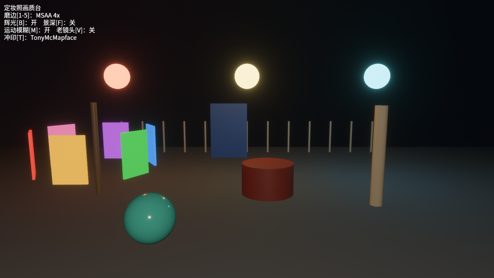

# 收场：《定妆照》

全章的旋钮拼一块总面板。夜戏开演前，盛师傅支起机器给老雷交货：一个场景吃下全部效果——三盏灯笼喂辉光、走马灯喂运动模糊、前中后三件货喂景深、白栏杆和上釉瓷柱喂抗锯齿——1~5 换磨边方案，B/F/M/V 四个效果开关，T 轮换冲印配方，左上角一块状态牌实时报幕。

架构上这台总成只有一个新讲究：**输入不碰相机，全部效果集中一处拆装**。相机 spawn 时只带“底盘”——`Hdr` 底片常驻，效果组件一件不挂：

```rust
{{#include ../../code/ch26-quality/src/main.rs:camera}}
```

键盘系统只往一块“黑板”资源上写字；真正拆装组件的活儿归一个系统管，而且只在黑板变过的那帧干活——第 5 章的资源变更检测在管调度：

```rust
{{#include ../../code/ch26-quality/src/main.rs:board}}
```

```rust
{{#include ../../code/ch26-quality/src/main.rs:press}}
```

<span class="caption">Listing 26-13（其一）：黑板是唯一的真相来源，键盘只写黑板（src/main.rs）</span>

```rust
{{#include ../../code/ch26-quality/src/main.rs:apply}}
```

<span class="caption">Listing 26-13（其二）：黑板落实到相机——全场唯一碰效果组件的地方（src/main.rs）</span>

这两段代码里有几处细节回应前文：

- 摘 TAA 时**只摘三件**（TAA 本体、抖动、mip 补偿），两个 prepass 留在原地——走马灯的运动模糊还等着 `MotionVectorPrepass` 干活呢。26.10 的换挡台整套摘是因为那个场景没有别的 prepass 用户；这里有，就得留。required components 的“只管上、不管下”在这种共享依赖上反而成了便利：拆谁、留谁，你说了算。（较真的话，运动模糊真正要的只有 `MotionVectorPrepass`，`DepthPrepass` 留下是纯搭伙、每帧白跑一遍深度——本例图个拆装省事，在乎这点开销就单独摘它；）
- 五种磨边方案里只有 MSAA 用 `Sample4`，其余一律先把 `Msaa` 拨 `Off`——TAA 的硬规矩（26.11）顺手就守了；
- `web_msaa` 是一条**平台互斥规则**，教训来自本书网页版 demo 的一次真实翻车。26.5 说过 WebGL2 读深度纹理受限——引擎那条注释还有后半句：能读的前提是 `Msaa::Off`。MSAA 挡若与运动模糊的 prepass 同场，网页版要按多重采样规格去建 prepass 纹理，WebGL2 根本造不出这种东西，GL 层当场 panic——而且光摘 `MotionBlur` 不够，**prepass 是 required component 补的票，得亲手连它们一起摘**，不然纹理照建、照崩。`press_keys` 里还有一道姊妹关卡：TAA 的着色器同样翻译不进 WebGL2（一张纹理配多只采样器，GL 语义装不下，实测按下去整个应用退场），网页版干脆把 5 号挡封存。`cfg!(target_arch = "wasm32")` 是编译期常量，桌面构建里这两段都直接折叠成“无事发生”。

状态牌是 UI 文本首秀——`Text` 组件加一个绝对定位的 `Node`，中文字模复用第 16 章的子集。UI 的正经讲解在第 28 章，这里先当一块会写字的板用：

```rust
{{#include ../../code/ch26-quality/src/main.rs:sign}}
```

```rust
{{#include ../../code/ch26-quality/src/main.rs:sign_update}}
```

<span class="caption">Listing 26-13（其三）：状态牌也吃 `resource_changed` 门控——黑板不动，一个字都不重排（src/main.rs）</span>

> 启动后终端会零星蹦几行 `ICU4X data error: No segmentation model for language: ja`——16.1 节见过的老朋友：文本排版引擎找不到中日韩分词模型的抱怨，无害，与本章内容无关。

全场跑起来：

```console
cargo run -p ch26-quality
```

```text
老雷：盛师傅，夜戏的定妆照全托您了。
盛师傅：1~5 磨边，B 辉光，F 景深，M 运动模糊，V 老镜头，T 冲印配方。
```

<figure class="bevy-demo" data-src="demos/ch26/index.html">
  
  <figcaption><span class="caption">Figure 26-25：《定妆照》画质台。读网页版的别只看剧照：点击画面入场，1~4 换磨边，B/F/M/V/T 逐项拨给自己看。网页版三条脾气（全是 WebGL2 的账，正文有解）：景深停摆，F 键是个空挡；MSAA 挡自动歇掉运动模糊；TAA 的 5 号挡整个封存。桌面版 <code>cargo run -p ch26-quality</code> 同一份代码，五挡俱全</span></figcaption>
</figure>

## 小结

这一章没往场景里加过一件东西，画面却前后判若两台戏。回顾账本：

- **一条流水线**：主 pass 之后、上屏之前，效果按固定次序接力（Figure 26-1）；冲印（tonemapping）是 HDR 与 LDR 的分水岭，吃亮度原料的效果全排在它前面；
- **一套语法**：所有画质效果都是相机组件——挂上生效、拆下失效、改字段调参、required components 自动补依赖。学会一个就学会了全家；
- **两类失效**：静默的（Bloom 丢了 Hdr、AutoExposure 忘挂插件、DoF 上 WebGL2）与大喇叭的（TAA 撞上 MSAA）。前者靠“查 require、查插件”的口诀，后者听终端的；
- **三笔交易**：辉光、景深、运动模糊各自都在拿性能换观感，参数的物理原型（emissive 亮度、光圈 f 值、快门角）替你把“调到多少像真的”这道题变成了抄答案；
- **四家磨边**：MSAA 治几何边、按三角形计费；FXAA 快而糊；SMAA 讲究而不糊；TAA 引入时间维度、通吃闪烁还兼职给随机采样技术当分母，代价是拖影和一条必须关 MSAA 的硬规矩；CAS 负责磨完开刃。

下一章视角一转：画质是给玩家看的，**调试可视化**是给你自己看的——Gizmos 即时画线画框、FPS 浮层、诊断数据，给第 20 章的 Breakout 加一层“开发者之眼”。

## 练习

1. **偏心暗角**：把 `Vignette` 的 `center` 挪到 (0.3, 0.5)、`color` 换成暖褐色，配上 `LensDistortion` 正畸变——一张“老照片”滤镜就成了。试着把三件套的参数包成一个函数 `fn vintage(camera: &mut EntityCommands)`；
2. **对焦拉杆**：给 Listing 26-5 加两个键，按住时 `focal_distance` 每秒 ±3.0 连续变化——电影里的“拉焦”运镜。想想为什么用 `pressed` 而不是 `just_pressed`（第 17 章的旧账）；
3. **哑巴坑侦探**：写一个诊断系统，每秒检查一次：相机上有 `Bloom` 却没有 `Hdr`、或有 `AutoExposure` 却没挂 `AutoExposurePlugin`（提示：后者可以查 `Assets<AutoExposureCompensationCurve>` 资源存不存在），有问题就 `warn!` 一声——把本章两个静默失效变成大喇叭。
